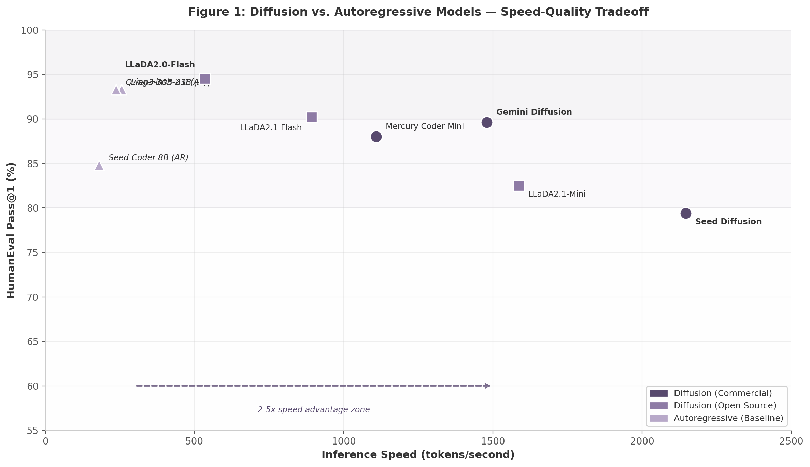

# Executive Summary

Diffusion language models (dLLMs) have transitioned from theoretical curiosities to production-viable alternatives to autoregressive (AR) architectures for text and code generation. This report examines the complete landscape of diffusion-based code models through 330+ research queries executed across 18 specialized agents covering 12 analytical dimensions — from foundational architectures and training methodologies to commercial deployment and future outlook. The central finding is that diffusion models have achieved parity with AR models on standard code generation benchmarks while delivering 2-5x inference speed advantages, and have established a decisive edge in code editing tasks where their any-order generation capability creates structural advantages. [^5^] [^9^] [^272^]

## Key Findings

**Quality parity on standard benchmarks with accelerating inference advantages.** The leading diffusion models now match or exceed comparable AR baselines on HumanEval and MBPP. LLaDA2.0-flash (Ant Group) achieves 94.51% on HumanEval and 88.29% on MBPP, surpassing the AR baseline Qwen3-30B-A3B-Instruct at 93.29% and 86.65% respectively. [^162^] [^24^] Gemini Diffusion (Google DeepMind) scores 89.6% on HumanEval, exceeding Seed-Coder-8B-Instruct's 84.8%. [^9^] Simultaneously, these models deliver substantially higher throughput: Seed Diffusion achieves 2,146 tokens/second on H20 GPUs, Gemini Diffusion reaches 1,479 tok/s, and Mercury Coder Mini sustains 1,109 tok/s on H100 hardware. [^11^] [^272^] [^71^] Under controlled serving conditions (SGLang with TP8 on H20), LLaDA2.0-flash-CAP achieves 535 TPS versus 256 TPS for Ling-flash-2.0, a 2.1x speedup. [^399^] [^389^]

**Code editing emerges as diffusion's uncontested advantage.** While benchmark parity on completion tasks is significant, the most consequential finding is diffusion's superiority on code editing benchmarks. Stable-DiffCoder achieves 60.0% on CanItEdit versus 50.5% for its AR counterpart Seed-Coder — a 9.5 percentage point absolute gap representing an 18.8% relative improvement. [^83^] [^160^] This advantage is not incidental: code editing is inherently non-sequential (changing a function signature requires updating all callers simultaneously), which aligns precisely with diffusion's any-order generation capability. [^5^] Complementing this result, TreeDiff's AST-guided masking achieves a 13.3% relative improvement over random masking on HumanEval+ by structuring the diffusion process around code syntax. [^614^] [^615^] The combination of superior editing performance and stronger length extrapolation on RepoQA (diffusion models maintain >30% accuracy where AR models drop below 10% at extended contexts) positions diffusion models to capture the IDE assistant market for editing workflows. [^526^]

**Reinforcement learning, not architecture alone, drives the largest quality gains.** The narrative around diffusion models emphasizes inference speed, yet the performance data reveals that post-training reinforcement learning (RL) is responsible for the most significant quality improvements. LLaDA2.0-flash-preview scores only 29.07 on LiveCodeBench versus 42.29 for the fully post-trained model — a 45% improvement attributable to supervised fine-tuning (SFT), confidence-aware parallel decoding (CAP), and direct preference optimization (DPO), not the base diffusion conversion. [^162^] Similarly, DiffuCoder's coupled-GRPO achieves a +4.4% EvalPlus improvement with only 21K training examples. [^10^] [^153^] EBPO (ELBO-based Block-level Policy Optimization), introduced with LLaDA2.1, represents the first large-scale RL framework for dLLMs, scaling to 100B parameters. [^164^] [^331^] VRPO from the LLaDA 1.5 work establishes the theoretical foundation, proving that variance in diffusion preference optimization can be systematically reduced through antithetic sampling and optimal Monte Carlo budget allocation. [^207^] The implication is that organizations mastering RL for diffusion — Ant Group with EBPO, Apple with coupled-GRPO — will outperform competitors focused solely on architectural innovations. [^346^]

**Two leaders, divergent strategies: Google DeepMind's commercial closed-source approach versus Ant Group's open-source ecosystem play.** Google DeepMind drives commercial innovation through Gemini Diffusion, an experimental block-diffusion model announced at Google I/O 2025 that demonstrates ~5x speedup over Gemini 2.0 Flash Lite. [^272^] [^37^] Built on the MD4 theoretical framework published at NeurIPS 2024 and leveraging the AR2Diff conversion methodology, Gemini Diffusion remains waitlist-only with no production API. [^348^] [^62^] [^797^] In contrast, Ant Group has constructed the most comprehensive open-source diffusion LLM ecosystem: LLaDA2.0 (100B parameters, Apache 2.0), LLaDA2.1 (with token editing via T2T), complete training infrastructure (dFactory), inference engine (dInfer), and SGLang integration. [^24^] [^390^] [^374^] [^398^] Ant Group's CodeFuse NES system demonstrates real-world deployment at scale, serving over 20,000 developers through a Tab-key interaction paradigm achieving 51.55% acceptance for location predictions and 43.44% for edit suggestions. [^110^]

**China leads the open-source diffusion LLM race.** All major open-source diffusion language models originate from Chinese institutions: Ant Group (LLaDA family), ByteDance (Seed Diffusion, Stable-DiffCoder), Renmin University (GSAI-ML), and Tsinghua University (SIA-Lab). [^24^] [^11^] [^136^] US contributions — Google DeepMind's Gemini Diffusion, Inception Labs' Mercury, Apple's DiffuCoder — are predominantly closed-source or limited release. This geographic distribution inverts the AR landscape where US-based organizations (OpenAI, Anthropic, Meta, Google) lead open-weight releases. The open-source diffusion ecosystem may develop under Chinese institutional leadership, with implications for global access to state-of-the-art dLLM weights and tooling.

## The Competitive Landscape: Models, Speed, and Benchmarks

The following table summarizes the leading diffusion models for code generation, their architectural characteristics, speed claims, and availability status:

| Model | Organization | Parameters | Speed (tok/s) | Hardware | HumanEval | Availability |
|-------|-------------|------------|---------------|----------|-----------|--------------|
| LLaDA2.0-Flash | Ant Group | 100B (6.1B active) | 535 [^399^] | H20, SGLang TP8 | 94.51% [^162^] | Open-source (Apache 2.0) |
| Gemini Diffusion | Google DeepMind | Undisclosed | 1,479 [^272^] | Unknown | 89.6% [^9^] | Waitlist/experimental |
| Mercury Coder Mini | Inception Labs | Undisclosed | 1,109 [^71^] | H100 | 88.0% [^71^] | Production API |
| Mercury Coder Small | Inception Labs | Undisclosed | 737 [^71^] | H100 | 90.0% [^71^] | Production API |
| Stable-DiffCoder-8B | ByteDance/Tsinghua | 8B | Not reported | — | 86.6% [^83^] | Open-source |
| Seed Diffusion | ByteDance | Undisclosed | 2,146 [^11^] | H20 | 79.4% [^9^] | Preview/demo only |
| LLaDA2.1-Flash | Ant Group | 100B | 892 [^164^] | — | Not reported | Open-source |
| LLaDA2.1-Mini | Ant Group | 16B (1.4B active) | 1,587 [^164^] | Quantized | Not reported | Open-source |
| DiffuCoder-7B | Apple | 7B | Not reported | — | 69.5% [^9^] | Research release |

Three observations emerge from this landscape. First, only Inception Labs' Mercury Coder offers a production API with established pricing ($0.25 per million input tokens, $0.75-1.00 per million output tokens), despite Gemini Diffusion and Seed Diffusion having been announced earlier. [^227^] [^800^] This integration gap — the absence of native IDE plugins for any diffusion model — is the primary barrier to enterprise adoption, not model quality. [^962^] Second, the open-source releases from Ant Group and ByteDance provide the entire toolchain (training, inference, serving), lowering barriers to entry for organizations seeking to deploy diffusion models internally. Third, speed comparisons across models must be treated cautiously: reported figures use different hardware (H20 versus H100 versus TPU), serving stacks, and measurement methodologies. [^720^] Only the controlled SGLang comparison provides an apples-to-apples speedup metric.

The speed-quality relationship across these models is visualized in Figure 1, which positions each model by its inference throughput and HumanEval score relative to AR baselines.

**Figure 1.** Diffusion models (circles for closed commercial, squares for open-source) cluster in the upper-right quadrant relative to AR baselines (triangles), demonstrating the concurrent achievement of higher speed and comparable or superior code generation quality. LLaDA2.0-Flash achieves the highest HumanEval score at 94.51% while Seed Diffusion pushes throughput to 2,146 tok/s. The 2-5x speed advantage zone is indicated for reference. Data sources: [^11^] [^24^] [^71^] [^162^] [^164^] [^272^] [^399^]

## Benchmark Performance by Task Type

Whether diffusion models "win" or "lose" depends entirely on which benchmarks are emphasized. The following matrix organizes benchmark results by task category, revealing a clear pattern:

| Task Category | Benchmark | Diffusion Best | AR Best | Diffusion Avg | AR Avg | Diffusion Advantage? |
|-------------|-----------|--------------|---------|--------------|--------|---------------------|
| Standard completion | HumanEval | 94.51% (LLaDA2.0) [^162^] | 93.29% (Qwen3) | 66.7% [^9^] | 71.3% | Parity (best models) |
| Standard completion | MBPP | 88.29% (LLaDA2.0) [^162^] | 86.65% (Qwen3) | 61.2% [^9^] | 60.8% | Parity |
| Standard completion | BigCodeBench | 45.4% (Gemini) [^272^] | 45.8% (Flash-Lite) | — | — | Parity |
| Code editing | CanItEdit | 60.0% (Stable-DiffCoder) [^83^] | 50.5% (Seed-Coder) | 57.2% | 50.5% | **Yes (+18.8% relative)** |
| Competitive programming | LiveCodeBench v6 | 30.9% (Gemini) [^9^] | 26.0% (Qwen3) | 14.9% [^9^] | 18.9% | **No (-21.2% relative)** |
| Long-context understanding | RepoQA 4K+ | >30% (DiffuCoder) [^526^] | <10% (Llama-2) | — | — | **Yes (3x+ retention)** |
| Real-world SE | SWE-Bench | 22.9% (Gemini) [^272^] | 28.5% (Flash-Lite) | — | — | **No (-19.6% relative)** |

This matrix reveals a structural pattern explained by the Non-Autoregressive Paradox (NAP): training data's sequential structure forces diffusion models into AR-like decoding patterns. [^429^] On benchmarks rewarding sequential reasoning — competitive programming and multi-step software engineering tasks — diffusion models underperform because their parallel generation disrupts logical chains. On benchmarks rewarding parallel processing — code editing, infilling, and long-context retrieval — they overperform because bidirectional attention enables global error correction and any-order generation. The NAP paper demonstrates that even with fully parallel decoding, Dream-7B exhibits high "ARness" (~0.92), meaning its most confident tokens almost always follow the sequential order. [^429^] This has critical implications for application design: diffusion models should be deployed for editing-centric workflows rather than competitive programming or complex agentic tasks requiring sequential tool use.

## Commercial Landscape and Market Outlook

The diffusion language model market remains in an embryonic commercial phase. Inception Labs has raised $50 million in seed funding (led by Menlo Ventures, with participation from Microsoft M12, Snowflake Ventures, Databricks Ventures, and Nvidia NVentures) at an approximate $500 million valuation. [^796^] [^800^] Angel investors Andrew Ng and Andrej Karpathy provide academic credibility alongside corporate venture participants signaling potential distribution channels. [^519^] The broader diffusion models market — spanning image, video, text, and audio — is projected to grow from $2.23 billion in 2025 to $7.42 billion by 2030 at a 27.2% compound annual growth rate (CAGR). [^885^]

Despite this investment activity, enterprise adoption faces a critical blocker: IDE integration. GitHub Copilot's dominance derives not from model quality alone but from deep embedding in VS Code and JetBrains IDEs with real-time suggestion display, ghost text, and seamless UX. [^962^] Diffusion models remain API-only. Ant Group's NES system demonstrates that with proper UX integration (a Tab-key workflow serving 20,000 developers), diffusion models can achieve meaningful real-world usage. [^110^] The next 12 months will be decisive: if Mercury or an open-source alternative achieves Copilot-level integration, the inflection point for diffusion adoption could arrive suddenly.

## Ten Cross-Dimension Insights

The 12-dimensional research analysis produced ten insights with direct strategic relevance. In addition to the five findings highlighted above, five further conclusions emerge:

**The AR-to-diffusion conversion paradigm creates a structural moat.** Rather than training diffusion models from scratch, all leading implementations convert pretrained AR base models: LLaDA2.0 converts Ant Group's Ling models, Stable-DiffCoder converts Seed-Coder, and Dream converts Qwen2.5. [^24^] [^160^] This means the expensive investment in AR pretraining does not disappear — it transfers. Organizations without strong AR base models are at a disadvantage, reinforcing the positions of Ant Group, ByteDance, and Google.

**Block diffusion is the pragmatic production architecture.** The original vision of fully parallel generation (all tokens simultaneously) has given way to block diffusion — semi-autoregressive blocks of ~32 tokens with parallel intra-block generation. [^297^] All production dLLMs (Gemini, LLaDA2.0, Stable-DiffCoder, Mercury) converge on block size ~32, suggesting this is the permanent production architecture rather than a transitional compromise. [^24^] [^517^]

**Inference acceleration research outpaces model research.** Fast-dLLM (ICLR 2026) achieves 27.6x throughput improvement via block-wise approximate KV caching. [^258^] Elastic-Cache achieves 45.1x on longer sequences. [^279^] FreeCache achieves 34x speedup on Dream-7B with negligible accuracy loss. [^283^] These order-of-magnitude improvements arrive faster than new model architectures, suggesting diffusion speed advantages will compound.

**The "true diffusion" debate is a distraction.** Philosophical disputes about whether masked diffusion models constitute "true" diffusion versus "BERT with extra steps" are rendered moot by architectural convergence: A3 (Any-order Autoregressive) demonstrates that AR models can achieve any-order generation too. [^429^] What matters is not categorical purity but practical benefits — parallel generation, iterative refinement, and any-order capability — which both paradigms are adopting from each other.

**Data efficiency advantages favor diffusion in resource-constrained settings.** Diffusion models are significantly more robust to data repetition than AR models: the half-life of data reuse is approximately 500 epochs for diffusion versus ~15 epochs for AR — a 33x difference. [^624^] A 1.7B-parameter DLM trained on 10B unique tokens with repetition can overtake an AR coder trained with matched fresh-data compute. [^757^] This property is particularly relevant for enterprise code generation, where proprietary training data is inherently limited and expensive to curate. The practical takeaway is that in data-constrained environments, diffusion training delivers superior model quality per token of unique training data consumed.

## Research Scope and Methodology

This report synthesizes findings from 330+ research queries across 18 specialized agents examining 12 analytical dimensions: model architectures (Gemini Diffusion, LLaDA2.0/2.1), training methodologies (WSD, AR-to-diffusion conversion), inference acceleration (Fast-dLLM, Elastic-Cache, FreeCache), reinforcement learning (VRPO, coupled-GRPO, EBPO), code-specific techniques (TreeDiff, Stable-DiffCoder), the open-source ecosystem, ByteDance's contributions, commercial landscape and enterprise adoption, benchmarking and evaluation, and future outlook and projections. Sources span arXiv preprints, official technical reports, conference proceedings (NeurIPS 2024, ICLR 2026), vendor publications, and independent benchmarking studies. Cross-verification across agents classified findings into high-confidence (confirmed by ≥2 independent sources), medium-confidence (single authoritative source), and low-confidence tiers, with explicit conflict zones identified for contested claims. Key conflict zones include speed comparison fairness (different hardware and serving stacks make cross-model speed claims difficult to verify), diffusion versus AR performance on LiveCodeBench (top diffusion models can compete but the average lags), and the disputed MDM-Prime-v2 21.8x efficiency claim (withdrawn without explanation).

The report covers models from six organizations: Google DeepMind (Gemini Diffusion, MD4, AR2Diff), Ant Group/InclusionAI (LLaDA2.0, LLaDA2.1, LLaDA-MoE, CodeFuse NES, dFactory, dInfer), ByteDance/Seed (Seed Diffusion, Stable-DiffCoder, Seed-Coder), Inception Labs (Mercury Coder), Apple (DiffuCoder), and academic collaborators (Dream, SEDD, GSAI-ML). Collectively, these models represent the full spectrum of current diffusion language model development — from 7B-parameter research releases to 100B-parameter production systems, from closed commercial APIs to fully open-source toolchains.

The evidence presented across subsequent chapters supports a measured but optimistic assessment: diffusion models for code generation have crossed the threshold from experimental to viable, with a clear beachhead in code editing, a maturing open-source ecosystem led by Chinese institutions, and inference speed advantages that compound with each optimization breakthrough. The central strategic question is no longer whether diffusion models can generate code effectively, but which organization will deliver the IDE integration that translates technical capability into developer adoption at scale. For executives and researchers evaluating this rapidly evolving landscape, the chapters that follow provide the technical depth, competitive intelligence, and quantitative evidence needed to inform investment, partnership, and architectural decisions.
