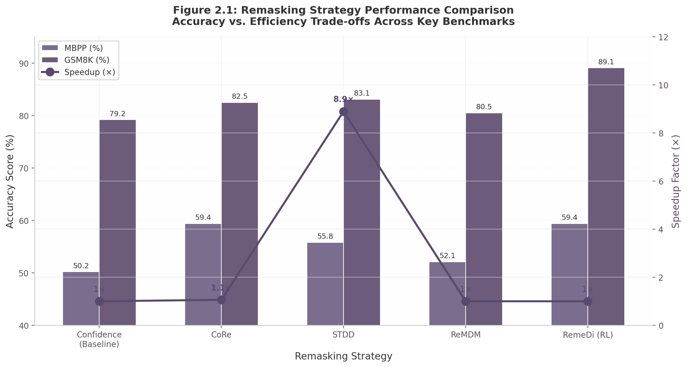

## 2. Technical Foundations of Diffusion Language Models

The adaptation of diffusion models from continuous image domains to discrete language domains represents one of the most significant architectural shifts in generative modeling over the past three years. Where diffusion originally operated on the principle of progressively denoising Gaussian-corrupted pixels, language generation requires reasoning over discrete token vocabularies. This fundamental mismatch — continuous versus discrete state spaces — has driven the development of multiple competing paradigms, each with distinct mathematical formulations and empirical trade-offs. This chapter examines the three architectural families that have emerged: discrete diffusion over token spaces, embedding-space diffusion with rounding, and masked diffusion models (MDMs) that have rapidly become the dominant implementation choice for production systems.

### 2.1 From Images to Text: Adapting Diffusion for Discrete Data

#### 2.1.1 The Core Challenge: From Pixels to Tokens

Diffusion models, as originally formulated for image generation, operate in continuous Euclidean space where the forward process gradually injects Gaussian noise into pixel-valued tensors and the reverse process learns to denoise them. Text, by contrast, is fundamentally discrete: a vocabulary of tokens $\mathcal{V}$ (typically 32,000 to 100,000 entries in modern subword tokenizers) forms a finite, unordered state space. Applying Gaussian noise to a discrete token ID produces a meaningless real-valued vector, and no natural notion exists for "partially noising" a token in the same way that a pixel can be incrementally corrupted toward $\mathcal{N}(0, I)$.

Two principal strategies have emerged to resolve this incompatibility. The first, **discrete diffusion**, defines the forward process as a Markov chain over the finite vocabulary using a transition matrix $\mathbf{Q}_t$ that stochastically maps each token to other tokens or a special [MASK] state at each timestep. The second, **embedding-space diffusion**, maps tokens to continuous vector representations, applies standard Gaussian diffusion in that continuous space, and rounds the final continuous vectors back to discrete tokens at the end of the reverse process. Both approaches have demonstrated strong empirical results, though masked diffusion — a specific discrete formulation — has come to dominate the practical landscape.

#### 2.1.2 Discrete Diffusion: Markov Chains over Vocabulary Space

The discrete diffusion formulation, introduced by D3PM (Discrete Denoising Diffusion Probabilistic Models) and subsequently refined by SEDD (Score Entropy Based Discrete Diffusion), defines the forward process through a series of transition matrices. At each timestep $t$, the distribution over tokens is computed as $\mathbf{x}_t \sim \mathbf{Q}_t \mathbf{x}_{t-1}$, where $\mathbf{Q}_t \in \mathbb{R}^{|\mathcal{V}| \times |\mathcal{V}|}$ governs how each token transitions to other vocabulary entries or to an absorbing [MASK] state. The training objective simplifies under certain conditions to a weighted cross-entropy loss integrated over masking rates:

$$\mathcal{L}_{\text{CE}}(\theta) = \mathbb{E}_{t \sim U(0,1), \mathbf{x}_t} \left[ -\sum_{i} w(t) \log p_\theta(x_0^{(i)} \mid \mathbf{x}_t, t) \right]$$

where $w(t)$ is a timestep-dependent weighting function and $\mathbf{x}_t$ represents the partially masked or corrupted sequence. This formulation has the practical advantage that training reduces to a form of masked language modeling, which can leverage the same infrastructure developed for BERT-style pretraining. The denoising model $p_\theta$ learns to predict the original token at each position given the corrupted context, and the objective closely resembles the cross-entropy loss used in autoregressive (AR) language modeling — albeit with bidirectional rather than unidirectional context.

Discrete diffusion models of this family have demonstrated strong scaling properties and remain the dominant paradigm at scale. Standard masked diffusion models (MDMs) empirically require approximately 16 times more compute than autoregressive models to match validation loss under standard single-epoch training regimes [^622^]. However, subsequent innovations have narrowed this gap substantially: MDM-Prime (v1), published at NeurIPS 2025, achieved a perplexity of 15.36 on OpenWebText (OWT), surpassing autoregressive baselines at 17.54 — the first MDM-based approach to do so without autoregressive formulation [^637^].

#### 2.1.3 Embedding-Space Diffusion: Continuous Flows with Rounding

The alternative approach maps discrete tokens to continuous embeddings, applies standard Gaussian diffusion or flow matching in the embedding space, and rounds back to discrete tokens at the final timestep. Two landmark models — LangFlow and ELF — have demonstrated that this approach can now match or exceed discrete diffusion on standard benchmarks, marking a reversal from earlier results where continuous-space models consistently lagged their discrete counterparts.

**LangFlow** is the first continuous diffusion language model to surpass state-of-the-art discrete diffusion models on multiple standard language modeling benchmarks [^529^]. Its core theoretical contribution is connecting embedding-space diffusion to Flow Matching via Bregman divergence. For any convex function $f$, the training objective becomes:

$$\mathcal{L}_f(\theta) = \mathbb{E}_{\gamma \sim \pi, z_\gamma} \left[ \frac{1}{L} \sum_{i=1}^{L} \mathcal{D}_f\left(\mathbf{1}_{x^{(i)}}, \hat{\mathbf{x}}_{\theta}^{(i)}(z_\gamma, \gamma)\right) \right]$$

where $\mathcal{D}_f$ denotes the Bregman divergence and $\gamma$ is the log-noise-to-signal ratio sampled from an information-uniform noise schedule [^528^]. LangFlow achieves a perplexity of 30.0 on LM1B and 24.6 on OWT, surpassing all uniform-state discrete diffusion baselines and matching masked diffusion performance [^529^]. Notably, LangFlow's profiling reveals that the optimal noise schedule for language follows a Gumbel distribution over $\gamma$ — a finding that "greatly differs from conclusions in the image generation domain" [^529^] — motivating a learnable scheduler grounded in this distributional form.

**ELF** (Embedded Language Flows), from Kaiming He's team at MIT, takes a different design path. Rather than jointly training embeddings with the diffusion model as LangFlow does, ELF operates on **frozen pretrained embeddings** from a T5 encoder. The denoising process stays entirely within the continuous embedding space until the final timestep, where a shared-weight network maps representations back to discrete tokens [^531^]. This design choice yields remarkable training efficiency: ELF-B (105M parameters) achieves a generative perplexity of approximately 24.1 on OWT with only 32 sampling steps, while using **10 times fewer training tokens** than comparable models (45B versus 500B+ tokens) [^532^] [^530^]. ELF is also the only method to simultaneously employ continuous-time Flow Matching, frozen pretrained encoder representations, no per-step discretization during training or inference, and no separate decoder [^531^].

**Table 2.1: Discrete versus Continuous Diffusion Approaches for Language Modeling**

| Aspect | Discrete Diffusion (D3PM/SEDD/MDLM) | Continuous Diffusion (LangFlow/ELF) |
|:---|:---|:---|
| State space | Finite vocabulary with [MASK] absorbing state | Continuous embedding vectors |
| Forward process | Markov chain via transition matrix $\mathbf{Q}_t$ | Gaussian noise / flow interpolation in embedding space |
| Training objective | Weighted cross-entropy over token predictions | Bregman divergence flow matching (LangFlow); standard FM (ELF) |
| Embedding strategy | Token embeddings learned jointly | Jointly trained (LangFlow); frozen pretrained T5 (ELF) |
| Noise schedule | Cosine / learned over discrete timesteps | Gumbel-distributed $\gamma$ (LangFlow); linear rectified flow (ELF) [^529^] [^531^] |
| Perplexity (OWT) | 15.36 (MDM-Prime v1) [^637^] | 24.6 (LangFlow), ~24.1 (ELF-B) [^529^] [^530^] |
| Training data efficiency | Standard (requires ~16× compute vs. AR) [^622^] | ELF uses 10× fewer tokens than comparables [^532^] |
| Classifier-free guidance | Not directly applicable | Native compatibility via continuous space [^531^] |
| Key advantage | Mature ecosystem, strong at scale | Training efficiency, image-domain technique transfer |

The choice between discrete and continuous paradigms involves fundamental trade-offs. Discrete diffusion models benefit from a more mature training infrastructure and have demonstrated stronger results at the largest scales (LLaDA 8B, MDLM), while continuous models offer superior training data efficiency and native compatibility with established image-domain diffusion techniques such as classifier-free guidance. The field has not yet converged on which design is fundamentally superior [^539^] [^536^].

### 2.2 Masked Diffusion: The Dominant Paradigm

While both discrete and continuous formulations remain active research areas, a specific variant of discrete diffusion — **masked diffusion language models (MDLMs)** — has emerged as the dominant paradigm for production-scale diffusion language models. MDLMs simplify the general discrete diffusion framework by restricting the forward process to a single operation: masking tokens. Rather than allowing arbitrary token-to-token transitions through a full transition matrix, the forward process merely replaces each token with a special [MASK] token according to a learned or scheduled masking rate.

#### 2.2.1 MDLM: Simplifying Diffusion to Masked Language Modeling

MDLM (Masked Diffusion Language Models) demonstrated that a simplified formulation, where training reduces to masked language modeling with a learned masking schedule, achieves state-of-the-art results among diffusion models at the GPT-2 scale. The training objective becomes a straightforward cross-entropy loss: the model learns to predict the original tokens at masked positions given the unmasked context. At inference time, the model starts from a fully masked sequence and iteratively unmasks tokens according to a learned or heuristic schedule.

The practical appeal of MDLM is substantial. Because the training objective is structurally identical to BERT's masked language modeling objective, existing pretraining infrastructure — including data pipelines, distributed training frameworks, and optimizer configurations — requires minimal modification to implement masked diffusion. Furthermore, the masking schedule — determining what fraction of tokens are masked at each timestep — can be learned end-to-end or specified analytically, giving practitioners fine-grained control over the speed-quality trade-off during inference. This simplicity has made MDLM and its descendants the default choice for organizations building production diffusion language models.

#### 2.2.2 MD4: Forward-Backward Consistency and Learned Masking

MD4 (Masked Diffusion 4), presented at NeurIPS 2024 by Google DeepMind, advanced the MDLM framework with two key contributions. First, **mean parameterization** ensures mathematical consistency between the forward masking process and the reverse denoising process. In standard formulations, the model estimates the posterior distribution over clean tokens given a masked sequence, but this estimate may not be consistent with the actual forward process that generated the masked sequence. Mean parameterization constrains the reverse process to match the forward process in expectation, eliminating the training-inference mismatch that plagues simpler formulations where the model is trained to predict tokens under random masking but must generate under a structured unmasking schedule at inference time.

Second, **GenMD4** extends MD4 by optimizing state-dependent masking schedules via REINFORCE, allowing the model to learn which tokens to unmask at each step based on the current state of the partially decoded sequence. Rather than applying a fixed schedule that unmasks tokens at a predetermined rate, GenMD4 treats the masking decision as a policy optimization problem, using the REINFORCE gradient estimator to maximize expected generation quality. This learned schedule outperforms fixed schedules across standard benchmarks, particularly for longer sequences where early errors compound. Both MD4 and GenMD4 were open-sourced by Google DeepMind, establishing them as foundational reference implementations for the field.

#### 2.2.3 Block Diffusion: The Pragmatic Production Compromise

In practice, fully parallel generation of all tokens simultaneously — while theoretically appealing — creates substantial engineering challenges. Chief among these is the incompatibility with KV caching, the inference acceleration technique that stores key-value activations from previously generated tokens to avoid redundant computation. Pure diffusion models generate tokens in an any-order fashion, making standard KV caching impossible because the model cannot assume a fixed generation order.

**Block diffusion** addresses this by dividing sequences into fixed-size blocks (typically 32 tokens) and applying bidirectional attention within each block while maintaining causal attention between blocks. This semi-autoregressive design enables KV cache compatibility — the prefix blocks can be cached as in standard AR inference — while preserving parallel generation within each block. Fast-dLLM v2, BD3-LM, SDAR, and I-DLM all converge on block-wise diffusion as the most deployable architecture [^669^] [^70^]. LLaDA2.0, Stable-DiffCoder, and Gemini Diffusion all employ block sizes of approximately 32 tokens at inference, suggesting this configuration represents a stable operational optimum rather than a temporary engineering workaround.

**Table 2.2: Evolution of Masked Diffusion Language Models**

| Model / Framework | Key Innovation | Contribution Type | Open Source | Institution |
|:---|:---|:---|:---|:---|
| MDLM (2024) | Simplified to masked LM with learned schedule | Foundation | Yes | Cornell / Kuleshov group |
| MD4 (NeurIPS 2024) | Mean parameterization; forward-backward consistency | Architecture | Yes | Google DeepMind |
| GenMD4 | State-dependent masking via REINFORCE | Learned inference | Yes | Google DeepMind |
| MDM-Prime v1 (NeurIPS 2025) | Partial masking; first MDM to surpass AR on OWT [^637^] | Architecture | Yes | Academic |
| Block Diffusion (2025) | Bidirectional within blocks, causal between blocks | Engineering | Yes | Multiple |
| LLaDA (2025) | 8B-parameter open-source DLM; 2.3T training tokens | Scale | Yes | GSAI-ML |
| LLaDA2.0 (2025) | Block size 32; WSD conversion from AR models | Production | Yes | Ant Group |

The progression from MDLM to MD4 to production deployments like LLaDA2.0 and Gemini Diffusion illustrates a clear trend: the field is converging on block-wise masked diffusion as the canonical architecture for production language models. This convergence reflects a pragmatic compromise between the theoretical ideal of fully parallel generation and the engineering constraints of production serving infrastructure.

### 2.3 Remasking and Decoding Strategies

The defining characteristic of diffusion language models during inference is their iterative nature: tokens are not committed in a single forward pass but are generated through a sequence of denoising steps, each of which may revise previously unmasked tokens. This iterative refinement is both a strength — enabling error correction during generation — and a critical bottleneck, as the choice of which tokens to revise (remask) at each step profoundly impacts both output quality and generation speed.

#### 2.3.1 Remasking as the Critical Quality-Determining Step

The standard decoding strategy for masked diffusion models proceeds as follows: at each step, the model predicts logits for all currently masked positions, samples tokens from these distributions, and adds them to the partially decoded sequence. A **remasking** strategy then selects which tokens — including previously unmasked ones — should be re-masked before the next denoising iteration. This remasking decision is the single most important inference-time choice for diffusion language model quality.

The simplest and most widely used approach is **low-confidence remasking**: tokens whose predicted probability falls below a fixed or dynamic threshold are selected for revision. While intuitive, this approach has a significant limitation: a token may have high predicted probability yet still be incorrect if the surrounding context is itself unreliable. CoRe (Context-Robust Remasking) demonstrated that standard confidence-based strategies can actually **degrade** performance on code generation tasks [^182^].

CoRe addresses this by framing remasking as a distributionally robust optimization problem. Rather than ranking tokens by their raw confidence scores, CoRe performs a lightweight stress test: it evaluates whether each token remains strongly predicted when parts of its surrounding context are masked. Tokens whose likelihood drops substantially under context perturbation are flagged as "context-brittle" and prioritized for revision [^182^]. This training-free framework achieves a **+9.2% improvement on MBPP** accuracy while adding only approximately 6% more forward passes than standard decoding [^182^]. The gains are validated by compute-matched controls where random or margin-based revision yields negligible improvement, confirming that the context-robust selection criterion itself drives the quality improvement [^182^].

**STDD** (Spatio-Temporal Dynamics-Driven Token Refinement) takes a different approach by detecting each token's temporal variance (convergence status) and spatial deviance (inter-token correlations) to adaptively adjust the confidence threshold for every token at every step [^527^]. When integrated with LLaDA-Instruct-8B, STDD achieves **8.9× speedup on MBPP** — far surpassing Fast-dLLM's 4.15× and DUS's 2.70× — while simultaneously improving accuracy from 79.2 to 83.1 on GSM8K [^527^]. The key insight underlying STDD is that mainstream remasking strategies rely on a single global confidence threshold, overlooking the fact that individual tokens converge at different rates and have different dependency structures [^527^].

The chart above illustrates the fundamental trade-off landscape in remasking strategy design. RemeDi achieves the highest raw accuracy through reinforcement learning-driven remasking but offers no speedup. STDD achieves the best efficiency-quality frontier, delivering both the highest speedup and strong accuracy. CoRe occupies a middle ground, trading modest compute overhead (~6%) for substantial quality gains on structure-sensitive tasks. The baseline confidence strategy is strictly dominated: it offers the lowest accuracy and no speed advantage.

#### 2.3.2 Key Finding: Confidence-Based Remasking Can Degrade Code Performance

CoRe's finding that "standard confidence-based remasking strategies (e.g., ReMDM) can degrade code performance in our experiments" represents a significant challenge to the field's default practice [^182^]. Code generation is particularly sensitive to this issue because programming languages have rigid syntactic constraints — a single misplaced bracket or incorrect variable reference can render an entire function uncompilable. Confidence scores at the token level do not capture these structural dependencies. A token may be individually high-confidence (the model strongly predicts a closing brace) yet contextually wrong (the brace closes the wrong scope).

This limitation has driven interest in structure-aware alternatives. TreeDiff, for instance, incorporates Abstract Syntax Tree (AST)-aware masking for code generation, achieving a **13.3% relative improvement** over random masking on HumanEval+ by selectively masking tokens belonging to key AST nodes using a tiered weighting scheme [^269^] [^615^]. Lower weights are assigned to structural elements (imports, function definitions) while higher weights target logic and control flow tokens, preserving program skeletons during the diffusion process [^269^].

#### 2.3.3 RemeDi: RL-Superior Remasking via Self-Reflection

**RemeDi** (Remasking-enabled Diffusion Language Model) represents the most sophisticated remasking approach developed to date, achieving **89.1% on GSM8K**, 52.9% on MATH, 73.2% on HumanEval, and 59.4% on MBPP — state-of-the-art among open-source diffusion language models at the time of publication [^186^]. RemeDi's architecture jointly predicts token distributions and per-token confidence scores, with an Unmasking Policy Stream (UPS) attached to a base LLaDA model. At each diffusion step, high-confidence tokens are unmasked while low-confidence ones are re-masked, regardless of whether they have been previously unmasked [^186^].

The critical innovation is a **two-stage training pipeline**: Remask SFT followed by Remask RL. In the first stage, the model learns to identify and remask incorrect tokens while simultaneously predicting masked tokens, using sequences constructed by randomly masking tokens or replacing them with random alternatives. The second stage applies outcome-based reinforcement learning, optimizing entire generation trajectories toward higher rewards by learning how to remask and predict tokens at each step [^186^]. This reinforcement learning stage is what elevates RemeDi above all other remasking approaches: the RL optimization discovers remasking policies that are not accessible through hand-designed heuristics. The UPS parameters use a higher learning rate ($2.0 \times 10^{-5}$) than original model parameters ($2.0 \times 10^{-6}$), enabling rapid adaptation of the remasking policy [^186^].

**Table 2.3: Remasking Strategy Comparison**

| Strategy | Type | Overhead | MBPP Gain | GSM8K Gain | Key Mechanism | Training-Free |
|:---|:---|:---|:---|:---|:---|:---|
| Confidence (baseline) | Low-confidence threshold | None | Baseline | Baseline | Fixed threshold on predicted probability | Yes |
| CoRe [^182^] | Context-robust selection | ~6% forward passes | +9.2% | +3.3% | Perturbation-based brittleness detection | Yes |
| STDD [^527^] | Spatio-temporal dynamics | None (speedup) | +5.6% | +3.9% | Per-token adaptive threshold from convergence/deviance | Yes |
| ReMDM | Principled resampling | ~1-2× baseline | +1.9% | +1.3% | Inference-time scaling via resampling | Yes |
| RemeDi [^186^] | RL-trained policy | RL training stage | +9.2% | +9.9% | Two-stage SFT+RL with dedicated UPS stream | No |

The diversity of approaches and their significant quality impacts indicate that remasking strategy may matter as much as training for diffusion language model performance. Inference-time strategy design has become as active a research frontier as training methodology. Several broader trends emerge from this landscape: training-inference alignment is becoming a central theme (PAPL's planner-aware ELBO achieves up to 4× MAUVE improvement with a one-line code change) [^225^]; post-training adaptation is proving remarkably effective (SCMDM achieves 50% perplexity reduction with only 3.25B post-training tokens) [^575^]; and structure-aware approaches show particular promise for code generation where syntax constraints create unique challenges.

### 2.4 Any-Order Generation and Self-Correction

#### 2.4.1 Core Advantage: Iterative Refinement and Error Correction

The fundamental architectural advantage of diffusion language models over autoregressive models is the ability to generate tokens in any order and to revise previously generated tokens during the generation process. Autoregressive models commit to each token permanently once it is generated; errors propagate irreversibly down the sequence. Diffusion models, by contrast, can revisit and correct early errors as the sequence converges, a property that has been described as "self-correcting generation."

This property is particularly valuable for tasks where global consistency matters more than local fluency. Code generation exemplifies this: a function must have consistent variable names, matching brackets, and type-correct assignments across the entire body. The ability to generate a rough draft of the full function and then iteratively refine details is a natural fit for diffusion's any-order capability. Stable-DiffCoder's 60.0% accuracy on CanItEdit versus Seed-Coder's 50.5% — an 18.8% relative advantage — is attributed in part to this structural editing capability [^269^] [^615^].

#### 2.4.2 Self-Conditioning: Conditioning on Previous Predictions

**SCMDM** (Self-Conditioned Masked Diffusion Models) demonstrates that a lightweight post-training adaptation — conditioning each denoising step on the model's own previous clean-state predictions — can dramatically improve generation quality with minimal architectural modification. SCMDM achieves nearly a **50% reduction in generative perplexity** on OpenWebText-trained models: from 42.89 to 23.72 at 1000 sampling steps, using only 3.25B additional post-training tokens on a model pretrained for 262B tokens [^575^] [^580^].

The key technical insight is that in standard masked diffusion, if a token remains masked after a reverse update, the model discards its clean-state prediction for that position. Still-masked positions must therefore be repeatedly inferred from the mask token alone at each step. SCMDM carries the clean-state distribution forward from previous steps, enabling still-masked positions to be refined incrementally [^575^]. Critically, SCMDM's experiments reveal that **full self-conditioning consistently outperforms partial self-conditioning** in the post-training regime. While partial conditioning (rate=0.5) improves over vanilla MDLM (generative perplexity 42.89 to 37.04), full self-conditioning achieves 23.72 — a massive additional improvement [^580^]. This finding contradicts the "commonly used 50% dropout strategy" from continuous diffusion and reveals a refinement-specialization effect that had not been previously characterized [^575^].

At inference time, SCMDM requires no additional forward passes — the clean-state prediction from step $t+1$ is reused as the self-conditioning input at step $t$ — making it a zero-overhead post-training optimization [^575^]. The method generalizes across domains, improving CIFAR-10 FID from 86.48 to 78.59 in discrete image synthesis and showing gains in small molecule generation and genomic sequence modeling [^575^].

#### 2.4.3 Theoretical Limitations: Linear Steps for Reasoning Tasks

Despite the practical advantages of any-order generation, theoretical analysis has identified important limitations. Feng et al. proved that masked diffusion models require a **linear number of steps** (in sequence length) to achieve a low sequence-level error rate on reasoning tasks, effectively eliminating the speed advantage of parallel generation for that task class. This result arises because reasoning tasks require each token to be conditionally dependent on the correct resolution of preceding logical steps; generating steps out of order creates dependency violations that can only be resolved through sufficient iterative refinement.

This theoretical finding aligns with empirical observations on competitive programming benchmarks. The Beyond Autoregression study found that diffusion models average 14.9% on LiveCodeBench versus 18.9% for autoregressive models [^614^] — a gap attributed in part to the sequential reasoning demands of competitive programming problems, where each step in a proof or algorithm construction depends critically on the correct resolution of all prior steps. Conversely, diffusion models excel on tasks that benefit from global restructuring, such as code editing (CanItEdit) and long-context infilling, where the any-order generation capability provides genuine advantage over left-to-right AR generation by enabling the model to draft a complete solution and then revise structurally inconsistent portions.

The practical implication is that diffusion language models may find their strongest niche in applications requiring iterative refinement and global restructuring — code editing, document revision, creative writing — rather than in tasks demanding strictly sequential reasoning. Block diffusion architectures partially mitigate this limitation by imposing causal structure across blocks while maintaining parallel generation within each block, but the fundamental trade-off between parallelism and sequential dependency resolution remains an active area of investigation.

The tension between diffusion's bidirectional flexibility and the sequential structure of certain tasks has also motivated hybrid approaches. I-DLM (Introspective Diffusion Language Model) moves closer to autoregressive behavior by employing causal attention with logit shift, achieving the first diffusion language model to match autoregressive quality with only 4.5B training tokens [^70^]. This convergence suggests that the architectural boundary between autoregressive and diffusion models is blurring, with future production systems likely to incorporate elements of both paradigms optimized for specific task requirements.
