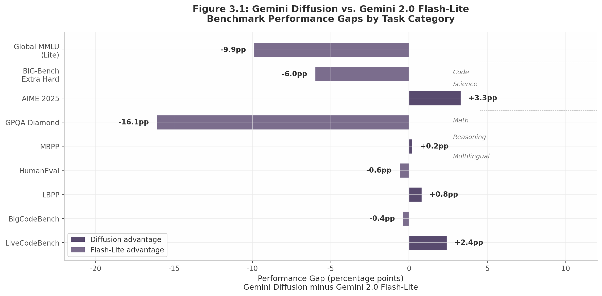

## 3. Google DeepMind: From MD4 to Gemini Diffusion

Google DeepMind's diffusion language model program represents one of the most systematic corporate research efforts to challenge autoregressive (AR) dominance in large language model (LLM) text generation. Beginning with foundational theoretical work in mid-2024, advancing through conversion methodology research, and culminating in the experimental release of Gemini Diffusion at Google I/O 2025, DeepMind has pursued a multi-pronged strategy that combines theoretical simplification, empirical transfer learning, and production-scale architecture engineering. This chapter examines each of these research streams in detail, tracing the intellectual lineage from the MD4 theoretical framework through the AR2Diff conversion paradigm to the production block diffusion architecture of Gemini Diffusion.

### 3.1 Research Lineage and Key Contributors

#### 3.1.1 A Compressed Timeline of Theoretical and Engineering Progress

DeepMind's diffusion text generation program developed across an exceptionally compressed eighteen-month window, from January 2024 to May 2025. Four milestones define this trajectory, each building upon or complementing the prior contributions.

The first milestone, AR2Diff (January 2024), established the feasibility of converting pretrained AR models into diffusion models through lightweight adaptation [^62^]. This was followed by MD4 (June 2024, NeurIPS), which provided the foundational theoretical framework for masked diffusion on discrete data, including a dramatically simplified training objective and mean parameterization [^348^]. Between MD4 and Gemini Diffusion, the CANDI framework (approximately December 2024) addressed the theoretical problem of coupling discrete and continuous diffusion processes, identifying and resolving what its authors termed "temporal dissonance" between discrete corruption and continuous denoising [^319^]. Finally, Gemini Diffusion (May 2025, Google I/O) represented the first production-scale diffusion LLM from DeepMind, demonstrating 1,479 tok/s average throughput with block diffusion architecture [^272^].

| Milestone | Date | Venue | Core Contribution | Key Authors |
|---|---|---|---|---|
| AR2Diff | Jan 2024 | arXiv | AR-to-diffusion conversion via SUNDAE loss; prefix LM + decoder-only as optimal architecture | Kehang Han, Kathleen Kenealy, Aditya Barua, Noah Fiedel, Noah Constant [^62^] |
| MD4 | Jun 2024 | NeurIPS 2024 | Simplified continuous-time ELBO to weighted cross-entropy integral; mean parameterization; GenMD4 state-dependent masking | Jiaxin Shi*, Kehang Han*, Zhe Wang, Arnaud Doucet, Michalis K. Titsias [^348^] |
| CANDI | ~Dec 2024 | arXiv (Oct 2025) | Hybrid discrete-continuous diffusion; resolved temporal dissonance; outperforms masked diffusion at low NFE | Patrick Pynadath, Jiaxin Shi, Fuheng Zhang [^319^] |
| Gemini Diffusion | May 2025 | Google I/O 2025 | Block diffusion with intra-block bidirectional + inter-block causal attention; 1,479 tok/s; ~5x faster than Flash-Lite | DeepMind Gemini team (Brendan O'Donoghue, Oriol Vinyals, Jack Rae) [^272^] |

Table 3.1: DeepMind diffusion language model research timeline, January 2024–May 2025. Each milestone built directly upon prior work: AR2Diff established the conversion paradigm; MD4 provided the theoretical foundation; CANDI resolved discrete-continuous coupling; Gemini Diffusion integrated all prior insights into a production system.

This timeline reveals a deliberate research strategy: theoretical simplification (MD4) preceded empirical validation (AR2Diff's conversion experiments), which in turn preceded architectural integration (Gemini Diffusion). The CANDI contribution, though published later, filled a theoretical gap between MD4's discrete formulation and Gemini Diffusion's hybrid implementation. Specifically, CANDI addressed "temporal dissonance"—a phenomenon where continuous diffusion underperforms on discrete data because, at noise levels where discrete corruption preserves enough structure for conditional learning, continuous denoising is trivial, and vice versa [^319^]. By decoupling discrete and continuous corruption, CANDI enabled simultaneous learning of conditional structure and continuous geometry, outperforming masked diffusion at low Number of Function Evaluations (NFE) [^319^]. This property directly supports Gemini Diffusion's ability to achieve high-quality output with relatively few denoising steps.

Notably, Jiaxin Shi and Kehang Han appear as co-first authors on MD4, while Han also led AR2Diff, indicating DeepMind's investment in a cohesive research group rather than disconnected projects. The overlapping authorship across MD4, AR2Diff, and Gemini Diffusion suggests that theoretical insights flowed directly into engineering decisions, rather than being developed in isolation.

#### 3.1.2 Key Researchers and Institutional Vision

The intellectual leadership behind DeepMind's diffusion program spans theoretical research, engineering implementation, and executive sponsorship. Five individuals stand out as particularly influential.

**Jiaxin Shi**, research scientist at Google DeepMind and first author of MD4, is the program's primary theoretical architect. A Tsinghua PhD with postdoctoral experience at Stanford and Microsoft Research, Shi described masked diffusion in a 2024 LoG New York Meetup talk as "a simple and general framework that unlocks the full potential of diffusion models for discrete data" [^357^]. His work on MD4 established the simplified variational objective and mean parameterization that likely underpin Gemini Diffusion's training.

**Kehang Han**, Shi's co-first author on MD4 and lead author of AR2Diff, directed the empirical validation of diffusion conversion at scale. Han's AR2Diff paper demonstrated that lightweight adaptation from AR checkpoints could produce competitive diffusion models at 280M–1.7B parameter scales, establishing the conversion paradigm later adopted by LLaDA2.0 and other systems [^62^].

**Brendan O'Donoghue**, research scientist at DeepMind and a lead on the Gemini Diffusion project, served as the program's primary public-facing technical authority. In a June 2025 interview, O'Donoghue articulated four major technical advantages of diffusion over AR generation: lower latencies through parallel generation, adaptive computation that scales with task difficulty, non-causal reasoning via bidirectional attention, and iterative self-correction during the denoising process [^37^]. He also acknowledged two disadvantages: higher serving costs due to multiple forward passes per denoising step, and elevated Time-to-First-Token (TTFT) since "the first token can only appear when the entire sequence of tokens is ready" [^37^].

**Oriol Vinyals**, VP of Research and Deep Learning Lead at DeepMind and Co-Head of the Gemini project, provided executive-level endorsement. Vinyals stated, "It's been a dream of mine to remove the need for 'left to right' text generation," positioning diffusion as a long-term strategic direction rather than an isolated experiment [^419^]. The model's demo at Google I/O ran so fast that the presentation team had to slow the video down to make it watchable [^419^].

**Jack Rae**, Principal Scientist at DeepMind, characterized Gemini Diffusion as a "landmark moment," noting that "until now, autoregressive models had consistently outperformed diffusion models in text quality, and it wasn't clear whether that gap could ever be closed" [^419^]. This assessment frames Gemini Diffusion as achieving near-parity with production AR models for the first time at a major AI lab.

### 3.2 MD4: The Foundational Framework

MD4 (Masked Diffusion 4, subtitled "Simplified and Generalized Masked Diffusion for Discrete Data") was published at NeurIPS 2024 and provides the theoretical foundation for DeepMind's diffusion language model work [^348^]. Its three technical contributions—a simplified training objective, mean parameterization, and state-dependent masking—each address critical bottlenecks in discrete diffusion training.

#### 3.2.1 Simplified Continuous-Time ELBO to Weighted Cross-Entropy

The central theoretical result of MD4 is that the continuous-time Evidence Lower Bound (ELBO) for masked diffusion models simplifies to a weighted integral of cross-entropy losses. Formally, the training objective becomes:

$$L = \int_0^1 w(t) \cdot \text{CE\_loss}(t) \, dt$$

where $w(t)$ is a time-dependent weighting factor related to the signal-to-noise ratio (SNR) at diffusion timestep $t$, and $\text{CE\_loss}(t)$ is the standard cross-entropy loss evaluated at the masking rate determined by $t$ [^348^].

This simplification is operationally significant. Prior masked diffusion formulations required specialized loss functions with complex per-timestep weighting schemes. MD4 showed that the theoretically correct objective is, in essence, cross-entropy averaged over masking schedules—an objective that requires no new infrastructure for teams already training AR language models. As the authors noted, the continuous-time variational objective reduces to "a simple weighted integral of cross-entropy losses" [^348^]. This result lowered the barrier to entry for diffusion language model training and enabled the AR2Diff conversion methodology discussed in Section 3.3.

The weighting function $w(t)$ encodes the relative importance of different noise levels during training. At low noise (few masked tokens), the model learns fine-grained token prediction; at high noise (many masked tokens), the model learns coarse structure. The integral formulation ensures balanced learning across all noise regimes.

#### 3.2.2 Mean Parameterization Replacing Score Parameterization

MD4's second contribution introduces mean parameterization to replace the conventional score parameterization used in continuous diffusion models. Score parameterization, standard in diffusion models for continuous data (images, audio), estimates the gradient of the log-density with respect to the input. For discrete data—where gradients are undefined—this requires approximations that introduce training instability.

Mean parameterization directly parameterizes the expected value of the clean data given the noised state, ensuring consistency between the forward corruption process and the backward denoising process [^362^]. This forward-backward consistency eliminates a class of training instabilities that plagued earlier discrete diffusion formulations, particularly at extreme noise levels where score estimates become unreliable. By predicting the mean rather than the score, MD4's parameterization naturally respects the discrete support of text tokens, avoiding the "score truncation" artifacts that occur when continuous score estimates are discretized.

#### 3.2.3 GenMD4: State-Dependent Masking via REINFORCE

The generalized MD4 framework (GenMD4) extends the basic formulation by allowing each token's unmasking probability to depend not only on the diffusion timestep but also on the token's identity. As the authors explain, "the probability of unmasking a token depends not only on time, but also on the token's value" [^349^]. This means common tokens (e.g., punctuation, frequent words) and rare tokens (e.g., technical terms, proper nouns) can follow different corruption schedules optimized for their statistical properties.

The forward transition in GenMD4 is defined as $q(x_t | x_s) = \text{Cat}(x_t; Q(s,t)^T x_s)$, where $Q(s,t)$ incorporates state-dependent rates through an $\alpha_t$ vector function [^349^]. The masking schedule parameters themselves are learned, not hand-designed, using a REINFORCE leave-one-out estimator to compute low-variance unbiased gradients [^349^]. This is a notable departure from prior work where masking schedules were either uniform or followed fixed heuristics (e.g., cosine, linear).

Empirically, MD4 achieved state-of-the-art results among diffusion models at GPT-2 scale on 4 out of 5 zero-shot language modeling tasks on OpenWebText [^348^]. On the character-level text8 benchmark, it attained the best Bits Per Character (BPC) result among diffusion models, while on CIFAR-10 it achieved 2.75 Bits Per Dimension (BPD)—better than autoregressive models of similar sizes. On ImageNet 64x64, it reached 3.40 BPD, comparable to larger Transformer AR models [^348^]. These cross-domain results (text, character-level language, images at two resolutions) demonstrate that MD4's framework generalizes beyond any single modality.

The open-source JAX implementation (github.com/google-deepmind/md4) has enabled follow-on research across the broader diffusion LLM community. The repository includes full training and sampling algorithms for both text (OpenWebText) and image (CIFAR-10, ImageNet) datasets, with state-dependent masking schedule implementation using REINFORCE optimization [^348^]. This release follows DeepMind's broader pattern of publishing research openly, though notably, the specific block diffusion architecture used in Gemini Diffusion, the AR2Diff implementation, and the CANDI codebase remain closed-source.

The practical significance of MD4's theoretical simplification extends beyond DeepMind. By showing that the correct training objective is fundamentally a weighted cross-entropy integral, MD4 enabled practitioners to adapt existing AR training infrastructure—data pipelines, optimization schedules, distributed training frameworks—with minimal modification. The mean parameterization eliminated the need for score estimation tricks that complicated earlier discrete diffusion implementations, while GenMD4's learned masking schedules removed the manual tuning burden of designing corruption schedules. These simplifications collectively lowered the activation energy required for the broader research community to experiment with diffusion language models.

### 3.3 AR2Diff: Transfer Learning from Autoregressive Models

AR2Diff ("Transfer Learning for Text Diffusion Models"), published in January 2024, addressed a practical question that MD4's theoretical framework enabled: can the vast computational investment in pretrained AR models be transferred to diffusion models? [^62^]

#### 3.3.1 Three-Stage Conversion via SUNDAE Loss

The AR2Diff methodology prescribes a three-stage conversion pipeline. First, an AR decoder is pretrained with causal attention on a large text corpus. Second, this checkpoint is continued as a diffusion model with bidirectional attention enabled—this is the critical architectural modification, as it allows tokens to attend to future positions within the same training context. Third, the model is fine-tuned as a diffusion model on downstream tasks [^62^]. The paper denotes models by the number of additional pretraining steps in stage two (AR2Diff_N, where N ranges from 0 to 100K).

The diffusion training uses a simplified variant of the SUNDAE (Structured Unified Noise Denoising Autoencoder) text diffusion loss [^62^]. SUNDAE itself builds upon the MD4 theoretical framework by providing a concrete non-AR training objective that preserves the pretrained knowledge embedded in AR checkpoints. The key architectural change—enabling bidirectional attention during diffusion training—transforms a causal decoder into a full bidirectional encoder-decoder during the diffusion phase.

Models were tested at three scales: Base (280M parameters), Large (approximately 700M parameters), and XL (1.7B parameters), using a pretraining mixture of 80% multilingual web pages and 20% Python code [^62^].

#### 3.3.2 Optimal Architecture: Decoder-Only with Prefix LM Objective

Through extensive architectural ablations, AR2Diff identified a consistent winner: "training a decoder-only model with a prefix LM objective is best or near-best across several tasks" [^302^]. This finding directly informed subsequent DeepMind diffusion architectures, including Gemini Diffusion's design.

| Method | Size | WMT14 En-Fr (BLEU) | SQuAD (F1) | MBPP (Pass@80%) |
|---|---|---|---|---|
| Autoregressive | Base (280M) | 33.27 | 68.11 | 5.5 |
| Diffusion (from scratch) | Base | 29.83 | 77.41 | 12.2 |
| AR2Diff_0 | Base | 29.62 | 64.77 | 1.1 |
| AR2Diff_10K | Base | 29.41 | 68.12 | 4.4 |
| AR2Diff_100K | Base | 29.92 | 71.87 | 7.7 |
| Autoregressive | Large (~700M) | 34.92 | 78.43 | 15.5 |
| Diffusion (from scratch) | Large | 29.36 | 80.56 | 12.2 |
| AR2Diff_100K | Large | 32.20 | 80.71 | 10.0 |
| Autoregressive | XL (1.7B) | 35.48 | 84.08 | 15.5 |
| Diffusion (from scratch) | XL | 29.30 | 82.78 | 18.8 |
| AR2Diff_100K | XL | 32.55 | 83.54 | 15.5 |

Table 3.2: AR2Diff performance comparison across three model scales and training methodologies [^62^]. Diffusion models (trained from scratch) outperform AR on SQuAD and MBPP at all scales. AR2Diff_N improves monotonically with conversion steps N, approaching AR quality on generation tasks while retaining diffusion advantages on discriminative tasks.

The table reveals several important patterns. On SQuAD (reading comprehension), diffusion models consistently outperform AR: 77.41 vs. 68.11 at Base, 80.56 vs. 78.43 at Large, and 82.78 vs. 84.08 (near parity) at XL. On MBPP (code synthesis), diffusion achieves 18.8% at XL compared to AR's 15.5%—a 21% relative improvement [^62^]. However, on WMT14 En-Fr (machine translation), AR maintains a consistent advantage across all scales, suggesting that generation tasks requiring strict left-to-right coherence benefit less from diffusion's bidirectional structure.

The AR2Diff_N models show monotonic improvement with additional conversion steps (N), with AR2Diff_100K approaching or exceeding the AR baseline on discriminative tasks (SQuAD) while remaining below it on pure generation tasks (WMT). This suggests that the conversion process preserves AR knowledge for generation while unlocking diffusion-specific capabilities for bidirectional understanding.

#### 3.3.3 Significance: The Conversion Paradigm

AR2Diff's most lasting contribution is establishing that AR pretraining investment transfers to diffusion. This finding created the "conversion paradigm" adopted by LLaDA2.0 (converting Ling models), ByteDance's Stable-DiffCoder (converting Seed-Coder), and Apple's DiffuLLaMA (converting LLaMA-2) [^62^]. Rather than training diffusion models from scratch—a computationally expensive proposition—practitioners can leverage existing AR checkpoints and continue training with diffusion objectives.

The inference speed analysis further supports diffusion's practical potential: "as the decoding sequence length increases from 500 tokens (e.g., MBPP task) to 4,000 tokens, the speedup gained by diffusion (using 10 steps) increases from 10x to 30x" [^62^]. However, the paper also notes a caveat: a single AR step (14ms/token) was still faster than a single diffusion step (179ms/step) in their implementation, due to the lack of KV caching for diffusion—a limitation that subsequent work on block diffusion and Fast-dLLM has addressed.

AR2Diff's conversion paradigm carries broader strategic implications for the competitive landscape of foundation models. The finding that AR pretraining investment transfers to diffusion creates a structural advantage for organizations that have already invested in large-scale AR training—Google (Gemini), Ant Group (Ling/LLaDA), and ByteDance (Seed-Coder)—while making it harder for new entrants without strong AR base models to compete. The "moat" of expensive AR pretraining does not disappear in a diffusion future; it transfers. This dynamic explains why the most prominent open-source diffusion LLMs (LLaDA2.0, Stable-DiffCoder, DiffuLLaMA) all originate from organizations with substantial prior AR training infrastructure rather than from pure-play diffusion startups.

### 3.4 Gemini Diffusion: Production Deployment

Gemini Diffusion, announced at Google I/O on May 20, 2025, represents DeepMind's attempt to translate eighteen months of theoretical and empirical research into a production-scale diffusion language model [^272^]. It is the first diffusion LLM from a major AI lab to achieve near-parity with production AR models on real tasks. Its name positions it within the Gemini family, but its underlying architecture—block diffusion with iterative denoising—differs fundamentally from the autoregressive Transformers that power Gemini 2.5 Pro and Flash.

#### 3.4.1 Block Diffusion Architecture

Gemini Diffusion's defining architectural innovation is **block diffusion**: a hybrid attention pattern that combines intra-block bidirectional attention with inter-block causal attention [^297^]. Within each block (typically 32 tokens), every position can attend to every other unmasked position, enabling non-causal reasoning and global error correction. Between blocks, standard causal masking preserves the autoregressive structure needed for KV cache compatibility.

This design represents a pragmatic compromise between the ideal of fully parallel generation (all tokens simultaneously) and the operational reality of existing inference infrastructure. As O'Donoghue explained, the bidirectional attention "allows non-causal reasoning to take place and allows the model to make global edits within a block to produce more coherent text" [^37^]. The architecture also incorporates a U-Net-like encoder-decoder structure with skip connections to preserve low-level information across layers [^301^].

The block diffusion architecture enables two capabilities that fully parallel diffusion lacks: KV caching between blocks (reducing memory pressure during inference) and streaming generation (outputting completed blocks while subsequent blocks are still being processed). These properties make block diffusion compatible with existing LLM serving stacks, a crucial consideration for production deployment.

The convergence on block diffusion across all major production diffusion LLMs—Gemini Diffusion, LLaDA2.0 (block size 32), Stable-DiffCoder, and Inception Labs' Mercury—suggests this is not a temporary architectural compromise but the permanent production paradigm [^297^]. Block sizes of approximately 32 tokens have emerged as a de facto standard, large enough to enable meaningful parallel computation within each block while small enough to limit the coordination problem that plagues fully parallel generation. The U-Net encoder-decoder structure with skip connections, adopted from image diffusion architectures, enables information to flow across layers without degradation—a property particularly important for maintaining coherence in long-form text generation [^301^].

#### 3.4.2 Performance Specifications

Gemini Diffusion achieves 1,479 tokens/second average throughput across evaluated tasks, with overhead (TTFT) of 0.84 seconds from prompt input to generation start [^272^]. On programming tasks, it reaches up to 2,000 tokens/second even accounting for tokenization, prefill, and safety checks [^419^]. DeepMind reports this as approximately 5x faster than Gemini 2.0 Flash-Lite [^37^].

On code generation benchmarks, Gemini Diffusion demonstrates near-parity with Flash-Lite: 89.6% on HumanEval (vs. Flash-Lite's 90.2%), 76.0% on MBPP (vs. 75.8%), and 45.4% on BigCodeBench (vs. 45.8%) [^272^]. The 30.9% score on LiveCodeBench (v6) actually exceeds Flash-Lite's 28.5% [^272^]. These results support O'Donoghue's claim that "the gap between the two techniques is essentially closed in terms of benchmark performance, at least at the relatively small sizes we have scaled up to" [^37^].

A second defining operational feature is **adaptive computation**: the number of denoising steps automatically adjusts to task complexity. As O'Donoghue explained, "diffusion models will converge to a sequence of tokens at different rates depending on the task's difficulty. This allows the model to consume fewer resources (and have lower latencies) on easy tasks and more on harder ones" [^37^]. Unlike autoregressive models, which expend identical compute per token regardless of whether the task is trivial or complex, diffusion models can terminate early when the sequence has converged to a stable solution. This property is theoretically unique to diffusion and represents a potential efficiency advantage that has not yet been fully exploited in production systems.

A third defining feature is **iterative self-correction**: tokens sampled during the denoising process can be revised in subsequent steps. As O'Donoghue described, "the denoising process involves sampling, which can introduce errors just like in autoregressive models. However, unlike autoregressive models, the tokens are passed back into the denoiser, which then has an opportunity to correct the error" [^37^]. This property makes diffusion particularly suited for text editing applications, where O'Donoghue noted "diffusion models are uniquely applicable for scenarios where text needs to be modified in-place, such as grammar correction, adapting content for different personas, or integrating SEO keywords directly into existing drafts" [^56^]. Gemini Diffusion's "Instant Edit" mode enables precisely this workflow: users paste existing text and edit it in real-time with minimal prompting [^37^].

#### 3.4.3 Performance Gaps: The Coordination Problem

Despite strong code generation results, Gemini Diffusion exhibits significant deficits on benchmarks requiring deep reasoning, scientific knowledge, or multilingual capability.

| Benchmark | Category | Gemini Diffusion | Gemini 2.0 Flash-Lite | Gap (pp) |
|---|---|---|---|---|
| LiveCodeBench (v6) | Code | 30.9% | 28.5% | +2.4 |
| BigCodeBench | Code | 45.4% | 45.8% | -0.4 |
| LBPP (v2) | Code | 56.8% | 56.0% | +0.8 |
| HumanEval | Code | 89.6% | 90.2% | -0.6 |
| MBPP | Code | 76.0% | 75.8% | +0.2 |
| GPQA Diamond | Science | 40.4% | 56.5% | -16.1 |
| AIME 2025 | Mathematics | 23.3% | 20.0% | +3.3 |
| BIG-Bench Extra Hard | Reasoning | 15.0% | 21.0% | -6.0 |
| Global MMLU (Lite) | Multilingual | 69.1% | 79.0% | -9.9 |

Table 3.3: Gemini Diffusion vs. Gemini 2.0 Flash-Lite benchmark comparison [^272^]. Code generation shows near-parity (average gap: +0.5pp), while science reasoning (GPQA Diamond), complex reasoning (BIG-Bench Extra Hard), and multilingual tasks (Global MMLU) show substantial deficits. AIME 2025 is an exception where diffusion exceeds AR.

The 16.1 percentage point gap on GPQA Diamond (40.4% vs. 56.5%) is the largest deficit and the most significant barrier to diffusion adoption for scientific applications. Research on the "coordination problem" in parallel generation provides a theoretical explanation: "Think First, Diffuse Fast" demonstrated that diffusion models suffer from a coordination problem on multi-step reasoning—AR models build coherence token-by-token, while diffusion must coordinate all positions simultaneously [^89^]. The same study showed that plan conditioning (using an AR model to generate a plan that the diffusion model follows) improves diffusion LLM reasoning by +11.6 percentage points on GSM8K [^89^], suggesting that diffusion models need external sequential guidance for complex reasoning.

The visualization reveals a clear pattern: Gemini Diffusion excels at tasks where parallel processing and iterative refinement provide advantage (code generation, mathematics) while underperforming on tasks requiring sequential multi-step reasoning (science, complex reasoning) and fine-grained token-level control across diverse languages. The near-zero average gap on code benchmarks (+0.5pp) contrasts sharply with the double-digit deficits on science (-16.1pp), reasoning (-6.0pp), and multilingual (-9.9pp) tasks. This pattern suggests that diffusion's parallel generation paradigm is well-suited for structured outputs like code (where syntax enforces global consistency) but less suited for open-ended reasoning (where each step depends on the prior).

The AIME 2025 mathematics result (+3.3pp over Flash-Lite) is a notable exception. Mathematics problems, while requiring reasoning, have well-defined structure and verifiable answers—properties that may benefit from diffusion's iterative refinement. The model can sample multiple solution paths and correct errors during denoising, a capability less applicable to open-ended science questions where the reasoning chain itself is the answer.

The 9.9 percentage point gap on Global MMLU Lite (69.1% vs. 79.0%) raises questions about diffusion's suitability for multilingual tasks. Multilingual evaluation requires fine-grained token-level control across languages with diverse morphological structures, and bidirectional attention within blocks may not equally benefit all language families. Languages with agglutinative morphology (e.g., Turkish, Japanese) or extensive compounding (e.g., German) may require more sequential processing than block-parallel generation can provide. Additionally, if Gemini Diffusion was trained with a different multilingual data mixture than Flash-Lite, the gap may reflect data distribution differences as much as architectural limitations.

Understanding why diffusion excels at code but struggles with science and multilingual tasks is critical for guiding future architecture development. Code has deterministic syntax and verifiable semantics—properties that align with diffusion's iterative refinement and global consistency checking. Science questions, by contrast, require open-ended multi-hop reasoning across unstructured knowledge, a task where sequential chain-of-thought generation provides clear advantages. This task-dependent performance profile suggests that the future of text generation may not be a single architecture but rather a hybrid ecosystem where diffusion and AR models serve different use cases.

#### 3.4.4 Current Status: Research Preview, Not Product

Gemini Diffusion remains available only through an experimental waitlist since its May 2025 announcement, with no production API [^272^]. DeepMind's official positioning is explicit: "Gemini Diffusion is currently available as an experimental demo to help develop and refine future models" [^272^]. This framing distinguishes Gemini Diffusion from production Gemini variants (2.5 Pro, 2.5 Flash) and places it in the research pipeline rather than the product catalog.

The experimental status reflects both the performance gaps documented above and practical deployment challenges. O'Donoghue acknowledged "higher cost of serving" as a fundamental disadvantage, since each denoising step requires a full forward pass through the model [^37^]. The 0.84-second TTFT overhead makes diffusion uncompetitive for short generations where AR models can produce the first token immediately. These infrastructure challenges, combined with the -16.1pp science reasoning gap, likely contribute to Google's cautious rollout.

Several contextual factors frame DeepMind's strategic positioning. First, Google has successfully deployed diffusion for other modalities—images (Imagen, Nano Banana) and video (Veo 3)—establishing internal expertise that transfers to text. Second, leadership statements from Vinyals and Rae indicate long-term commitment beyond the current experimental release. Third, the broader industry context includes Inception Labs raising $50M for its Mercury diffusion LLM and the emergence of open-source alternatives (LLaDA 2.0 at 100B parameters, Dream 7B), suggesting that diffusion LLMs are transitioning from research curiosity to competitive product category [^437^] [^31^].

The gap between Gemini Diffusion and Gemini 2.5 Pro remains substantial: on GPQA Diamond, Pro achieves 83.0% versus Diffusion's 40.4%; on AIME 2025, Pro scores 83.0% versus Diffusion's 23.3% [^313^] [^312^]. These comparisons suggest that diffusion's current value proposition is speed and editing capability, not frontier model quality. For applications where 1,479 tok/s throughput and inline editing outweigh the need for deep reasoning, Gemini Diffusion offers a compelling alternative. For science, complex reasoning, and multilingual tasks, autoregressive models retain a decisive advantage that diffusion architectures have yet to close.

Looking forward, DeepMind's diffusion program appears positioned along two potential trajectories. The first is continued refinement of block diffusion as a specialized system for code generation and text editing, where it already achieves competitive quality at superior speed. The second—more ambitious—path involves closing the reasoning gap through hybrid approaches: plan conditioning (using AR models to generate reasoning plans that diffusion executes), anchored diffusion (constraining certain positions to guide generation), or alternating AR and diffusion steps within a single generation. The presence of MD4 authors on the Gemini Diffusion team suggests that theoretical innovations from the research pipeline will continue to inform production architecture decisions, maintaining the tight coupling between foundational research and engineering implementation that has characterized DeepMind's approach to date.
