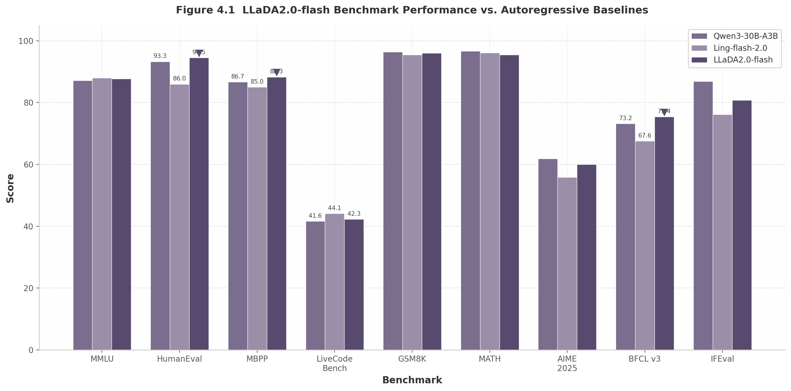
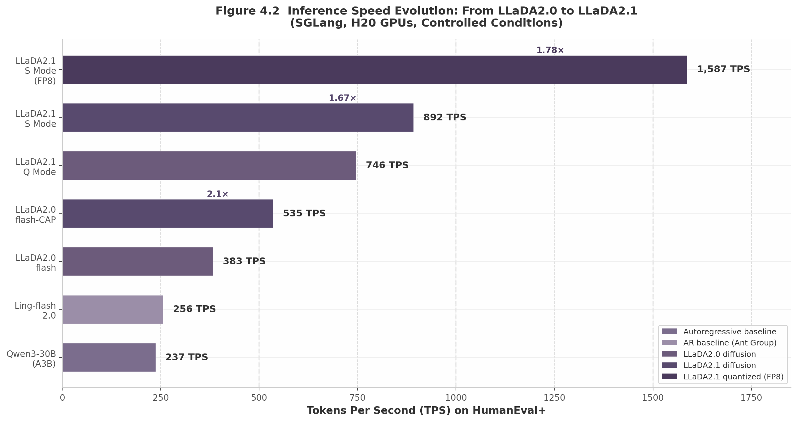

## 4. Ant Group: The LLaDA Ecosystem

No single organization has committed more engineering resources or released more open-source artifacts for diffusion language models than Ant Group. Through its InclusionAI initiative, the Alibaba-affiliated fintech giant has produced the LLaDA model family — the only open-source diffusion LLMs scaled beyond 100B parameters — alongside a complete toolchain spanning training (dFactory), inference (dInfer), and serving integration (SGLang). This chapter examines the full scope of Ant Group's diffusion LLM program: the organizational philosophy driving open-source publication, the technical innovations that enabled LLaDA2.0 to reach parity with autoregressive (AR) baselines at 100B scale, the token-editing and reinforcement learning advances in LLaDA2.1, the developer-facing CodeFuse ecosystem, and the academic collaboration network that underpins the research.

### 4.1 Inclusion AI and the Open-Source Strategy

#### 4.1.1 AGI-as-Public-Good Philosophy

InclusionAI, Ant Group's open-source AI research division, operates under a philosophy articulated by CTO He Zhengyu: "AGI should be a public good — a shared milestone for humanity's intelligent future." [^348^] This framing is deliberately inclusive, positioning Ant Group's releases as contributions to global science rather than competitive moats. All models are released under the MIT license, with model weights distributed through Hugging Face and ModelScope, full deployment support via vLLM and SGLang, and OpenAI-compatible API endpoints provided through third-party hosting services [^299^].

The strategic rationale for this openness is pragmatic as well as ideological. As noted by AI researcher Nathan Lambert, InclusionAI recognizes that "Western companies likely won't pay for their services, so having open models is their only open door to meaningful adoption and influence." [^306^] In a landscape dominated by well-capitalized Western closed-source providers, open-source publication becomes a distribution strategy — a way to ensure Ant Group's architectural choices and engineering standards propagate through the global developer community.

InclusionAI organizes its research into three model families, each targeting a distinct capability tier [^348^]:

- **Ling** (灵): Efficiency-focused sparse Mixture-of-Experts (MoE) language models, designed for high-throughput inference with minimal active parameters per token.
- **Ring**: Advanced reasoning models featuring explicit chain-of-thought pathways, competitive with frontier thinking models from OpenAI and DeepSeek.
- **Ming** (明): Native omnimodal systems processing text, image, audio, and video within unified architectures, including Diffusion Transformer (DiT)-based image generation [^91^].

This tripartite structure ensures that diffusion research (primarily within the Ling line, from which LLaDA models are derived) sits alongside complementary efforts in reasoning and multimodal understanding, enabling cross-pollination of techniques.

#### 4.1.2 Rapid Iteration: Six Ling Versions in Twelve Months

The pace of Ant Group's model releases rivals that of any frontier lab globally. Between April 2025 and April 2026, the Ling family underwent six major iterations [^306^]: Ling-Plus (293B sparse MoE) marked the organization's entry into the open foundation model race; Ling 1.5 delivered a substantial capability upgrade in July 2025; Ling 2.0 / Ring 2.0 (September–October 2025) introduced three model sizes under a unified MoE architecture guided by empirical scaling laws; Ling-2.5-1T and Ring-2.5-1T (February 2026) pushed context windows to one million tokens and achieved International Mathematical Olympiad (IMO) 2025 Gold Medal standard [^341^]; finally, Ling-2.6-flash (April 2026) arrived after anonymous testing as "Elephant Alpha" on OpenRouter, trending at #1 with over 100 billion daily token calls [^437^].

Ring-2.5-1T's mathematical reasoning capabilities are particularly noteworthy: the model scored 35/42 on IMO 2025 (Gold Medal threshold) and 105/126 on the Chinese Mathematical Olympiad (CMO) 2025, surpassing China's national team cutoff [^341^]. These results establish Ant Group as a genuine competitor in frontier reasoning, not merely an efficiency-focused engineering shop.

#### 4.1.3 The Complete Toolchain: dFactory, dInfer, and SGLang

Releasing model weights alone does not make a model practically usable. Ant Group has invested heavily in the surrounding infrastructure to bridge the gap between research artifact and deployable system. The toolchain comprises three components:

**dFactory** is the distributed training framework, built on the VeOmni distributed training backend, providing optimized implementations for all stages of diffusion LLM training — from continual pre-training (CPT) through supervised fine-tuning (SFT) and reinforcement learning (RL) [^374^]. dFactory supports data packing (concatenating multiple short sequences for throughput), specialized block-diffusion attention implementations, and the Multi-Turn Forward (MTF) augmentation pipeline introduced in LLaDA2.1 [^164^].

**dInfer** is a custom inference engine specifically adapted for block diffusion decoding, providing low-latency serving with KV-cache reuse, tensor parallelism, and CUDA graph optimization [^427^]. dInfer handles the unique requirements of diffusion generation — block-wise causal masked attention, parallel token acceptance within blocks, and threshold-based decoding — that standard inference engines designed for AR models do not natively support.

**SGLang integration** represents the deployment layer. The LMSYS team provided day-zero support for LLaDA2.0 block diffusion inference in December 2025 [^389^][^399^], and a customized SGLang version jointly developed by Ant Group and the SGLang team serves as LLaDA2.1's production inference engine [^164^]. This collaboration extends SGLang's Radix caching and batching support to block diffusion LLMs, optimizing memory usage and throughput for concurrent requests [^164^].

The existence of this complete toolchain — training, inference, and serving — distinguishes Ant Group's diffusion program from every other open-source or commercial diffusion LLM effort. While competitors publish model weights, none provide the same depth of engineering infrastructure for production deployment.

### 4.2 LLaDA2.0: Scaling Diffusion to 100B Parameters

#### 4.2.1 Architecture: The First 100B Diffusion LLM

LLaDA2.0, published in December 2025 (arXiv:2512.15745v2), represents the first successful scaling of discrete diffusion language models to 100B total parameters [^24^][^162^]. The model is not trained from scratch; instead, it is produced by systematically converting pretrained autoregressive base models from the Ling 2.0 family into diffusion models through a three-phase Warmup-Stable-Decay (WSD) training strategy. This conversion approach is approximately seven times more compute-efficient than training an equivalent dense model from scratch [^433^].

Two model variants are released:

| Parameter | LLaDA2.0-mini | LLaDA2.0-flash |
|:---|:---:|:---:|
| Total parameters | 16B | 100B |
| Active parameters (MoE) | 1.4B | 6.1B |
| Non-embedding active | 789M | 4.8B |
| Routed experts | 256 | 256 |
| Shared experts | 1 | 1 |
| Experts activated/token | 8 | 8 |
| Activation ratio | 1/32 | 1/32 |
| MoE intermediate size | 512 | 512 |
| Routed scaling factor | 2.5 | 2.5 |
| License | Apache 2.0 [^390^] | Apache 2.0 [^390^] |

**Table 4.1: LLaDA2.0 Architecture Specifications.** Both variants use sigmoid-based, auxiliary-loss-free routing with MTP (Multi-Token Prediction) layers, QK-Norm, and Partial-RoPE. The 1/32 activation ratio — meaning only one of every 32 parameters participates in computing any given token — was identified as optimal through Ling Scaling Laws, small-scale experiments fitted to power-law predictions before committing GPUs to full-scale training [^452^]. At 6.1B active parameters, LLaDA2.0-flash is computationally comparable to a ~40B dense model while offering the memory and throughput advantages of extreme sparsity. Both models are available on HuggingFace and ModelScope under the Apache 2.0 license, alongside training code (dFactory), inference engine (dInfer), and comprehensive technical reports [^390^][^374^].

#### 4.2.2 WSD Three-Phase Training

The Warmup-Stable-Decay (WSD) strategy is the core technical innovation enabling smooth AR-to-diffusion conversion. It decomposes the transition into three coordinated phases that progressively expand and then contract the model's exposure to bidirectional context [^24^][^311^].

**Phase 1: Warmup (Progressive Block Size Expansion).** Starting from the AR base model where block size equals 1 (standard autoregressive generation), training proceeds through a sequence of block size transitions: 1 → 4 → 32 → 64 → 4096. At each transition, the model is trained on "moderate-scale data" to ensure smooth adaptation [^24^]. When block size reaches 4096, the Block Diffusion Language Model (BDLM) becomes equivalent to a standard Masked Diffusion Language Model (MDLM) with full-sequence bidirectional denoising. This progressive enlargement allows internal representations to adapt to larger contextual spans and more complex masking patterns without catastrophic forgetting.

**Phase 2: Stable (Large-Scale MDLM Training).** With block size fixed at 4096, the model trains on large-scale corpora to deepen its understanding of diffusion dynamics. A critical optimization at this stage: because the full sequence is processed as a single block, the "clean" part of the attention computation no longer requires the complex block-wise masks used in Phase 1, significantly reducing computational cost [^24^]. The Ling base models were trained on over 20 trillion tokens [^392^], suggesting that the diffusion conversion process requires substantially less data than full pretraining from scratch — a key efficiency advantage of the AR-to-diffusion paradigm. The pretraining backend uses Megatron-LM with five-dimensional parallelism: data parallelism (DP), pipeline parallelism (PP), tensor parallelism (TP), context parallelism (CP), and expert parallelism (EP) [^24^][^415^]. A cuDNN attention backend achieves greater than 1.3× end-to-end speedup and over 90% memory savings in the attention layer compared to unfused TransformerEngine attention [^24^], while a zig-zag partitioning strategy balances the block-diffusion attention mask workload across the context parallelism group [^24^].

**Phase 3: Decay (Block Size Reduction for Inference).** The model gradually reduces block size from 4096 through intermediate values down to 32. This decay process "distills the global contextual knowledge learned during MDLM into a compact blockwise structure" [^24^]. The final block size of 32 was chosen as the optimal quality-speed tradeoff: ablation studies show that block size 16 yields the highest score (70.26) but slowest throughput (2.44 tokens per forward pass, TPF), while block size 64 degrades both quality and speed [^162^].

**Training stability mechanism.** During the AR-to-diffusion transition, gradient explosion can occur at high mask ratios because masked token embeddings decay toward zero during AR pretraining — masked tokens are never observed by the AR model. LLaDA2.0 addresses this by adding independent Gaussian noise to the embedding layer output for masked tokens during initial iterations, ensuring that the L2 norm of masked token embeddings remains significant and stabilizing the training process [^24^]. This approach avoids the alternative of randomly reinitializing masked token embeddings, which would cause catastrophic forgetting of pretrained knowledge.

**Document-level attention mask.** A specialized block-wise attention mask prevents cross-document semantic contamination when packing heterogeneous documents during training. For a concatenated sequence comprising noisy tokens $x_t$ followed by clean tokens $x_0$, the attention mask $M \in \{0,1\}^{2L \times 2L}$ encodes three constraints: block-diagonal attention within the noisy sequence (tokens attend only to others in the same block), offset block-causal cross-attention from noisy to clean tokens, and block-causal attention within the clean sequence [^24^][^184^]. For full MDLM training (block size = 4096), this simplifies to a document-level mask where attention operates strictly within document boundaries. The paper finds this mechanism "more fundamental" than complementary techniques such as random-length masking or CART for achieving stable bidirectional diffusion training [^93^].

#### 4.2.3 Benchmark Results: Parity with Strong AR Models

Across 47 benchmarks organized into five evaluation dimensions — knowledge (10 benchmarks), reasoning (12), coding (13), mathematics (9), and agent/alignment (4) — LLaDA2.0-flash achieves an average score of 73.18, compared to 73.60 for Qwen3-30B-A3B-Instruct-2507 and 72.15 for Ling-flash-2.0 [^162^][^24^]. The 0.42-point gap versus Qwen3-30B demonstrates fundamental parity: diffusion models at 100B scale can match comparably sized AR models across a broad capability spectrum.

The pattern within these aggregates reveals task-specific advantages. LLaDA2.0-flash leads decisively on coding benchmarks: HumanEval at 94.51 (versus 93.29 for Qwen3-30B and 85.98 for Ling-flash-2.0), MBPP at 88.29 (versus 86.65), and LiveCodeBench at 42.29 (versus 41.63) [^162^]. It also leads on agent tasks, with BFCL v3 at 75.43 — surpassing all AR baselines including Qwen3-30B at 73.19 [^162^]. Mathematics performance is strong: GSM8K at 96.06, MATH at 95.44, and AIME 2025 at 60.00, though Qwen3-30B maintains a slight edge on the most challenging competition problems (61.88 on AIME 2025) [^162^].

| Benchmark | Qwen3-30B-A3B | Ling-flash-2.0 | LLaDA2.0-flash | Leader |
|:---|:---:|:---:|:---:|:---:|
| **Average (47 tasks)** | **73.60** | 72.15 | 73.18 | Qwen3-30B |
| MMLU | 87.13 | 87.98 | 87.69 | Ling-flash-2.0 |
| HumanEval | 93.29 | 85.98 | **94.51** | LLaDA2.0-flash |
| MBPP | 86.65 | 85.01 | **88.29** | LLaDA2.0-flash |
| LiveCodeBench | 41.63 | 44.11 | 42.29 | Ling-flash-2.0 |
| GSM8K | 96.36 | 95.45 | 96.06 | Qwen3-30B |
| MATH | 96.70 | 96.10 | 95.44 | Qwen3-30B |
| AIME 2025 | **61.88** | 55.89 | 60.00 | Qwen3-30B |
| BFCL v3 | 73.19 | 67.57 | **75.43** | LLaDA2.0-flash |
| IFEval | **86.90** | 76.16 | 80.78 | Qwen3-30B |

**Table 4.2: LLaDA2.0-flash Benchmark Comparison.** Bold values indicate the highest score in each row. LLaDA2.0-flash leads on four of the nine highlighted benchmarks, with particularly strong advantages in coding (HumanEval, MBPP) and agent tasks (BFCL v3). The preview model (trained without full post-training) scores only 23.33 on AIME 2025 and 29.07 on LiveCodeBench [^162^], demonstrating that post-training — supervised fine-tuning, CAP training, and DPO — contributes a substantial portion of the final model's capabilities, not merely the base diffusion conversion. Areas of weakness include SciBench (4.13) and HARDMath2 (4.27), extremely difficult benchmarks where all compared models struggle [^162^].

The pattern of strengths and weaknesses carries strategic implications. LLaDA2.0-flash's coding dominance (94.51 on HumanEval, best among all compared models) and agent-task leadership (75.43 on BFCL v3) suggest that diffusion models possess structural advantages in domains where parallel information access and iterative refinement matter more than strict sequential dependency. Code generation, in particular, benefits from the ability to consider multiple function signatures, variable names, and control-flow structures simultaneously rather than committing to each token in lockstep order. Conversely, the model's slight underperformance on instruction following (IFEval at 80.78 versus Qwen3-30B's 86.90) and hardest mathematical reasoning (AIME 2025 at 60.00 versus 61.88) points to residual challenges in tasks requiring extended chain-of-thought reasoning where sequential accumulation of context provides decisive advantages. This task-specific performance profile suggests that diffusion and autoregressive models may occupy complementary niches rather than competing as zero-sum replacements.

#### 4.2.4 Inference Speed: 535 TPS and the 2.1× Speedup

Inference speed represents the most commercially significant advantage of diffusion LLMs, and LLaDA2.0 delivers measurable gains under controlled conditions. LLaDA2.0-flash-CAP achieves 535 tokens per second (TPS) on benchmark tasks, compared to 256 TPS for Ling-flash-2.0 and 237 TPS for Qwen3-30B-A3B-Instruct-2507 under identical serving configurations (SGLang with tensor parallelism of 8 on H20 GPUs) [^389^][^403^]. This constitutes a 2.1× speedup over comparable AR models, verified independently by the LMSYS team [^389^].

The standard (non-CAP) LLaDA2.0-flash achieves 383 TPS, meaning CAP training alone contributes a 40% throughput improvement [^389^]. The LMSYS blog reports slightly different absolute figures — approximately 500 TPS for LLaDA2.0-flash-CAP and 1.9× speedup over AR baselines at small batch sizes [^389^] — but the directional finding of roughly 2× speedup is consistent across all measurement sources. Discrepancies in absolute TPS figures reflect differences in batch size, hardware tuning, and measurement methodology rather than fundamental disagreement.

Two technical innovations enable these speeds. **Top-k checkpoint merge**, based on the Warmup-Stable-Merge (WSM) scheduler by Tian et al. (2025) [^310^], selects the best $k$ checkpoints based on validation perplexity and averages their parameters. This optimizer-agnostic, offline procedure explicitly ensembles distinct high-performing model states, smoothing the parameter landscape and yielding more robust generalization than exponential moving average (EMA) alone [^24^]. **CAP (Confidence-Aware Parallel) training** adds an auxiliary confidence loss to standard SFT, selectively minimizing entropy on correctly predicted tokens. By sharpening the model's predictive distribution, CAP enables threshold-based parallel decoding to accept more tokens per forward pass: standard LLaDA2.0-flash at 383 TPS jumps to 535 TPS with CAP applied [^24^][^404^].

The tradeoff is modest: the LLaDA2.0-mini-CAP scores 70.90 on BFCL v3 versus 74.11 for the non-CAP preview [^162^], suggesting that confidence sharpening introduces some rigidity in predictions that slightly reduces performance on certain reasoning tasks. For deployment scenarios where throughput is the primary constraint, this exchange is favorable.

### 4.3 LLaDA2.1: Token Editing and EBPO Reinforcement Learning

Released in February 2026 (arXiv:2602.08676), LLaDA2.1 introduces three major innovations that advance diffusion LLMs from "viable" to "practical": Token-to-Token (T2T) editing for in-generation self-correction, dual-mode configurable decoding (Speed Mode versus Quality Mode), and EBPO — the first large-scale reinforcement learning framework specifically designed for diffusion models [^330^][^346^]. Rather than scaling parameters further, LLaDA2.1 prioritizes "decoding versatility over mere parameter scaling or benchmark peaking" [^330^], keeping the same 16B and 100B model sizes while dramatically expanding what the decoding process can achieve.

#### 4.3.1 Dual-Mode Generation: M2T Drafting and T2T Editing

LLaDA2.1 operates through two complementary mechanisms. **Mask-to-Token (M2T)** is the standard diffusion operation: at each denoising step, the model predicts tokens for currently masked positions, filling in the sequence progressively. This is the "drafting" capability [^331^]. **Token-to-Token (T2T)** is the novel editing operation: after each M2T step, the model re-examines all already-revealed (non-mask, non-prompt) positions and overwrites tokens where an alternative candidate exceeds a confidence threshold [^331^][^308^].

The T2T mechanism is formalized through dual probability thresholds at each timestep $t$: an **unmasking set** $\Gamma_t$ containing positions where the current token is `[MASK]` and the predicted probability exceeds $\tau_{\text{mask}}$, and an **editing set** $\Delta_t$ containing positions where the current token differs from the top candidate and the candidate's probability exceeds $\tau_{\text{edit}}$ [^164^]. The state evolution simultaneously applies both operations:

$$x_{t-1}^i = v_t^i \quad \text{if } i \in \Gamma_t \cup \Delta_t; \qquad x_{t-1}^i = x_t^i \quad \text{otherwise}$$

This means a single forward pass can both unmask new positions and edit already-visible tokens [^164^]. The inner loop iterates until all masks are filled and no further T2T edits are triggered, at which point generation advances to the next block [^308^].

Training aligns both capabilities through a unified mixture of M2T and T2T objectives: a drafting stream teaches the model to predict correct tokens at masked positions, while an editing stream teaches recovery from random noise perturbations [^421^]. Multi-Turn Forward (MTF) data augmentation further exposes the model to diverse iterative editing scenarios during training, simulating the multi-round refinement that occurs at inference [^331^].

Three structural failure modes of T2T have been identified by follow-up research: correction inertia (when the posterior is multimodal, no single alternative crosses the confidence threshold), premature replacement (swapping a correct token for an incorrect one under incomplete context), and positional lock-in (T2T can replace visible tokens but cannot reopen positions for longer-span corrections) [^181^][^307^]. The Token-to-Mask (T2M) follow-up proposes resetting suspicious tokens to `[MASK]` rather than overwriting them, improving accuracy by +13.33 points on AIME 2025 and +8.56 on CMATH [^307^]. These findings suggest that the T2T mechanism, while powerful, is an evolving design space rather than a finalized solution.

#### 4.3.2 Speed Mode vs. Quality Mode: Configurable Decoding

LLaDA2.1 introduces two operational modes governed by the dual thresholds $(\tau_{\text{M2T}}, \tau_{\text{T2T}})$, allowing users to configure the speed-quality tradeoff at inference time [^336^]:

**Speed Mode (S Mode)** employs a low mask threshold ($\tau_{\text{M2T}} \approx 0.5$) to aggressively draft by filling many positions per step, combined with a moderate editing threshold to restrict edits to high-confidence swaps. Example configuration: `threshold = 0.5`, `editing_threshold = 0.0` [^430^]. This yields a TPF (tokens per forward pass) of 5.93 for the Flash model — nearly double the 3.08 TPF of LLaDA2.0 [^424^].

**Quality Mode (Q Mode)** raises both thresholds so only high-confidence actions are taken: `threshold = 0.7`, `editing_threshold = 0.5` [^430^]. TPF drops to 3.64, but benchmark scores surpass those of LLaDA2.0 on both mini and flash variants, demonstrating that T2T editing improves not just speed but also quality through self-correction [^164^].

| Configuration | LLaDA2.1 S Mode | LLaDA2.1 Q Mode | LLaDA2.0 (baseline) |
|:---|:---:|:---:|:---:|
| Avg Score (Flash 100B) | 72.34 | **73.54** | 72.43 |
| TPF (Flash) | **5.93** | 3.64 | 3.08 |
| HumanEval+ Score (Flash) | **89.63** | **89.63** | 87.80 |
| HumanEval+ TPS (Flash, quantized) | **892** | — | ~535 |
| HumanEval+ TPS (Mini, quantized) | — | — | 1,587 [^164^] |
| $\tau_{\text{M2T}}$ | 0.5 | 0.7 | N/A |
| $\tau_{\text{T2T}}$ | 0.0 | 0.5 | N/A |
| `max_post_steps` | N/A | $\geq$ 5 (rec. 16) | N/A |

**Table 4.3: LLaDA2.1 Speed Mode vs. Quality Mode Comparison.** S Mode approximately doubles TPF relative to LLaDA2.0 while causing only a ~0.1–0.2 absolute average score drop compared to Q Mode [^336^]. Q Mode surpasses LLaDA2.0's scores despite identical model size and minimal training data changes, proving that the editing mechanism itself confers quality advantages. Domain-specific speed variation is notable: highest throughput occurs in code generation (structured output tolerates aggressive drafting), while lowest throughput occurs in instruction following (open-ended generation requires conservative thresholds) [^164^].

#### 4.3.3 Multi-Block Editing: Cross-Block Revision

Multi-Block Editing (MBE) extends T2T's local correction capability across block boundaries. Without MBE, decoding and editing are confined within a single block — tokens are generated under threshold constraints and local edits revise intermediate outputs before the block is finalized [^164^]. MBE relaxes this constraint: after generating a new block, the model can revisit earlier blocks and apply edits based on the additional context provided by newly decoded content [^334^].

The performance impact is substantial. With MBE enabled, LLaDA2.1-flash's average score improves from 70.69 to 72.67; the mini variant improves from 57.63 to 58.24 [^164^]. Specific benchmarks show dramatic gains: AIME 2025 Flash improves from 63.33 to 70.0 with MBE, and LiveCodeBench Flash improves from 44.05 to 46.48 [^164^]. These gains are "particularly evident on reasoning and coding tasks" where global consistency across long outputs matters most, with only a "modest reduction in throughput" as the cost [^334^].

#### 4.3.4 EBPO: Reinforcement Learning for Diffusion Models

EBPO (ELBO-based Block-level Policy Optimization) is the first large-scale RL framework tailored specifically for diffusion LLMs [^330^]. It addresses a fundamental challenge: standard policy gradient methods require sequence-level log-likelihoods, which are intractable for diffusion models due to their non-autoregressive, parallel decoding nature [^346^].

EBPO's solution uses the Evidence Lower Bound (ELBO) as a tractable proxy for the true likelihood, estimating gradients through block-level conditional probabilities computed in parallel via vectorized likelihood estimation [^331^]. The objective maximizes a clipped surrogate function weighted by a probability ratio $\rho$ (analogous to PPO-style clipping), ensuring stable policy updates [^331^]. Block-conditional log probabilities are aggregated across discretized timesteps and blocks, enabling efficient computation within a single forward pass [^331^]. The RL training extends the AReaL framework with specialized likelihood estimation and advantage estimation protocols that explicitly support both T2T and M2T modes [^164^].

The significance of EBPO extends beyond LLaDA2.1 itself. As noted by independent analysts, "the team applied reinforcement learning to a diffusion model with hundreds of billions of parameters for the first time" [^346^]. This opens the door for RLHF-style alignment of diffusion models at a scale previously thought intractable. The use of ELBO as a substitute for log-likelihood in preference optimization is conceptually related to the DPO adaptations explored in earlier diffusion RL work such as VRPO (from LLaDA 1.5), but EBPO's block-conditional formulation and vectorized estimation make it the first approach to operate practically at 100B scale. However, the paper acknowledges that "the RL stage and T2T editing mechanism currently operate separately. Future work aims to merge them, using RL to directly optimize self-correction behavior" [^334^] — a merger that could yield transformative self-improving diffusion models capable of learning to edit their own outputs through reward signals rather than fixed confidence thresholds.

#### 4.3.5 Inference Infrastructure: Alpha-MoE, FP8 Quantization, and Custom SGLang

LLaDA2.1's inference infrastructure represents a substantial upgrade over LLaDA2.0. Three components are critical:

**Alpha-MoE megakernel**, adapted from Aleph-Alpha, fuses two FusedMoE computations into a single kernel call, reducing kernel launch overhead and improving memory locality [^164^]. This is particularly impactful for MoE architectures where expert routing introduces substantial kernel dispatch costs.

**Per-block FP8 quantization** reduces memory bandwidth requirements and increases compute throughput. On the HumanEval+ benchmark, quantization achieves 891.74 TPS for LLaDA2.1-flash (versus 746.66 TPS unquantized) and 1,586.93 TPS for LLaDA2.1-mini (versus 1,496.67 TPS unquantized) [^164^]. The score impact is minimal — only -0.61 points on HumanEval+ for the mini variant [^336^]. The per-block (rather than per-tensor) granularity of FP8 scaling is well-suited to MoE architectures, as different experts may have different dynamic ranges [^427^].

**Block-wise causal masked attention** enables the KV cache for the entire long context to be computed in a single forward pass. Within a block, attention is fully bidirectional (all positions attend to each other); across blocks, attention is strictly causal (block $j$ attends only to blocks $0$ through $j$) [^164^]. The attention mask at the block level is $M_{\text{atm}} = \text{tril}(\mathbf{1}_{N_k \times N_k})$, expanded to token-level resolution [^308^]. This structure, combined with customized SGLang providing Radix caching and batching support for block diffusion, makes LLaDA2.1 the most production-optimized open-source diffusion LLM available [^164^][^399^].

The cumulative effect of these infrastructure innovations is striking: LLaDA2.1-flash in S Mode achieves 892 TPS, approximately 3.5× faster than comparable AR models under the same conditions (Qwen3-30B at 240 TPS, Ling-flash-2.0 at 257 TPS) [^424^]. The mini variant with FP8 quantization reaches 1,587 TPS [^164^] — speeds that place diffusion LLMs firmly in the realm of interactive, real-time applications.

A recognized limitation is **stuttering artifacts** — n-gram repetitions where phrases loop on themselves, a direct consequence of independent parallel sampling in diffusion models when the masking threshold is set too aggressively [^334^][^430^]. These artifacts primarily occur in open-ended generation scenarios with S Mode; structured domains (code, math) are less affected because T2T editing is particularly effective at catching repetitive patterns [^164^]. Mitigation strategies include using Q Mode for chat applications, applying T2T editing and MBE for cross-block correction, and setting temperature to 0.0 for reliability [^430^].

### 4.4 CodeFuse: From Research to Developer Tools

#### 4.4.1 NES: Next Edit Suggestion for 20,000+ Developers

While LLaDA demonstrates that diffusion LLMs can achieve competitive benchmark scores, the CodeFuse NES (Next Edit Suggestion) system demonstrates that they can serve real developers at scale. NES is an instruction-free, low-latency code editing framework deployed at Ant Group serving over 20,000 developers through a seamless Tab-key interaction pattern [^110^]. Rather than requiring developers to describe desired changes in natural language, NES learns from historical editing trajectories to implicitly capture coding goals and habits, eliminating context-switching between code and prose [^117^].

The system employs a **dual-model architecture** [^102^][^297^]:

- The **NES-Location Model** predicts the next most probable edit location using the developer's historical editing patterns, achieving 75.6% accuracy in placement prediction. It uses binary rewards (+1.0 for exact match, -1.0 otherwise) during RL training [^303^].
- The **NES-Edit Model** generates precise code modifications for the predicted location, delivering a 27.7% Exact Match Rate and 91.36% Edit Similarity. It uses hierarchical rewards (+1.0 for exact match, +0.5 × Edit Similarity for ES > 0.5, -1.0 otherwise) [^303^].

In production, NES achieves effective acceptance rates of 51.55% for location predictions and 43.44% for edit suggestions [^110^] — meaning developers accept roughly half of all suggested edit locations and nearly half of the generated edits. Inference latency remains under 250 milliseconds, achieved through Prefix Caching (PC) and Speculative Decoding (SD) optimizations running on Nvidia L20 GPUs [^297^].

The training pipeline is two-stage: supervised fine-tuning on large-scale historical editing datasets establishes foundational capabilities, followed by reinforcement learning with DAPO (Dynamic sAmpling Policy Optimization) to refine both models [^303^]. Dataset construction involves converting raw editing trajectories into structured tuples containing pre-edit code state, historical trajectory, and ground-truth edit, with an LLM-based relevance filter classifying edits as "modification" (logically connected to history) or "preservation" (uncorrelated) — the latter becoming negative samples that teach the model when *not* to suggest a change [^303^].

The NES paper was accepted at FSE Companion 2026, and both SFT and DAPO datasets are publicly available on HuggingFace [^102^][^297^]. This real-world deployment — thousands of daily code changes handled through simple Tab key sequences — provides perhaps the strongest evidence that diffusion-aligned code models can deliver genuine productivity improvements in production software engineering workflows.

#### 4.4.2 DAPO: Dynamic Sampling Policy Optimization

DAPO, the RL algorithm powering NES's post-training, was originally developed by Yu et al. (2025) as an open-source large-scale RL system for LLM reasoning enhancement, achieving 50 points on AIME 2024 with Qwen2.5-32B using only 50% of the training steps required by DeepSeek-R1-Zero-Qwen-32B [^389^]. DAPO is a variant of Group Relative Policy Optimization (GRPO) that addresses three known failure modes in standard GRPO: entropy collapse, reward noise, and training instability.

Four techniques distinguish DAPO [^389^][^387^]:

1. **Clip-Higher** increases the upper clipping limit ($\epsilon_{\text{high}}$ from 0.2 to 0.28) to promote diversity and avoid entropy collapse, allowing the model to explore high-entropy, low-probability tokens essential for reasoning.
2. **Dynamic Sampling** filters out prompts with accuracy equal to 0 or 1, ensuring each batch contains samples with effective gradients. If initial sampling produces all-correct or all-incorrect outputs, additional samples are drawn until diversity is achieved.
3. **Token-Level Policy Gradient Loss** operates at the token level rather than averaging within each response, weighting longer sequences more heavily — described as "super key for Long-CoT" scenarios [^308^].
4. **Overlong Reward Shaping** uses soft punishment for longer responses with an expected maximum length of 16,384 tokens, reducing reward noise and stabilizing training [^389^].

For NES specifically, DAPO is adapted with hierarchical reward functions tailored to code editing. The DAPO-trained model demonstrates improved similarity scores for modification tasks and "better aligns with the high-frequency practices observed in real-world development" [^297^]. The DAPO system is fully open-sourced, including training code and datasets [^136^].

#### 4.4.3 CodeFuse Survey: Mapping the Code LLM Landscape

Ant Group's contributions to code intelligence extend beyond specific models to systematic knowledge synthesis. The CodeFuse survey paper, "Unifying the Perspectives of NLP and Software Engineering: A Survey on Language Models for Code" (November 2023), covers 70+ models, 40+ evaluation tasks, 180+ datasets, and 900+ related works [^451^]. Unlike previous surveys, it integrates software engineering (SE) with natural language processing (NLP) perspectives — SE applying language models for development automation, NLP adopting SE tasks for language model evaluation — providing a bidirectional lens on the field. The survey is maintained as a living document on GitHub [^451^].

The CodeFuse ecosystem also includes CodeFuse-13B (an early multilingual code LLM supporting 40+ programming languages, deployed to 5,000+ engineers via IDE plugins) [^461^][^473^], CodeFuse-MFTCoder (multi-task fine-tuning framework), DevOps-ChatBot (AI assistant for the software development lifecycle), CodeFuse-Query (static code analysis platform processing 10B+ lines daily), and CodeFuse IDE (an AI-integrated development environment based on OpenSumi) [^467^].

### 4.5 Academic Collaborations

#### 4.5.1 Partnership Model and Author Network

The LLaDA2.0 paper lists 31 authors from five institutions, reflecting a deeply collaborative research model [^414^]. Ant Group provides the majority of authors (23, including four technical leaders) and all engineering infrastructure. Academic partners contribute specialized expertise: Renmin University of China (Ji-Rong Wen, a renowned information retrieval and NLP researcher, and Chongxuan Li, an expert in diffusion models) [^414^]; Zhejiang University (Jiaqi Hu and Junbo Zhao, contributing computer vision and multimodal ML expertise) [^414^]; Westlake University (Zhenzhong Lan, a technical leader, and Zhanchao Zhou, contributing NLP and representation learning expertise) [^414^]; and HKUST (Xiaocheng Lu, contributing systems and efficient ML knowledge) [^414^].

This five-institution network represents one of the largest collaborative efforts in open-source diffusion LLM research. The academic partners bring theoretical depth in diffusion modeling, information retrieval, and systems optimization, while Ant Group contributes scale engineering, compute infrastructure, and product-market feedback loops from internal deployment. The LLaDA2.1 paper continues this collaboration with Zhejiang University, Westlake University, and Southern University of Science and Technology [^330^].

#### 4.5.2 Chinese Institutional Leadership in Open-Source Diffusion LLMs

A striking pattern emerges from the global diffusion LLM landscape: all major open-source diffusion models originate from Chinese institutions. Ant Group's LLaDA family (8B to 100B), ByteDance's Seed Diffusion and Stable-DiffCoder, Renmin University's GSAI-ML, and Tsinghua's SIA-Lab collectively produce the entire open-source ecosystem [^24^][^306^]. US contributions — Google DeepMind's Gemini Diffusion, Inception Labs' Mercury, and Apple's DiffuCoder — are either closed-source or limited release. This is the inverse of the autoregressive LLM landscape, where US-based companies (OpenAI, Anthropic, Meta, Google) lead open-weight releases.

The implications are significant for the trajectory of diffusion LLM development. Just as DeepSeek's open-weight releases disrupted the AR landscape by providing high-performance alternatives to closed Western models, Ant Group's LLaDA releases — complete with training frameworks, inference engines, and serving integrations — provide a full-stack open-source diffusion alternative. Western organizations relying on closed-source diffusion APIs may face competitive pressure from open Chinese alternatives that offer not only model weights but also the engineering infrastructure required for production deployment. This dynamic also reinforces a structural advantage identified across the diffusion LLM field: the AR-to-diffusion conversion paradigm means organizations with strong pretrained AR models (Ant Group with Ling, ByteDance with Seed-Coder) gain a head start in the diffusion race, since their expensive AR pretraining investments transfer directly. New entrants without strong AR base models face a higher barrier to producing competitive diffusion LLMs, potentially consolidating leadership among the small set of organizations that have already achieved trillion-token AR pretraining at scale.

Ant Group's strategic bet on diffusion models, executed through the InclusionAI initiative and validated by the LLaDA2.0 and LLaDA2.1 results, positions the organization as the single most important contributor to open-source diffusion LLM research globally. The combination of 100B-parameter models, complete toolchains, real-world developer deployments at 20,000+ scale, and open academic collaboration creates an ecosystem that no other organization — commercial or academic — currently matches in breadth or depth.
