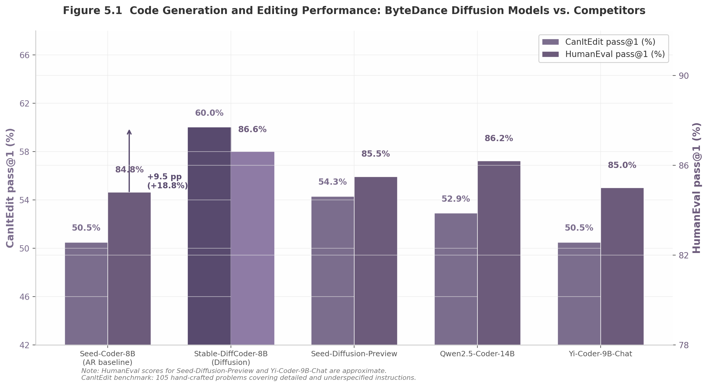

## 5. ByteDance Seed: Training Curriculum and Open Source

ByteDance Seed has emerged as the third major institutional force in diffusion-based code generation, following Google DeepMind and Ant Group, with a research program characterized by two distinctive features: a deeply engineered training curriculum designed to overcome the pathologies of masked diffusion, and a commitment to controlled experimental methodology that isolates the effect of the diffusion paradigm itself. Where Ant Group's LLaDA ecosystem prioritizes scale and toolchain completeness, and Google DeepMind's Gemini Diffusion leverages massive proprietary compute, ByteDance Seed's contribution lies in its rigorous training design and its willingness to subject diffusion models to the scientific discipline of identical-architecture, identical-data comparisons against autoregressive (AR) baselines.

The Seed program operates across three model tiers: Seed Diffusion Preview, a preview-level diffusion language model optimized for inference speed; Seed-Coder, an 8-billion-parameter AR model trained on 6 trillion tokens that serves as the foundation for both the Seed Diffusion conversion and the open-source Stable-DiffCoder release; and Stable-DiffCoder itself, the result of applying block diffusion continual pretraining (CPT) to Seed-Coder while holding every other variable constant. This tiered structure -- AR foundation, diffusion conversion, speed-optimized preview -- allows ByteDance to draw causal conclusions about the diffusion contribution that are unavailable from studies that vary architecture, data, and training paradigm simultaneously [^160^].

### 5.1 Seed Diffusion Preview: Four-Pillar Architecture

Released on July 31, 2025, Seed Diffusion Preview is built upon four interconnected technical pillars that together achieve 2,146 tokens per second (tok/s) on H20 GPUs -- a figure reported to be 5.4x faster than comparable autoregressive models of similar scale -- while maintaining competitive code quality across standard benchmarks [^168^][^508^]. The architecture does not treat diffusion as a single monolithic training objective but as a carefully choreographed sequence of design choices, each addressing a specific failure mode observed in prior discrete diffusion language models (DLLMs).

#### 5.1.1 Four-Pillar System

The first pillar, the **Two-Stage Curriculum (TSC)**, addresses the training dynamics of the diffusion forward process. For the first 80% of training steps, Seed Diffusion uses standard mask-based corruption where tokens are progressively replaced with [MASK] according to a noise schedule $\gamma_t$. For the final 20%, an edit-based corruption process is introduced, applying token-level insertions, deletions, and substitutions controlled by Levenshtein distance [^11^]. The combined loss function is:

$$\mathcal{L}_{\text{diff}}(\theta) = -\mathbb{E}_{q_{\text{edit}},t} \log p_\theta(x_0|x_t) - \mathbb{E}_{q_{\text{mask}},t}\left[\frac{\gamma'_t}{\gamma_t} \sum \mathbf{1}[x_t[i]=m] \log p_\theta(x_0[i]|x_t[i])\right]$$

This two-stage structure was motivated by the observation that purely mask-based diffusion creates a harmful inductive bias: the model learns that unmasked tokens are always correct, which prevents self-correction during inference [^276^]. The edit-based phase forces the model to re-evaluate all positions, including those that appear uncorrupted.

The second pillar, **Constrained-Order Training**, tackles the problem of redundant generation orders. Standard diffusion training exposes the model to all possible generation trajectories, many of which are "redundant, detrimental, or misaligned with the natural structure of language" [^256^]. Seed Diffusion generates a large pool of candidate trajectories using the pre-trained model, filters them by maximizing the Evidence Lower Bound (ELBO), and fine-tunes on these high-quality distilled trajectories [^256^][^517^]. The constrained-order loss takes the form $\mathcal{L}_c(\theta) = \mathbb{E}_{\tau \sim U(T), (x_i, x_0) \in \tau} [-\lambda(x_i) \log p_\theta(x_0 | f(x_i))]$, where $\tau$ denotes a trajectory and $f(x_i)$ represents the state transformation function [^256^].

The third pillar, **On-Policy Diffusion Learning**, optimizes for minimal sampling steps at inference. The team established that trajectory length $\|\tau\|$ is proportional to the inverse of average Levenshtein distance between trajectory states: $\|\tau\| \propto \mathbb{E}_{i,j} \mathbf{1}/d_{\text{Lev}}(\tau[i], \tau[j])$ [^11^]. Directly minimizing trajectory length caused unstable training, so the surrogate objective optimizes the inverse of average Levenshtein distance, which implicitly prunes low-quality paths. A model-based verifier $V(\cdot)$ ensures that correctness is preserved throughout this aggressive step reduction [^11^][^517^].

The fourth pillar, **Block-wise Parallel Sampling with KV-Cache**, provides the inference infrastructure that makes the speed claims achievable. The system uses block-wise semi-autoregressive decoding where each block is denoised in parallel while blocks maintain causal order [^517^]. KV-cache reuse eliminates redundant computation across blocks. Ablation studies on H20 GPUs found a block size of 32 tokens to be the optimal operating point, with per-block latency of 1.40 milliseconds -- compared to 1.20 ms for 16-token blocks and 1.80 ms for 64-token blocks [^517^]. This block-size sensitivity reflects a fundamental trade-off: smaller blocks offer lower per-step latency but require more sequential steps, while larger blocks amortize overhead but increase per-step cost.

#### 5.1.2 Two-Stage Training Curriculum: Breaking the "Unmasked = Correct" Shortcut

A critical design decision in Seed Diffusion is the explicit **rejection of carry-over unmasking** -- the common practice of copying unmasked input tokens directly to the model output [^276^]. While this practice improves perplexity metrics during training, it introduces what the Seed team terms "a detrimental inductive bias": the model learns that any token that was not masked must be correct, leading to overconfidence and an inability to revise its own outputs during iterative decoding [^276^]. This pathology is particularly damaging for code generation, where models must frequently revise function signatures, update variable names, or refactor logic across multiple locations.

The edit-based augmentation used in the final 20% of training (the "C" in TSC) forces the model to **re-evaluate all tokens, including unmasked ones** [^276^]. The forward process samples corrupted sequences using a predefined edit operation set comprising deletions, insertions, and substitutions, with the total edit-operation number $k_t$ approximately controlling Levenshtein distance [^11^]. The signal-to-noise ratio scheduler $\alpha_t$ is constrained to $[0, 0.1]$ to maintain density estimation integrity [^477^]. This specific design choice was validated by its elimination of "unexpected behavior such as repetitions in the sampling process" [^11^] -- a known failure mode in diffusion language models where the model enters loops of repeated tokens.

The 80/20 split between mask-based and edit-based training was not derived from first principles but from empirical exploration. The ratio reflects a practical need to first establish broad density estimation capabilities through masking before introducing the more complex edit operations that require the model to already possess a coherent understanding of the target distribution. This phased approach mirrors curriculum learning traditions in machine learning but applies them to the forward process of a diffusion model for the first time at this scale.

#### 5.1.3 Performance: Speed, Quality, and Training Budget

Seed Diffusion Preview reports 2,146 tok/s on H20 GPUs, which is 5.4x faster than comparable AR models of similar scale [^168^][^508^]. On the CanItEdit benchmark -- 105 hand-crafted problems covering detailed and underspecified instructions -- Seed Diffusion Preview scores 54.3%, placing it ahead of the Qwen2.5-Coder-14B-Instruct baseline at 52.9% despite Seed Diffusion's presumably smaller parameter count [^83^]. The model was trained on a budget of 1.3 trillion tokens across 160,000 steps with a batch size of 512 [^479^].

Several important caveats attach to these headline figures. The 2,146 tok/s claim has not been independently verified, as Seed Diffusion Preview is not open-sourced (unlike Stable-DiffCoder), and the specific comparison AR models and exact benchmarking conditions are not fully detailed in announcement materials [^508^]. The hardware specification (H20 GPUs) differs from competitors reporting on H100s (Mercury Coder at 1,109 tok/s) or unspecified hardware (Gemini Diffusion at 1,479 tok/s), making direct comparison difficult without normalization for compute capacity [^168^]. Additionally, Seed Diffusion Preview reportedly outperforms Mercury Coder and Gemini Diffusion on raw speed while remaining competitive with AR models on HumanEval, MBPP, and other code generation benchmarks [^168^].

### 5.2 Stable-DiffCoder: Controlled Open-Source Release

Where Seed Diffusion Preview operates as a closed preview demonstrating speed optimization, Stable-DiffCoder represents ByteDance Seed's primary scientific contribution to the diffusion-for-code literature: the first large-scale controlled study demonstrating that diffusion training can outperform AR training on code when architecture, data, and training pipeline are held constant [^160^]. This experimental design shifts the burden of proof in the diffusion-versus-AR debate -- previously, DLLMs had to demonstrate they could match AR models; Stable-DiffCoder's results suggest that AR models must now justify their paradigm against a demonstrably superior alternative on at least some tasks.

#### 5.2.1 Block Diffusion Continual Pretraining from Seed-Coder

Stable-DiffCoder is built upon Seed-Coder, an 8-billion-parameter AR model trained on 6 trillion tokens [^160^]. The conversion from AR to diffusion proceeds through **Block Diffusion Continual Pretraining (CPT)**, a technical innovation designed to address the instability that has historically plagued attempts to transition AR models to diffusion objectives.

The stability challenge is significant. The ByteDance team observed "significant instability in gradient norms during the CPT of DLLMs" [^149^]. Ablation studies revealed two critical failure modes: omitting block clipping leads to a high fraction of zero-mask steps, effectively wasting compute on batches with no corruption signal; and skipping the warmup phase results in gradient norm spikes exceeding 10x the baseline magnitude [^479^]. These findings explain why prior AR-to-diffusion conversions have often required extensive hyperparameter tuning or have failed entirely at large scale.

Stable-DiffCoder's CPT employs two stabilizing mechanisms. First, a **warmup strategy** gradually increases mask pattern difficulty and removes cross-entropy weighting over "a few thousand steps, sufficient to ramp up maximum corruption smoothly" [^149^][^479^]. Second, a **block-wise clipped noise schedule** sets linear schedule boundaries tailored for block diffusion with a fixed block size of $B=4$ tokens for code [^479^][^497^]. The schedule is clipped per block to ensure at least one mask per block, eliminating wasted compute. A mixing weight $\lambda$ starts at approximately 0.5 and is annealed to zero as the block size increases during training [^479^]. The total training budget for the CPT stage is 1.3 trillion tokens (160,000 steps, batch size 512) [^479^].

Seed-Coder's data pipeline itself represents a notable contribution. Departing from "human-centric" approaches that rely on hand-crafted filtering rules, the team used DeepSeek-V2-Chat as an oracle to score 222,066 code files across four dimensions -- readability, modularity, clarity, and reusability -- on a 0--10 scale [^520^]. A 1.3-billion-parameter Llama 2 model with a regression head was then fine-tuned for one epoch to serve as an efficient quality scorer at scale, filtering the bottom ~10% of files and yielding approximately 1 trillion unique tokens covering 89 programming languages [^520^]. The full pretraining corpus comprises 5 trillion tokens for regular pretraining plus 1 trillion for continued pretraining, totaling 6 trillion tokens [^519^].

#### 5.2.2 The CanItEdit Result: 60.0% versus 50.5%

The headline result from Stable-DiffCoder is a **9.5 percentage point gap** on CanItEdit, with Stable-DiffCoder-8B-Instruct scoring 60.0% against Seed-Coder-8B-Instruct's 50.5% -- an 18.8% relative improvement [^83^][^160^]. This makes Stable-DiffCoder the top performer on CanItEdit across all compared models at the time of reporting, including Qwen2.5-Coder-14B-Instruct (52.9%) and Yi-Coder-9B-Chat (50.5%), both of which use the autoregressive paradigm and comparable or larger parameter counts [^83^].

The authors hypothesize that this gain "benefits from the denoising nature of DLLMs: random masking and reconstruction inherently train the model on edit- and infill-like patterns, enabling it to better exploit editing supervision and extract more editing-related knowledge from the same data" [^83^]. This mechanism -- where the diffusion training objective functions as a form of implicit data augmentation for editing tasks -- represents a principled explanation for why diffusion models excel at code editing specifically, even when their performance on standard completion benchmarks (HumanEval, MBPP) shows smaller or negligible differences.

However, the advantage is not uniform. On Aider, a multi-turn editing benchmark requiring long context windows, Stable-DiffCoder scores 54.9%, slightly below Seed-Coder's 57.1% [^83^]. The authors attribute this to the 8,192-token training window being insufficient for Aider's multi-turn requirements, which exceed this length [^83^]. This creates an important tension in the diffusion-for-code landscape: diffusion's any-order modeling helps single-turn editing but block-size constraints may hurt long-context editing tasks.

#### 5.2.3 Controlled Comparison Methodology

Stable-DiffCoder's core scientific contribution extends beyond the raw performance numbers to the **experimental design** that produced them [^20^][^149^]. The methodology adheres to four strict controls:

1. **Identical architecture**: Seed-Coder's 8-billion-parameter architecture is reused without modification [^160^].
2. **Identical data**: The same 6-trillion-token pretraining corpus from Seed-Coder is used for the diffusion conversion [^160^].
3. **Identical training pipeline**: Preprocessing, supervised fine-tuning (SFT) data, and evaluation protocols remain unchanged [^20^].
4. **Single variable changed**: Only the training objective switches -- from pure AR to AR pretraining -> block diffusion CPT -> SFT [^83^].

The authors explicitly state their motivation: "existing code DLLMs still lag behind strong AR baselines under comparable budgets. We revisit this setting in a controlled study" [^160^]. This design allows the conclusion that "diffusion-based training can improve code modeling quality beyond AR training alone, even under tightly controlled data and architecture constraints" [^20^].

At smaller scale (2.5 billion parameters), the team further identified two preconditions for successful DLLM training: **Clean Evidence** -- pre-annealing AR checkpoints must retain clean, malleable knowledge suitable for diffusion conversion; and **Alignment** -- consistency between training and inference processes must be maintained to avoid distribution shift [^149^]. These findings provide practical guidance for organizations attempting similar conversions.

#### 5.2.4 Low-Resource Language Benefits and Cross-Model Benchmarks

Stable-DiffCoder demonstrates **particularly large gains in low-resource programming languages** on the MultiPL-E multilingual code generation benchmark [^83^][^160^]. Languages such as C# and PHP show gains exceeding 10 percentage points [^497^]. The authors' explanation is that "diffusion-style stochastic sampling can effectively amplify learning signals from low-resource code by exposing the model to multiple corrupted-and-denoised views of the same underlying example, thereby improving generalization in data-scarce languages" [^83^]. This mechanism -- where diffusion corruption acts as **principled data augmentation** for scarce samples -- is one of the key theoretical contributions of the work [^160^].

A notable caveat is that these gains partially attenuate after supervised fine-tuning. Because the SFT stage extensively supplements scarce data for languages like C# and PHP, "the advantage in multilingual coding capabilities has been reduced" for the final instruct model relative to the base model [^160^]. This suggests that the diffusion augmentation benefit is most pronounced when the model must generalize from limited exposure, and is partially diluted when explicit data supplementation is applied.

The following table consolidates benchmark results across Seed Diffusion Preview, Stable-DiffCoder, their AR baseline Seed-Coder, and selected competitors:

| Model | Paradigm | Params | CanItEdit | HumanEval | Aider | MultiPL-E (C#/PHP) |
|:---|:---|:---|:---:|:---:|:---:|:---:|
| Seed-Coder-8B-Instruct | AR | 8B | 50.5% [^83^] | 84.8% | 57.1% [^83^] | Baseline |
| Stable-DiffCoder-8B-Instruct | Diffusion (block CPT) | 8B | **60.0%** [^83^] | 86.6% [^160^] | 54.9% [^83^] | +10%+ [^497^] |
| Seed-Diffusion-Preview | Diffusion (full) | -- | 54.3% [^83^] | Competitive [^508^] | -- | -- |
| Qwen2.5-Coder-14B-Instruct | AR | 14B | 52.9% [^83^] | 86.2% | -- | -- |
| Yi-Coder-9B-Chat | AR | 9B | 50.5% [^83^] | 85.0% | -- | -- |

The CanItEdit column most clearly illustrates the diffusion advantage: Stable-DiffCoder's 60.0% represents a 9.5 percentage point improvement over its AR twin trained on identical data, and simultaneously outperforms a 14-billion-parameter competitor (Qwen2.5-Coder) by 7.1 percentage points. On HumanEval, the advantage narrows to approximately 1.8 percentage points, consistent with the pattern that diffusion models show their largest benefits on editing tasks while achieving near-parity on generation tasks. The Aider regression (54.9% versus 57.1%) serves as a reminder that diffusion's advantages are task-dependent and that long-context multi-turn editing remains a challenge for models trained with limited context windows.

*Figure 5.1 -- Code generation and editing performance comparison across ByteDance models and competitors. CanItEdit scores show the largest diffusion advantage (18.8% relative improvement for Stable-DiffCoder over Seed-Coder), while HumanEval scores cluster tightly, indicating that the diffusion paradigm's primary differentiator is editing rather than generation capability. Data sources: arXiv papers, ByteDance blog announcements.*

### 5.3 SIA-Lab and Research Collaboration

The research output of ByteDance Seed does not exist in isolation. It is produced through SIA-Lab, a formal joint laboratory between Tsinghua University's Institute for AI Industry Research (AIR) and ByteDance Seed [^11^][^136^]. This institutional arrangement shapes the research agenda, shares talent across organizational boundaries, and connects ByteDance's commercial objectives with academic publication norms.

#### 5.3.1 Joint Lab Structure and Governance

SIA-Lab operates as a formal research entity with dual affiliation for its personnel. Core contributors to the Seed Diffusion paper -- including Yuxuan Song and Zheng Zhang -- hold dual affiliation with ByteDance Seed and Tsinghua AIR/SIA-Lab [^11^]. Supervision spans both institutions: Jingjing Liu, Wei-Ying Ma, and Ya-Qin Zhang represent Tsinghua AIR, while Yonghui Wu, Hao Zhou, and Mingxuan Wang represent ByteDance Seed [^11^]. The DAPO (Dynamic Adaptive Policy Optimization) paper, which introduced reinforcement learning innovations for large language models, lists the identical shared affiliation: "SIA-Lab of Tsinghua AIR and ByteDance Seed" as the fourth institutional author [^136^].

This represents a **deep institutional partnership** with shared talent and co-authored publications, not a conventional funding relationship or advisory arrangement. The collaboration produces papers across multiple domains: diffusion language models (Seed Diffusion), code generation (Seed-Coder, Stable-DiffCoder), and reinforcement learning (DAPO). The breadth of this output suggests that SIA-Lab functions as a semi-autonomous research unit with its own agenda, staffed by researchers who move across project boundaries within the lab's scope.

#### 5.3.2 Author Overlap with DAPO and Shared RL Methodology DNA

The overlap between the diffusion model research team and the DAPO team is substantial and systematic. The following table documents the shared personnel across papers, revealing a research community whose members contribute to both diffusion and reinforcement learning projects:

| Person | Seed Diffusion | Stable-DiffCoder | DAPO | Affiliation |
|:---|:---:|:---:|:---:|:---|
| Yuxuan Song | Project Lead | Contributor | Dataset | ByteDance Seed + Tsinghua AIR |
| Zheng Zhang | Project Lead | -- | Algorithm | ByteDance Seed + Tsinghua AIR |
| Jing Su | Contributor | Contributor | -- | ByteDance Seed |
| Hongli Yu | -- | Contributor | Infra/Dataset | ByteDance Seed |
| Hao Zhou | Supervision | Supervision | Supervision | ByteDance Seed |
| Jingjing Liu | Supervision | -- | Supervision | Tsinghua AIR |
| Wei-Ying Ma | Supervision | -- | Supervision | Tsinghua AIR |
| Ya-Qin Zhang | Supervision | -- | Supervision | Tsinghua AIR |
| Lin Yan | -- | -- | Supervision | ByteDance Seed + Tsinghua AIR |
| Mingxuan Wang | Supervision | -- | Supervision | ByteDance Seed |

The concentration of shared authors at the supervision level is particularly significant. Hao Zhou, Jingjing Liu, Wei-Ying Ma, and Ya-Qin Zhang all serve as supervisors across both the diffusion and DAPO papers, suggesting that strategic research direction is coordinated at this level rather than emerging independently from individual research groups [^11^][^136^][^160^]. The project-lead level shows more specialization -- Yuxuan Song leads Seed Diffusion while Qiying Yu leads DAPO -- but cross-contribution remains common.

The technical connection between these research streams is methodological rather than direct algorithmic. The on-policy diffusion learning component of Seed Diffusion uses reinforcement-learning-style optimization (minimizing expected sampling steps with verifier guidance), which conceptually connects to DAPO's policy optimization innovations [^11^]. However, DAPO itself applies to autoregressive models (specifically Qwen2.5-32B), not diffusion models [^136^]. The shared infrastructure includes the veRL/verl training frameworks and a common methodological vocabulary around policy optimization, reward shaping, and verifier-guided training. This positions SIA-Lab as one of the few research groups worldwide with deep expertise in both diffusion language models and reinforcement learning for language models -- a combination that could prove decisive as the field moves toward RL-enhanced diffusion training, a direction no published paper has yet fully explored.

The institutional model represented by SIA-Lab -- a formal joint lab between a top-tier Chinese university and a major technology company, with dual-affiliation researchers, shared supervision, and cross-domain publications -- may serve as a template for industry-academia partnerships in the diffusion model era. The arrangement gives ByteDance access to academic credibility and fundamental research talent, while Tsinghua gains commercial relevance and computational resources for its researchers. Whether this model can scale beyond the specific individuals involved, or whether it depends on the relationships of a small group of senior researchers, will become clearer as SIA-Lab's publications continue across subsequent project cycles.
