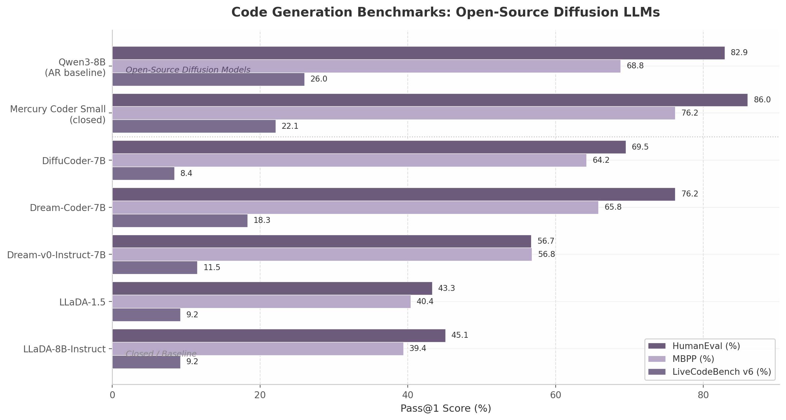

## 6. Open-Source Ecosystem and Community Models

The open-source diffusion language model (dLLM) ecosystem has matured rapidly since LLaDA's initial release in early 2025, with five distinct model families now defining the landscape: LLaDA from Ant Group and Renmin University, Dream from HKU and Huawei, DiffuCoder from Apple, SEDD from Stanford, and the commercial Mercury system from Inception Labs. Each represents a fundamentally different approach to training, licensing, and community engagement. The cumulative result is a diverse ecosystem that, while still smaller than its autoregressive counterpart, offers researchers and practitioners a range of architectural choices with permissive licensing and transparent training methodologies.

The trajectory of open-source dLLMs reveals a field transitioning from proof-of-concept to production-ready tooling. LLaDA-8B established that diffusion models could match autoregressive baselines on general language tasks; Dream demonstrated that autoregressive-to-diffusion conversion was a viable and potentially superior training paradigm; DiffuCoder introduced reinforcement learning (RL) techniques specifically designed for diffusion's non-causal structure; SEDD provided the mathematical foundation upon which much of this work rests; and Mercury proved that the approach could attract substantial commercial investment. Together, these models form a coherent innovation pipeline from theoretical foundations to deployed products.

**Table 6.1** summarizes the core characteristics of the major open-source diffusion LLM families, encompassing their architectural origins, training scale, licensing terms, and community adoption metrics as of mid-2025.

| Model Family | Organization | Parameters | Training Data | License | GitHub Stars | Key Innovation |
|:---|:---|:---|:---|:---|:---|:---|
| LLaDA-8B | Renmin U. / Ant Group | 8B | 2.3T tokens, 130K H800 hrs [^568^] | MIT | 3,800 [^169^] | First open-source dLLM, from-scratch training |
| LLaDA 1.5 | Renmin U. / Ant Group | 8B | 350K preference pairs [^216^] | MIT | — | VRPO variance-reduced preference optimization [^215^] |
| Dream 7B | HKU / Huawei | 7B | AR-initialized (Qwen2.5) [^257^] | Apache 2.0 | ~1,231 [^703^] | Context-adaptive noise rescheduling, Shift Operation [^257^] |
| Dream-Coder 7B | HKU / Huawei | 7B | OpenCoder, Stack-Edu, Dolmino [^573^] | Apache 2.0 | ~95 [^715^] | Full transparency release (recipes + checkpoints) [^171^] |
| DiffuCoder 7B | Apple | 7B | 130B code tokens [^153^] | Apple OSS | 821 [^170^] | Coupled-GRPO RL for diffusion [^153^] |
| SEDD | Stanford | GPT-2 scale | OpenWebText [^541^] | Open (GitHub) | — | Score entropy discrete diffusion [^541^] |

The table reveals a clear geographic and institutional split in the open-source ecosystem. Chinese institutions dominate the permissive open-source releases: Ant Group and Renmin University drive the LLaDA family under MIT licensing, while HKU and Huawei's Noah's Ark Lab release Dream under Apache 2.0. US contributions come primarily from corporate research laboratories (Apple's DiffuCoder) and academic groups (Stanford's SEDD), with Inception Labs choosing a closed-source commercial path for Mercury. This concentration of open-source leadership among Chinese institutions represents a notable inversion of the autoregressive LLM landscape, where US-based organizations have historically led open-weight releases.

### 6.1 LLaDA: The Pioneer

#### 6.1.1 LLaDA-8B Architecture and Training

LLaDA-8B, presented as an oral paper at NeurIPS 2025, was the first large-scale open-source diffusion language model, establishing the foundational training pipeline that subsequent dLLMs would follow, adapt, or reject [^31^]. Pre-trained from scratch on 2.3 trillion tokens using approximately 130,000 H800 GPU hours, LLaDA-8B closely follows the LLaMA3-8B architecture but with three critical modifications: vanilla multi-head attention replaces Grouped Query Attention (GQA), bidirectional attention removes the causal mask that constrains autoregressive models, and the feed-forward network dimension is adjusted to 12,288 to maintain comparable parameter count at approximately 8.02 billion total parameters [^568^].

The training pipeline proceeds through standard stages: data preparation, pre-training with uniform masking ratios sampled from [0, 1], supervised fine-tuning (SFT) on 4.5 million instruction pairs, and evaluation [^568^]. During SFT, only response tokens are masked while prompt tokens remain fully visible — the diffusion equivalent of autoregressive models computing loss exclusively on generated tokens during instruction tuning [^31^]. The optimizer configuration uses AdamW with a Warmup-Stable-Decay (WSD) learning rate schedule: 2,000-iteration warmup to 4e-4, a stable phase at 4e-4, a mid-training drop to 1e-4 after processing 1.2 trillion tokens, and final decay to 1e-5 over the last 0.3 trillion tokens [^571^].

The evaluation results established a critical baseline for the field. On MMLU, LLaDA-8B scores 65.9 versus LLaMA3-8B's 65.4; on HumanEval, LLaDA reaches 33.5% versus LLaMA3's 34.2% [^31^]. Perhaps more significantly, LLaDA surpasses GPT-4o on reversal poem completion — a task that directly tests bidirectional reasoning capability — providing concrete evidence that diffusion's non-sequential generation confers genuine advantages on certain task types [^31^]. The model's release under the MIT license — one of the most permissive open-source licenses available — enabled unrestricted commercial use, modification, and redistribution with minimal attribution requirements, catalyzing rapid community adoption that accumulated 3,800 GitHub stars within months of release [^169^].

#### 6.1.2 LLaDA 1.5 and VRPO

LLaDA 1.5 addressed the central challenge of aligning diffusion LLMs with human preferences: the high variance in Evidence Lower Bound (ELBO)-based likelihood estimates required for preference optimization [^215^]. Diffusion models cannot compute exact log-probability for generated sequences and instead rely on ELBO approximations. These estimates are inherently noisy, making preference-based gradient updates — which depend on precise likelihood differentials between preferred and dispreferred outputs — numerically unstable [^217^].

Variance-Reduced Preference Optimization (VRPO) introduces three principled variance-reduction techniques [^215^]. First, increased sampling budget for ELBO estimates uses more random draws of diffusion timestep and mask pattern configurations to reduce Monte Carlo noise. Second, optimal allocation recognizes that for a fixed total sample budget, sampling many different diffusion timesteps with only one mask per timestep minimizes estimation variance more effectively than alternative allocation strategies. Third, antithetic sampling shares identical random noise configurations between winning and losing outputs in preference comparisons, so random errors in their respective log-likelihood estimates tend to cancel when computing the preference differential [^215^] [^66^].

The training cost is remarkably efficient: approximately 405 H100 GPU hours for 8 Monte Carlo samples, representing less than 0.5% of the pre-training compute expenditure [^216^]. Training on 350,000 preference pairs covering creative writing (35%), knowledge QA (18%), NLP tasks (16%), mathematics (14%), recommendations (7%), code (5%), reasoning (3%), and safety tasks, VRPO delivers substantial improvements over the SFT-only LLaDA Instruct baseline: GSM8K +4.7 points, HumanEval +3.0, MBPP +1.8, IFEval +4.0, and Arena-Hard +4.3 [^215^]. The cost-effectiveness of these gains — high-quality alignment for under half a percent of pre-training compute — established a template for subsequent diffusion RL work.

#### 6.1.3 Scaling Behavior and LLaDA 2.0

LLaDA's from-scratch training demonstrated that diffusion LLMs could achieve competitive results when given data and compute budgets comparable to autoregressive counterparts, but the approach proved data-inefficient relative to alternative pathways. The development of LLaDA 2.0, which scales to 100 billion parameters via autoregressive-to-diffusion conversion rather than from-scratch training, represented a pivotal strategic shift [^24^]. LLaDA 2.0 employs a novel three-phase Warmup-Stable-Decay (WSD) block-level training paradigm that progressively converts pretrained autoregressive checkpoints into diffusion models, preserving the linguistic knowledge encoded in AR pretraining while gaining diffusion's parallel generation capability [^24^]. This conversion approach proved substantially more efficient than training from scratch, and the resulting 100-billion-parameter model — released as LLaDA 2.0-flash with 6.1 billion active parameters via Mixture-of-Experts (MoE) architecture — became the largest open-source diffusion LLM available [^408^].

### 6.2 Dream: AR-Initialized Adaptive Decoding

#### 6.2.1 Dream-7B Architecture

Dream-7B represents a fundamentally different philosophy from LLaDA's from-scratch approach. Rather than training a diffusion model de novo, Dream initializes from pretrained autoregressive weights — specifically Qwen2.5-Coder — and adapts them for diffusion-based generation through a "Shift Operation" that preserves the positional relationships learned during AR pretraining [^257^]. Under this strategy, the model continues to use hidden state $h_i$ to generate predictions for position $i+1$, contrasting with conventional diffusion that predicts masked tokens at their original positions. This preserves the sequential reasoning patterns that AR models learn while enabling non-sequential generation during inference [^257^].

The core technical innovation is context-adaptive token-level noise rescheduling. Dream re-determines the noise level for each masked token by measuring its contextual "informationness" using a mixture of geometric distributions. The weighting function quantifies each clean token's contribution to predicting masked tokens:

$$w(t, x_t, n) = \frac{1}{2} \sum_i \left[ \mathbf{1}[x_t^i \neq \text{MASK}] \cdot \text{Geo}(p, |n-i|-1) \right]$$

where parameter $p$ controls sharpness: smaller $p$ yields uniform contribution from all clean tokens, while larger $p$ emphasizes nearby clean tokens [^257^]. This adaptive rescheduling addresses a key limitation of uniform masking — not all tokens are equally informative, and treating them as such wastes model capacity on low-information positions.

Dream supports multiple remasking strategies including random, `maskgit_plus` (top-1 confidence selection), `topk_margin` (top1-top2 margin heuristic), and entropy-based remasking (using token distribution entropy as a confidence proxy). The entropy strategy with `alg_temp=0` serves as the default and corresponds to low-confidence remasking, which empirical evaluation has shown to be critical for diffusion LLM performance [^703^].

#### 6.2.2 Dream-Coder: Full Transparency Release

Dream-Coder 7B, released on July 15, 2025 by HKU and Huawei Noah's Ark Lab, represents the most transparent open-source release in the diffusion LLM ecosystem [^171^]. Positioned as a "fully open" 7-billion-parameter dLLM for code, it was trained exclusively on open-source and publicly available data across all stages: adaptation, SFT, and RL [^59^]. The release includes not only model checkpoints (Dream-Coder-7B and Dream-Coder-7B-Instruct) but complete training recipes, preprocessing pipelines, and inference code — a level of transparency that enables full reproducibility and community extension [^59^].

Training data sources include OpenCoder, Stack-Edu, Dolmino, and DCLM-Baseline [^573^]. The post-training recipe consists of two stages: SFT with random truncation and padding penalty to mitigate padding pathologies inherent in fixed-length diffusion training, followed by RL with verifiable rewards over curated high-quality prompts using a tailored RL recipe for diffusion language models [^59^]. Benchmark results are competitive with commercial diffusion models: 21.4% pass@1 on LiveCodeBench (2410-2505) — on par with Mercury Coder Small's 22.9% — alongside 82.9% on HumanEval, 79.6% on MBPP, and 73.1% on EvalPlus [^274^] [^287^].

A notable emergent property of Dream-Coder is its any-order generation capability, which manifests in three distinct patterns depending on task complexity [^59^]. For complex algorithms, the model exhibits sketch-first behavior: generating structural elements (function signatures, control flow) before filling implementation details. For straightforward completions, it defaults to left-to-right generation. For logic-intensive tasks, it produces interleaved reasoning — generating key conditional checks first, then supporting code. This adaptivity suggests that diffusion models can dynamically select generation strategies matched to task structure, a capability that rigidly sequential AR models cannot replicate.

#### 6.2.3 DreamOn: Variable-Length Generation

DreamOn, released in February 2026, addresses a fundamental limitation of masked diffusion models: fixed-length generation. Standard dLLMs require pre-specifying output length, which is either wasteful (padding short responses to maximum length) or constraining (truncating long responses) [^59^]. DreamOn introduces `[expand]` and `[delete]` special tokens that enable variable-length generation by allowing the model to dynamically resize the output sequence during the denoising process. The reported 26.4% improvement on key benchmarks demonstrates that the fixed-length constraint was a genuine performance bottleneck rather than merely an inconvenience [^59^]. This innovation is particularly relevant for code generation, where output length varies dramatically — from one-line completions to multi-file implementations.

### 6.3 DiffuCoder: Apple's RL-Enhanced Approach

#### 6.3.1 Coupled-GRPO

DiffuCoder 7B, Apple's open-source diffusion model for code, introduces coupled-GRPO (Group Relative Policy Optimization), a reinforcement learning algorithm specifically designed for the non-causal structure of diffusion models [^153^]. The model is trained on 130 billion tokens of code data across four stages: adaptation pre-training on a 400-billion-token code corpus from RefineCode and Stackv2 with early stopping at 65 billion tokens; mid-training on 16 billion tokens of annealed code data; instruction tuning on 436,000 SFT samples using classifier-free guidance; and RL post-training via coupled-GRPO on 21,000 hard samples from Acecoder-87K [^153^] [^602^].

The coupled-GRPO algorithm's central innovation is complementary mask sampling. For each training completion, two masks are constructed such that every token position is masked in exactly one of the two masks — together they cover all completion tokens exhaustively [^153^]. This construction guarantees three properties: each token's log-probability is computed at least once (ensuring non-zero learning signal everywhere), log-probability estimations are more accurate because they are evaluated under realistic partial-masking contexts rather than full masking, and the approach generates $2\lambda$ additional samples compared to baseline GRPO without increasing computational cost [^153^].

The empirical results validate the approach. Coupled-GRPO achieves a +4.4% improvement on EvalPlus over the SFT-only baseline, with final scores of 72.0% on HumanEval, 65.2% on MBPP, and 75.1% on EvalPlus [^153^]. An important secondary finding is that RL training shifts the optimal sampling temperature from 0.2 toward higher values, reducing the model's reliance on strict autoregressive causal decoding patterns. This suggests that RL enables diffusion models to discover and exploit their non-sequential generation capability more effectively than SFT alone.

#### 6.3.2 RL Versus SFT for Diffusion Models

DiffuCoder's training experiments yielded a striking finding that has implications for the entire dLLM field: reinforcement learning consistently outperforms supervised fine-tuning for diffusion model post-training, while standard SFT provides only marginal gains [^153^]. The underlying cause is train-test mismatch — SFT trains the model on fully masked outputs but inference requires generating under partially masked conditions, and this distributional shift undermines SFT effectiveness. Diffusion models are inherently trained to denoise from any masking configuration, but SFT optimizes only the fully masked endpoint, wasting the model's intermediate-denoising capability. RL, by contrast, evaluates the model under realistic inference conditions (variable masking) and rewards successful completion, directly optimizing for the metric of interest without distributional assumptions [^153^].

#### 6.3.3 Open-Source Release

DiffuCoder was released under Apple's standard open-source license (similar in permissiveness to Apache 2.0), with full code, training recipes, and model weights published on HuggingFace and GitHub [^170^]. The repository has accumulated 821 GitHub stars, reflecting solid community interest, though substantially below LLaDA's 3,800 [^170^]. Apple also actively supports community porting efforts, including an MLX implementation for Apple Silicon inference. However, DiffuCoder's strong code performance comes with limited general capability — the model is specialized for code generation and does not compete with general-purpose dLLMs like LLaDA or Dream on non-code benchmarks [^153^].

**Table 6.2** presents a detailed comparison of post-training RL techniques across the major open-source dLLM families, illustrating the rapid maturation of diffusion-specific alignment methods.

| Technique | Model | RL Algorithm | Training Data | Compute Cost | Key Improvement | Mechanism |
|:---|:---|:---|:---|:---|:---|:---|
| VRPO | LLaDA 1.5 | Variance-reduced DPO | 350K preference pairs [^216^] | 405 H100 hrs [^216^] | GSM8K +4.7, HumanEval +3.0 [^215^] | Optimal allocation + antithetic sampling |
| Coupled-GRPO | DiffuCoder 7B | Complementary mask GRPO | 21K hard code samples [^153^] | — | EvalPlus +4.4% [^153^] | Full token coverage via paired masks |
| Dream-Coder RL | Dream-Coder 7B | Verifiable reward RL | Curated high-quality prompts [^59^] | — | LiveCodeBench 18.3% [^274^] | Tailored RL recipe for diffusion LMs |
| EBPO | LLaDA 2.1 | Entropy-based preference opt. | Large-scale preference data | — | LiveCodeBench 42.29 [^408^] | Leverages inpainting for exploration |
| d1-LLaDA | LLaDA family | GRPO for MDMs | Task-specific | — | Task-variable [^516^] | One-step log-prob with random masking |

The diversity of RL approaches reflects the field's rapid innovation rate. VRPO addresses variance reduction for general alignment; coupled-GRPO solves the token-coverage problem specific to code generation; Dream-Coder's verifiable reward RL leverages the deterministic nature of code correctness; and EBPO exploits diffusion's inpainting capability to guide exploration. This specialization suggests that, unlike autoregressive models where a single RL algorithm (PPO, then DPO) achieved broad dominance, diffusion models may require task-specific RL formulations to realize their full potential.

**Figure 6.1** compares code generation performance across open-source diffusion LLMs and closed-source baselines on three standard benchmarks. Dream-Coder achieves the highest scores among fully open-source models, approaching Mercury Coder Small (closed API) on HumanEval while trailing on LiveCodeBench, which tests more complex competitive-programming-style problems. The substantial gap between open-source diffusion models and the Qwen3-8B autoregressive baseline on LiveCodeBench (26.0% versus a range of 8.4%–18.3% for open-source dLLMs) underscores that competitive programming remains a challenge for the diffusion paradigm, though Dream-Coder's 21.4% on the v4 benchmark [^59^] shows the gap is narrowing.

### 6.4 SEDD: ICML 2024 Best Paper

#### 6.4.1 Score Entropy for Discrete Diffusion

SEDD (Score Entropy Discrete Diffusion), authored by Aaron Lou, Chenlin Meng, and Stefano Ermon from Stanford University, received the ICML 2024 Best Paper award for establishing the mathematical foundation that enables diffusion models to operate effectively in discrete spaces such as text token vocabularies [^518^] [^551^]. The central technical challenge SEDD addresses is that standard diffusion models rely on score matching — estimating $\nabla_x \log p(x)$, the gradient of the data log-density — which generalizes naturally to continuous spaces (where gradients exist) but fails for discrete data like text token indices (where gradients are undefined) [^518^].

SEDD's solution replaces gradient-based score matching with probability ratio estimation. Rather than modeling how the log-density changes with infinitesimal input perturbations, SEDD parameterizes the reverse discrete diffusion process using ratios of the data distribution $p_t(y) / p_t(x)$. These probability ratios are learned through a novel score entropy loss that naturally extends score matching to discrete spaces [^541^] [^544^]:

$$D_{SE}(p_\theta(\cdot|x_t) \,||\, p_t(\cdot|x_0)) = \sum_y \frac{p_t(y|x_0)}{p_t(x)} \left[ \log\frac{p_t(y|x_0)}{p_t(x)} - \log s_\theta(x_t)_y \right]$$

This formulation has the elegant property that it reduces to standard score matching in the continuous limit while remaining well-defined for discrete vocabularies of arbitrary size.

Empirically, SEDD reduces perplexity by 25–75% compared to existing language diffusion paradigms and achieves 6–8× better generative perplexity than un-annealed GPT-2 at the same model scale [^541^]. Critically, SEDD can match GPT-2 generation quality with 32× fewer network evaluations, and it enables controllable infilling — matching nucleus sampling quality while supporting non-left-to-right prompting patterns [^545^]. The infilling capability is particularly significant because it demonstrates that diffusion models can naturally support the bidirectional context access that autoregressive models implement only through cumbersome workarounds.

#### 6.4.2 Theoretical Significance and Influence

SEDD's theoretical contribution extends beyond its immediate empirical results. By proving that probability ratios (not gradients) are the correct generalization of score matching to discrete spaces, SEDD provided the mathematical legitimacy that the entire discrete diffusion field required [^518^]. The paper directly influenced the development of LLaDA (which uses a simplified variant of SEDD's probability-ratio formulation), MDLM (Masked Diffusion Language Model, which extends the framework to larger scales), and subsequent theoretical work on discrete diffusion convergence properties. The intellectual lineage from SEDD to commercial systems is explicit: SEDD co-author Stefano Ermon co-founded Inception Labs, which commercialized the diffusion-language approach as the Mercury model family [^518^] [^583^]. This represents a rare instance of academic theoretical research translating directly into a commercial product within a single generation of technology development.

### 6.5 Mercury: First Commercial Diffusion LLM for Code

#### 6.5.1 Inception Labs and Funding

Inception Labs, founded in 2024 in Palo Alto by a trio of Stanford, UCLA, and Cornell professors — Stefano Ermon (Stanford, co-inventor of diffusion methods underlying Midjourney and Sora), Aditya Grover (UCLA), and Volodymyr Kuleshov (Cornell) — represents the first venture-backed company dedicated exclusively to commercializing diffusion language models [^519^] [^577^]. The founding team has collaborated for over a decade on generative modeling research, and their combined expertise spans the theoretical (Ermon's work on score-based models), algorithmic (Grover's work on structured prediction), and systems (Kuleshov's work on efficient inference) dimensions of the technology stack.

In November 2025, Inception Labs announced a $50 million seed round led by Menlo Ventures, with participation from Mayfield, Innovation Endeavors, NVentures (NVIDIA), M12 (Microsoft), Snowflake Ventures, Databricks Investment, and angel investors including Andrew Ng and Andrej Karpathy [^586^] [^589^]. The funding round, unusually large for a seed-stage company, reflects investor conviction that diffusion LLMs represent a genuine architectural alternative to autoregressive models rather than merely an academic curiosity. The reported post-money valuation of approximately $500 million signals strong market expectations for the technology's commercial viability [^519^].

#### 6.5.2 Mercury Coder Performance

Mercury Coder, launched in February 2025, is the world's first commercially available diffusion LLM, delivered through a managed API rather than open weights [^71^] [^586^]. Mercury Coder Mini achieves 1,109 tokens per second on NVIDIA H100 GPUs, while Mercury Coder Small reaches 737 tokens per second — approximately 5–10× faster than speed-optimized frontier autoregressive models while maintaining comparable output quality [^45^] [^71^]. On quality benchmarks, Mercury Coder Small achieves 90.0% on HumanEval, 76.6% on MBPP, 80.4% on EvalPlus, 25.0% on LiveCodeBench, and 45.5% on BigCodeBench [^71^].

The API pricing model — $0.25 per million input tokens and $1.00 per million output tokens — positions Mercury substantially below frontier autoregressive model pricing, with the cost advantage derived from diffusion's parallel generation reducing per-token inference compute [^519^] [^552^]. Mercury supports a 32,000-token context window and is available via platform.inceptionlabs.ai as well as through third-party integrations including Amazon Bedrock, OpenRouter, and Poe. Developer tool integrations include Continue.dev for VS Code, ProxyAI, Buildglare, and Kilo Code, though native IDE plugin support remains less mature than GitHub Copilot's deep VS Code and JetBrains integration [^519^].

#### 6.5.3 Licensing and Availability Landscape

**Table 6.3** provides a comprehensive comparison of licensing terms, weight availability, and commercial accessibility across all major diffusion LLMs, both open-source and proprietary.

| Model | License | Weights Available | Code Available | Training Data Known | Commercial Use | Access Method |
|:---|:---|:---|:---|:---|:---|:---|
| LLaDA 8B / 1.5 | MIT [^169^] | Yes | Yes | Yes | Yes | HuggingFace |
| LLaDA 2.0 (100B) | Open [^408^] | Yes | Yes | Partial | Yes | HuggingFace |
| Dream 7B | Apache 2.0 [^714^] | Yes | Yes | Yes | Yes | HuggingFace |
| Dream-Coder 7B | Apache 2.0 [^171^] | Yes | Yes | Yes | Yes | HuggingFace |
| DiffuCoder 7B | Apple OSS [^170^] | Yes | Yes | Yes | Yes | HuggingFace + GitHub |
| SEDD | Open (GitHub) | Yes | Yes | Yes | Yes | GitHub |
| Mercury | Proprietary [^519^] | No | No | No | Via API | API only |
| Gemini-Diffusion | Proprietary [^1^] | No | No | No | Via API | API only |
| Seed-Diffusion | Proprietary | No | No | No | Via API | Internal / API |

The licensing landscape reveals a sharp bifurcation. Open-source releases (LLaDA, Dream, DiffuCoder, SEDD) provide full transparency across weights, code, and training data, with permissive licenses enabling commercial adoption. Proprietary models (Mercury, Gemini-Diffusion, Seed-Diffusion) offer only API access, with no visibility into model architecture, training data, or inference infrastructure. This bifurcation has practical consequences: open-source models enable researchers to study and improve diffusion architectures, customize models for domain-specific applications, and deploy on private infrastructure, while proprietary models offer managed reliability, optimized inference, and continuous improvement without operational burden.

The open-source ecosystem's trajectory suggests continued expansion. LLaDA's family has grown from 8B to 100B parameters within a single year; Dream has spawned specialized variants for code (Dream-Coder) and variable-length generation (DreamOn); community tools like dInfer (efficient inference by InclusionAI), the Information-Gain Sampler (ICML 2026, a unified decoding framework for masked diffusion models), and A-CFG (adaptive classifier-free guidance) are building out the infrastructure layer that mature ecosystems require [^598^] [^578^] [^595^]. The open-source diffusion LLM ecosystem remains smaller than its autoregressive counterpart — measured by total GitHub stars, community contributors, or third-party integrations — but its growth rate and the concentration of innovation within it suggest that the gap will narrow substantially over the coming year.

The critical question facing the ecosystem is whether open-source diffusion models can close the quality gap with closed commercial systems. Current evidence is mixed: on HumanEval, Dream-Coder's 76.2% trails Mercury Coder Small's 86.0% by nearly 10 percentage points, but Dream-Coder matches Mercury on LiveCodeBench v4 at 21.4% versus 22.9% [^59^]. A comprehensive empirical study attributes the average performance gap to "the availability of higher-quality training data in commercial settings" [^9^], suggesting that the gap is not architectural but data-related. If this diagnosis is correct, careful data curation and continued RL innovation — both of which the open-source community is actively pursuing — should enable convergence. The open-source diffusion LLM ecosystem has established architectural viability, training methodology, and licensing frameworks. The next phase will determine whether it can match the scale and quality of commercial deployments.
