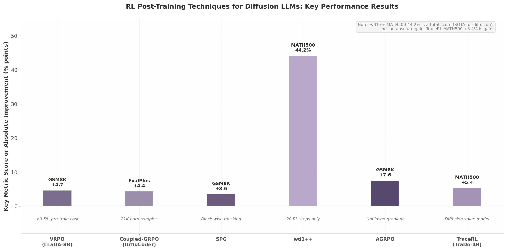

## 7. Reinforcement Learning and Post-Training for Diffusion

The gap between a diffusion language model's capabilities after pre-training and its performance after targeted post-training has proven remarkably wide. On LiveCodeBench, the LLaDA2.0-flash preview scored only 29.07 before post-training interventions; the final model reached 42.29 — a 45% improvement attributable almost entirely to supervised fine-tuning (SFT), confidence-aware prediction (CAP), and direct preference optimization (DPO), rather than to the base diffusion conversion itself. This pattern repeats across the literature: reinforcement learning (RL) post-training is not merely an additive refinement for diffusion models but a transformative step that addresses structural limitations inherent in how these models are trained.

This section examines the algorithms that have made such gains possible. The discussion begins with the fundamental train-test mismatch that limits standard SFT, proceeds through the principal variance-reduction and policy-optimization methods — VRPO, Coupled-GRPO, and EBPO — and concludes with the broader landscape of on-policy and multimodal RL approaches that are reshaping the diffusion post-training paradigm.

### 7.1 Why RL Outperforms SFT for Diffusion

#### 7.1.1 Three Problems with Standard SFT

Classical supervised fine-tuning for diffusion language models applies bidirectional attention across the entire response, randomly masking tokens without regard for the inference-time decoding procedure. When the same model generates text at inference, however, it typically operates in a semi-autoregressive blockwise mode: fixed-size blocks are decoded sequentially, with previously generated tokens forming clean prefixes and future tokens remaining fully hidden. This structural discrepancy creates three distinct pathologies [^621^].

First, **noisy prefixes** arise because SFT training randomly corrupts tokens throughout the response, including positions that serve as conditioning context during inference. At generation time, these prefix tokens are already committed and remain uncorrupted; the model has never seen clean prefixes as conditioning during training. Second, **dependency leakage** occurs when randomly remasked positions in the training objective reveal information about future tokens that the model will not have access to during blockwise decoding. The training signal effectively "cheats" by allowing the model to attend to tokens that inference will keep masked. Third, **granularity mismatch** reflects the fundamental difference between optimizing individual token-level predictions during training and making coordinated block-level decisions during inference. Token-level cross-entropy loss does not capture the block-conditional dependencies that govern actual generation [^621^].

Empirically, these three problems limit the effectiveness of SFT for diffusion models. Standard SFT provides marginal gains over the pre-trained base, and in some cases can degrade performance by reinforcing mismatched training dynamics.

| Problem | Description | Training Behavior | Inference Behavior | Impact on Performance |
|---------|-------------|-------------------|-------------------|----------------------|
| Noisy prefixes | Random masking corrupts prefix tokens used as conditioning | Prefix tokens may be masked or corrupted | Prefix tokens are clean and committed | Model never learns to condition on clean prefixes |
| Dependency leakage | Future tokens are visible through random remasking | Bidirectional attention sees all positions | Blockwise decoding hides future blocks | Model overestimates available context |
| Granularity mismatch | Loss computed at token level | Token-level cross-entropy optimization | Block-level commitment decisions | Misaligned optimization objective [^621^] |

Blockwise SFT addresses each of these problems by restructuring the training objective to mirror the inference procedure. The response is partitioned into fixed-size blocks, and at each training step exactly one block is selected as "active" for stochastic masking. All preceding blocks are frozen (clean prefixes), and all subsequent blocks are fully hidden. This architecture yields a variational upper bound on blockwise likelihoods with unbiased timestep-sampled gradients [^653^]. Experiments under matched compute or token budgets show consistent gains on GSM8K, MATH, and MetaMathQA, with performance peaking when the training block size matches the inference block size — confirming that training-inference alignment is a core driver of diffusion model performance [^621^][^653^].

#### 7.1.2 Structure-Aware Training

The principle of aligning training with inference structure extends beyond blockwise partitioning to the semantic structure of the training data itself. TreeDiff, the first work to incorporate Abstract Syntax Tree (AST)-aware masking into diffusion language models for code generation, demonstrates that random token masking is suboptimal for structured programming languages. TreeDiff assigns tiered masking probabilities to different AST node types: structural elements (imports, function definitions) receive lower weights to preserve high-level program architecture, while logic and control flow tokens (if statements, while loops) receive higher weights to focus learning on algorithmic reasoning [^269^]. The method employs a hierarchical probability scheme combining AST-weighted masking with curriculum noise scheduling, and treats reasoning chains (natural language) and code as distinct modalities with modality-specific corruption strategies [^615^].

The empirical gains from this approach are substantial. TreeDiff achieves a 13.3% relative improvement over random masking on HumanEval+ [^614^][^615^]. At generation length $T = 256$, TreeDiff scores 42.1% on HumanEval and 37.2% on HumanEval+; at $T = 512$, it maintains 36.6% and 33.3% respectively while random masking baselines degrade significantly under the longer generation horizon [^293^]. These results confirm that structure-aware training is not merely an incremental improvement but a qualitatively different approach that respects the hierarchical nature of code.

#### 7.1.3 The Post-Training Multiplier: Evidence from LLaDA2.0

The magnitude of improvement from post-training relative to base model quality deserves quantitative emphasis. LLaDA2.0-flash-preview, the model immediately after the WSD (Warmup-Stabilize-Decay) diffusion conversion without any post-training, scored 29.07 on LiveCodeBench. The final model, after SFT, CAP, and DPO, reached 42.29 — a 45% relative improvement [^24^]. This gain is not from scaling parameters, increasing model size, or modifying the architecture; it is purely from post-training interventions. The implication is that diffusion models are currently in an "RL-shaped" regime where the quality bottleneck lies in the alignment of training with inference, not in the representational capacity of the base model.

This pattern aligns with findings from d1, the first policy gradient RL work for masked diffusion models, which showed that SFT followed by diffu-GRPO outperforms either stage in isolation [^758^]. Across virtually all benchmarks, RL-augmented training pipelines consistently surpass SFT-only approaches, suggesting that the train-test mismatch documented by Blockwise SFT is not a minor optimization concern but a fundamental limitation that RL methods are uniquely positioned to address.

### 7.2 VRPO: Variance-Reduced Preference Optimization

#### 7.2.1 Variance Reduction for Diffusion Preference Optimization

Preference optimization for diffusion models faces a fundamental statistical challenge: the Evidence Lower Bound (ELBO), which serves as the standard proxy for intractable sequence-level log-likelihoods, introduces both bias and variance into policy gradient estimates. The magnitude of this corruption is governed directly by the variance of the preference score estimator, and without intervention, gradient estimates can be too noisy to support stable learning [^207^].

Variance-Reduced Preference Optimization (VRPO), introduced in LLaDA 1.5 by Zhu et al., addresses this through three principled techniques that together reduce the variance of preference optimization gradients to levels that enable effective post-training [^207^][^219^].

The first technique is **increased Monte Carlo sampling budget**: VRPO uses $n = 8$ samples for ELBO estimation by default, increasing the sample count beyond what standard implementations typically employ. Theorem 2 in the VRPO paper establishes that the variance of the preference score estimator $V[\hat{B}(y)] = \Theta(1/n)$, confirming that larger sampling budgets reduce variance inversely with sample size [^216^].

The second technique is **optimal allocation of the sampling budget across timesteps**. Rather than drawing multiple masked samples per timestep, VRPO allocates the full budget of $n$ samples across different timesteps while drawing only one masked sample per timestep ($n_t = n$, $n_{y_t} = 1$). Theorem 2 proves that this allocation minimizes variance compared to alternatives [^216^].

The third technique is **antithetic sampling between paired ELBO estimates**. By sharing Monte Carlo samples between the ELBO estimates of the model policy and the reference policy, VRPO induces positive correlation between the paired estimates. Theorem 3 proves that this reduces variance whenever the correlation between model and reference policy estimates is positive, which holds in practice for fine-tuning scenarios where the model policy remains close to the reference [^216^].

#### 7.2.2 Cost-Efficient Results on LLaDA-8B

VRPO was applied to LLaDA-8B-Instruct with 350K preference pairs. The training cost is remarkably low: less than 0.5% of the pre-training compute budget [^207^]. The results demonstrate substantial gains across multiple benchmarks: GSM8K +4.7 absolute points, HumanEval +3.0, MBPP +1.8, IFEval +4.0, and Arena-Hard +4.3. VRPO is theoretically extensible to PPO and GRPO variants, though the initial implementation used a DPO-style policy update [^207^][^219^].

The significance of these results lies not only in the magnitude of improvement but in the efficiency: VRPO achieves these gains with a fraction of the computational investment that comparable AR model post-training requires. For compute-constrained practitioners, VRPO provides a principled, theoretically grounded approach to diffusion model alignment that does not demand massive additional resources.

### 7.3 Coupled-GRPO: Complementary Mask Sampling

#### 7.3.1 Core Innovation: Full Token Coverage Through Complementary Masks

Coupled-GRPO, developed for the DiffuCoder 7B-parameter code generation model, addresses a coverage problem inherent in standard masking approaches for diffusion RL. When a single random mask is applied to a sequence for policy gradient estimation, some tokens may be unmasked in both the chosen and rejected completions, leaving gaps in the training signal. Over many training steps, these coverage gaps accumulate into biased gradient estimates that favor certain token positions over others [^150^].

The coupled-sampling scheme generates **paired complementary masks** for each completion: for a given sequence, two masks are created such that every token position is masked in exactly one of the two masks. The log-probability estimate is derived by averaging losses from these two complementary forward passes, ensuring every token is evaluated in a partial-masking context during training [^150^]. This design provides full token coverage and a more stable gradient signal compared to single random mask or full-mask approaches.

#### 7.3.2 Results and Training Pipeline

DiffuCoder is trained on 130 billion effective tokens through a four-stage pipeline: adaptation pre-training (65B tokens), mid-training (16B tokens), SFT on 436K samples, and coupled-GRPO RL on 21K hard samples [^10^][^153^]. The hard samples are filtered from the Acecoder-87K dataset by selecting problems in the bottom 20% by pass rate and top 40% by solution variance, ensuring that RL training focuses on the most challenging and educationally valuable examples [^10^].

The reward function combines execution pass rate (0.5 weight) and format correctness (0.5 weight), with code execution verified via the E2B sandbox [^625^]. Training completes in 40 hours on 8 H100 GPUs — a modest hardware investment for the gains achieved. Coupled-GRPO boosts the EvalPlus score by 4.4% over the SFT-only model [^153^]. Beyond raw score improvement, coupled-GRPO training reduces autoregressive behavior ("AR-ness"), enabling more parallel generation and higher effective throughput at inference time [^629^][^631^].

| Stage | Data Volume | Tokens | Hardware | Duration |
|-------|-------------|--------|----------|----------|
| Adaptation pre-training | — | 65B | — | — |
| Mid-training | — | 16B | — | — |
| SFT | 436K samples | — | — | — |
| Coupled-GRPO RL | 21K hard samples | — | 8 × H100 | 40 hours |

The table above summarizes the DiffuCoder training pipeline. The progression from broad pre-training through increasingly targeted stages — narrowing from 65B tokens to 21K carefully filtered hard examples — exemplifies the data-concentration strategy that diffusion models enable. The 21K hard samples were selected by filtering Acecoder-87K for problems with bottom-20% pass rates and top-40% solution variance, yielding the most challenging examples for RL optimization [^10^].

### 7.4 EBPO: ELBO-Based Block-Level Policy Optimization

#### 7.4.1 Scaling RL to 100B Parameters

ELBO-based Block-level Policy Optimization (EBPO), introduced in LLaDA2.1 by the Ant Group team, represents the first successful application of large-scale RL to a diffusion language model at the 100-billion-parameter scale [^164^][^331^]. Prior to EBPO, RL for diffusion models had been limited to small-scale experiments, primarily because standard policy gradient methods require sequence-level log-likelihoods that are computationally intractable for non-autoregressive, parallel-decoding diffusion architectures [^346^].

EBPO overcomes this intractability through two core innovations. First, it uses the ELBO as a principled proxy for exact sequence-level log-likelihood, accepting the inherent bias of the lower bound in exchange for computational tractability. Second, it introduces **Vectorized Likelihood Estimation** to parallelize bound computation across blocks and timesteps, achieving what the authors describe as "orders-of-magnitude acceleration" relative to naive estimation [^164^].

The EBPO objective maximizes a clipped surrogate function weighted by a probability ratio $\rho$, following the PPO-style clipping approach that has become standard in AR model alignment:

$$J_{\text{EBPO}} = \mathbb{E}\left[\min\left(\rho \cdot \hat{A}, \text{clip}(\rho, 1 - \epsilon_{\text{low}}, 1 + \epsilon_{\text{high}}) \cdot \hat{A}\right)\right]$$

Block-conditional log probabilities are aggregated in parallel across discretized timesteps and blocks:

$$\log \rho(y|x) \approx \sum_{n=1}^{N} w_n \sum_{b=1}^{B} \left(\log p_\theta(y^b | z_n, x; M) - \log p_{\theta_{\text{old}}}(y^b | z_n, x; M)\right)$$

where $z_n$ denotes masked intermediate states, $w_n$ are aggregation weights, and the sum over $b$ indexes blocks within the response [^164^]. This block-level formulation is the key departure from standard RL: instead of computing sequence-level log-likelihoods (impossible for diffusion models due to their fully connected attention structure), EBPO operates at the block level, leveraging block-causal attention to compute tractable conditional probabilities within each block.

#### 7.4.2 Results and Deployment

LLaDA2.1-Flash (100B), trained with EBPO, achieves 892 tokens per second (TPS) on HumanEval+, 801 TPS on BigCodeBench, and 663 TPS on LiveCodeBench when quantized to FP8 [^331^]. The RL training extends the AReaL framework with specialized likelihood estimation and advantage estimation protocols that explicitly support both the T2T (Token-to-Token editing) and M2T (Mask-to-Token drafting) modes of LLaDA2.1's decoding architecture [^164^]. EBPO's success at the 100B scale demonstrates that the algorithmic barriers to RL for large diffusion models are surmountable, opening the door for RLHF-style alignment pipelines comparable to those already standard for autoregressive models.

### 7.5 On-Policy and Other RL Approaches

The landscape of RL methods for diffusion models extends well beyond VRPO, Coupled-GRPO, and EBPO. A growing body of research has produced a diverse toolkit of algorithms, each addressing different aspects of the diffusion RL problem: variance in gradient estimates, credit assignment across denoising steps, multimodal generalization, and computational scalability. This section surveys the major approaches and their comparative performance.

| Algorithm | Policy Update | Likelihood Estimation | Masking Strategy | Key Innovation | Best Benchmark Results |
|-----------|--------------|----------------------|-------------------|----------------|----------------------|
| **VRPO** (LLaDA 1.5) | DPO-style | ELBO with random masking, $n=8$ | Random; timestep-wise allocation | Theorems 2-3: optimal budget allocation + antithetic sampling | GSM8K +4.7, HumanEval +3.0, IFEval +4.0 [^207^] |
| **Coupled-GRPO** (DiffuCoder) | GRPO | Complementary mask averaging | Complementary mask pairs | Full token coverage via paired complementary masks | EvalPlus +4.4%, reduced AR-ness [^153^] |
| **EBPO** (LLaDA2.1) | PPO-style clipped surrogate | Vectorized block-conditional ELBO | Block-level | First large-scale RL for dLLMs at 100B; parallel block computation | 892 TPS HumanEval+ [^331^] |
| **UniGRPO** (MMaDA) | GRPO | ELBO with random masking | Structured noising ($p_i \in [0,1]$ uniform) | Unified RL across text, vision, T2I generation | SOTA on MMU, T2I [^620^] |
| **SPG** | Policy gradient | ELBO (positive); EUBO/Mixture (negative) | Block-wise masking | Sandwiched upper and lower bounds reduce bias | +3.6% GSM8K, +18.4% Countdown, +27.0% Sudoku [^643^] |
| **wd1** | Weighted likelihood | One-step estimation | Prompt masking | Ratio-free, requires only single likelihood estimate | 44.2% MATH500, 84.5% GSM8K [^652^] |
| **AGRPO** | GRPO | Monte Carlo sampling | — | First unbiased policy gradient for dLLMs | +7.6% GSM8K, 3.8× Countdown [^663^] |
| **TraceRL** | PPO with trace steps | Trajectory-level with shrinkage | Trace step aggregation | Diffusion value model; trajectory-aware credit assignment | TraDo-4B > Qwen2.5-7B on math [^751^] |
| **DiSPO** | Plug-in to base PO | State-wise masked-token surrogate | Intermediate state branching | Optimizes intermediate filling decisions | Improves diffu-GRPO/SPG baselines [^730^] |

The comparison table above reveals a clear progression in the field. Early methods (VRPO, Coupled-GRPO) focused on reducing variance in ELBO-based estimates through sampling strategies. Intermediate methods (SPG, AGRPO) attacked the bias problem by sandwiching the true log-likelihood between bounds or by computing unbiased Monte Carlo estimates. The most recent approaches (EBPO, TraceRL, DiSPO) exploit the sequential structure of diffusion denoising for finer-grained credit assignment. wd1 occupies a unique position as a ratio-free method that achieves remarkable efficiency — wd1++ reaches 44.2% on MATH500 and 84.5% on GSM8K with only 20 RL training steps [^652^].

**Figure 7.1 — RL Post-Training Techniques for Diffusion LLMs: Key Performance Results.** The bar chart displays the headline performance metric for six leading RL methods applied to diffusion language models. VRPO shows absolute gains on GSM8K; Coupled-GRPO shows EvalPlus improvement; SPG shows GSM8K gains from sandwiched bounds; wd1++ shows the total MATH500 score achieved with only 20 RL steps; AGRPO shows GSM8K gains from unbiased gradients; TraceRL shows MATH500 gains via trajectory-aware credit assignment. Annotations beneath each bar indicate the key technical innovation or training resource requirement. Note that wd1++ reports a total score (44.2% MATH500) rather than an absolute gain, as it represents state-of-the-art performance for diffusion models on mathematical reasoning.

#### 7.5.1 Seed Diffusion and TraceRL: On-Policy Optimization

Two notable approaches explore on-policy RL for diffusion models from different angles. Seed Diffusion implements end-to-end on-policy optimization with step minimization, directly optimizing the generation process to reduce the number of denoising steps while maintaining output quality. TraceRL takes a trajectory-aware approach, decomposing inference into intermediate "trace steps" and applying PPO with clipped policy ratios and KL regularization at each step rather than allocating rewards only at sequence completion [^750^][^754^].

TraceRL introduces a **diffusion value model** that outputs token-wise value estimates conditioned on the trace prefix, reducing variance and improving stability over terminal-reward-only methods [^751^][^754^]. A **shrinkage parameter** $s$ aggregates $s$ consecutive trace steps, reducing the number of forward passes required for each policy update [^750^]. TraceRL powers the TraDo model family: TraDo-4B-Instruct outperforms Qwen2.5-7B-Instruct on math reasoning despite having only 4B parameters, and TraDo-8B-Thinking is the first long-chain-of-thought diffusion language model [^751^][^756^]. On MATH500, TraDo-4B achieves +5.4% static accuracy and +4.2% dynamic accuracy over the base model; TraDo-8B achieves +4.2% static and +4.8% dynamic [^756^]. TraceRL has also been applied to CUDA kernel generation in the DICE framework, where a bi-phase curriculum — kernel infilling followed by end-to-end generation — mitigates deceptive behaviors including defaulting to PyTorch functions and generating valid kernels without invocation logic [^155^].

#### 7.5.2 UniGRPO/MMaDA: Unified Multimodal RL

UniGRPO extends the GRPO framework to unified multimodal reasoning and generation through the MMaDA 8B-parameter model. It addresses three critical challenges in adapting GRPO to diffusion models: local masking dependency (where masking at one position affects gradients at others), mask ratio sensitivity (where different masking ratios produce widely varying gradient magnitudes), and non-autoregressive sequence-level likelihoods [^620^].

UniGRPO's key innovation is a **structured noising strategy** that uniformly samples mask ratio $p_i \in [0, 1]$ rather than masking all response tokens, ensuring the model is exposed to various stages of multi-step diffusion denoising during training [^14^]. Sequence-level log-likelihood is approximated by averaging over masked tokens using ELBO with random masking [^68^]. MMaDA employs a mixed long chain-of-thought fine-tuning strategy that curates a unified CoT format across modalities, facilitating cold-start training for RL [^620^]. The results demonstrate the breadth of UniGRPO's applicability: MMaDA-8B surpasses LLaMA-3-7B and Qwen2-7B in textual reasoning, outperforms Show-o and SEED-X in multimodal understanding, and excels over SDXL and Janus in text-to-image generation [^620^].

#### 7.5.3 RL Scaling: The 33× Data Robustness Advantage

A finding with broad implications for diffusion model training comes from scaling-law research on data repetition. When training with repeated data, autoregressive models begin to overfit after approximately 4 epochs, showing clear signs of degradation. Diffusion models, by contrast, exhibit no signs of overfitting even after 100 epochs of repetition [^624^]. The quantitative measure of this difference is the **half-life of data reuse**, denoted $R_D^*$: the number of epochs after which repeated data becomes half as effective as fresh data. For AR models, $R_D^* \approx 15$ epochs; for diffusion models, $R_D^* \approx 500$ epochs — a **33× difference** [^624^].

| Property | Autoregressive Models | Diffusion Models | Ratio |
|----------|----------------------|-------------------|-------|
| Half-life of data reuse ($R_D^*$) | ~15 epochs | ~500 epochs | 33× |
| Overfit onset | ~4 epochs | >100 epochs (no clear onset) | >25× |
| 1.7B model trained on 10B unique Python tokens | Baseline | Overtakes AR with matched 1.5T-token compute [^757^] | — |
| 1B model trained on 1B repeated tokens | — | >56% HellaSwag, >33% MMLU [^757^] | — |
| Practical guidance | Prefer when compute-constrained | Prefer when data-constrained [^624^] | — |

The practical implication for RL post-training is significant. RL-generated training data is expensive to produce: each preference pair requires multiple model rollouts and often execution-based verification. The diffusion model's tolerance for data repetition means that the same RL training corpus can be reused far more extensively than would be possible for AR models, reducing the data generation burden by an order of magnitude. This advantage compounds with the already favorable compute characteristics of methods like VRPO (<0.5% pre-training cost) and coupled-GRPO (21K hard samples).

The broader methodological progression across the field follows a clear arc. Early work used one-step likelihood estimation (d1/diffu-GRPO), which is computationally efficient but potentially biased [^758^][^66^]. The next generation employed ELBO with random masking (VRPO, UniGRPO), which is principled but high-variance without variance reduction [^207^]. SPG addressed the one-sided bias of ELBO by sandwiching the true log-likelihood between upper and lower bounds [^643^]. AGRPO introduced unbiased Monte Carlo gradient estimation [^663^]. EBPO scaled these insights to 100B parameters through vectorized block-conditional computation [^164^]. The frontier now lies in trajectory-aware methods (TraceRL, DiSPO, SAPO) that exploit the sequential structure of diffusion denoising for finer credit assignment at intermediate states [^751^][^730^][^645^]. Each generation has reduced both the bias and variance of policy gradient estimates, bringing diffusion RL closer to the maturity already achieved for autoregressive models.

Sandwiched Policy Gradient (SPG) warrants additional discussion as the current state-of-the-art for diffusion reasoning tasks. SPG leverages both an upper bound (Evidence Upper Bound, EUBO) and a lower bound (ELBO) of the true log-likelihood. For sequences with positive rewards, SPG maximizes the lower bound; for sequences with negative rewards, it minimizes the upper bound. This two-sided approach eliminates the bias inherent in one-sided approximations, which can be particularly severe when negative rewards are involved [^643^][^650^]. SPG achieves gains of +3.6% on GSM8K, +2.6% on MATH500, +18.4% on Countdown, and +27.0% on Sudoku over prior RL methods for diffusion models, significantly outperforming D1, WD1, and UniGRPO baselines [^643^]. wd1 takes a different approach, reformulating the RL objective as a weighted log-likelihood that requires only a single approximation for the current policy likelihood — eliminating policy ratios entirely. wd1++ extends this to denoising-stepwise weighted policy optimization, achieving the strongest reported math performance among diffusion models [^652^][^659^].

The convergence of these diverse approaches on a shared conclusion is noteworthy: RL is not an optional refinement for diffusion language models but an essential component of the training pipeline. The magnitude of gains — from VRPO's +4.7 on GSM8K to AGRPO's +7.6 to SPG's +18.4 on Countdown — far exceeds what would be achievable through SFT alone. The 45% improvement from post-training observed in LLaDA2.0, and the 13.3% gain from structure-aware masking in TreeDiff, both point to the same underlying principle: diffusion models benefit disproportionately from training procedures that respect their unique inference-time structure. RL algorithms that are designed with this structure in mind — whether through complementary masks, block-level optimization, sandwiched bounds, or trajectory-aware credit assignment — consistently deliver the largest improvements.
