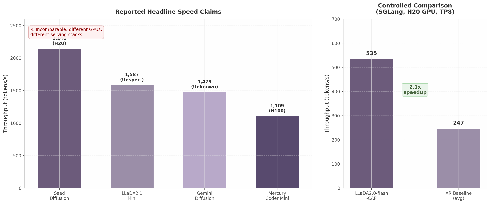
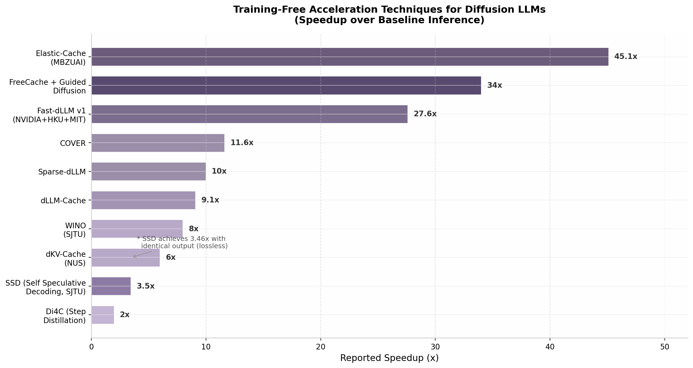

## 8. Inference Speed Optimization and Deployment

### 8.1 The Speed Advantage: Claims vs Reality

#### 8.1.1 Headline Claims and the Hardware Discrepancy Problem

Inference speed is the most frequently cited commercial advantage of diffusion language models. The headline numbers are striking: Seed Diffusion reports 2,146 tokens per second (tok/s) on H20 GPUs [^11^]; LLaDA2.1 Mini reaches 1,587 transactions per second (TPS) with quantization [^164^]; Gemini Diffusion clocks 1,479 tok/s on undisclosed hardware [^272^]; and Mercury Coder Mini achieves 1,109 tok/s on H100 GPUs [^71^]. These figures, if taken at face value, suggest that diffusion models have already surpassed autoregressive (AR) models by an order of magnitude in inference throughput.

The reality is considerably more nuanced. A systematic analysis of the measurement conditions behind each claim reveals that no two models were evaluated under comparable circumstances. Table 1 enumerates the hardware and software configurations for the major reported speed claims.

**Table 1: Reported Speed Claims and Their Measurement Conditions**

| Model | Reported Speed | GPU | Memory Bandwidth | Serving Stack | Notes |
|-------|---------------|-----|------------------|---------------|-------|
| Seed Diffusion | 2,146 tok/s [^11^] | H20 (96 GB HBM3) | 4.0 TB/s | Custom | Inference-optimized GPU, not directly comparable to H100 results |
| LLaDA2.1 Mini (quantized) | 1,587 TPS [^164^] | Unspecified | Unknown | Custom | Quantized; hardware undisclosed; Speed Mode (S-mode) |
| Gemini Diffusion | 1,479 tok/s [^272^] | Unknown | Unknown | Unknown | Experimental model; no hardware or serving stack disclosed |
| Mercury Coder Mini | 1,109 tok/s [^71^] | H100 (80 GB HBM2e) | 3.35 TB/s | Proprietary | Lower memory bandwidth than H20; proprietary serving stack |
| LLaDA2.0-flash-CAP | 535 TPS [^399^] | H20, SGLang TP8 | 4.0 TB/s | SGLang | Controlled fair-comparison environment |

The hardware discrepancy alone renders cross-model comparisons unreliable. The NVIDIA H20 is specifically designed for inference-heavy workloads, offering 96 GB of HBM3 memory with 4.0 TB/s bandwidth — higher than the H100's 3.35 TB/s [^743^]. Seed Diffusion's 2,146 tok/s on H20 versus Mercury's 1,109 tok/s on H100 cannot therefore be interpreted as evidence that Seed Diffusion's architecture is twice as fast; a meaningful portion of the gap may be attributable to the hardware advantage. ByteDance itself acknowledges this limitation, noting that "direct comparison with baselines is challenging due to differing test conditions: Mercury Coder was evaluated on a proprietary dataset with H100s, while Gemini Diffusion's speed was averaged over a mixed-task benchmark using unknown hardware" [^11^].

Beyond hardware, the serving stack introduces additional variability. vLLM's PagedAttention and SGLang's RadixAttention — the dominant optimized inference engines for AR models — were designed for unidirectional autoregressive generation and offer no native support for bidirectional diffusion attention [^720^]. Models evaluated on custom or proprietary serving stacks may benefit from optimizations unavailable to others, further biasing comparisons.

#### 8.1.2 Controlled Comparison: The SGLang Benchmark

The most rigorous controlled comparison to date comes from LMSYS's SGLang integration, which evaluated LLaDA2.0-flash-CAP alongside AR baselines on identical hardware (H20 GPU) with identical serving infrastructure (SGLang with tensor parallelism at TP8) [^399^]. Under these conditions, LLaDA2.0-flash-CAP achieved 535 TPS, while the AR baselines averaged approximately 247 TPS (258 TPS and 237 TPS for the two AR variants). This yields a **2.1x speedup** for diffusion over AR — a meaningful advantage, but far below the 5-10x claims that pervade vendor marketing materials. Inception Labs, for instance, claims Mercury Coder is "up to 10x faster" than speed-optimized AR models [^71^]; Peng et al.'s controlled study found no evidence supporting multiples of that magnitude under fair conditions [^720^].

#### 8.1.3 The Measurement Conditions Problem

Peng et al. (Renmin University) identify three systematic biases in existing diffusion language model (dLLM) efficiency evaluations [^720^]. First, inconsistent serving environments: many papers measure speed under HuggingFace Transformers, a reference implementation not optimized for production throughput, while others use highly tuned engines. Second, unfair generation length controls: diffusion models can directly control output length, whereas AR models naturally stop at the end-of-sequence token; forcing AR models to generate to a fixed length inflates their apparent latency. Third, batch size sensitivity: acceleration strategies yield significant gains at batch size 1 — the regime most relevant for interactive applications — but their advantage diminishes as batch size grows, eventually falling behind AR models with mature serving stacks [^720^]. The interaction of these three effects explains why headline claims diverge so dramatically from controlled results.

### 8.2 Training-Free Acceleration Techniques

The most rapid progress in diffusion inference optimization has come from **training-free** methods that operate off-the-shelf on existing pretrained models. This paradigm is attractive because it requires no additional training data or compute — a crucial consideration for production deployment where retraining billion-parameter models is prohibitively expensive. Figure 8.2 summarizes the speedups achieved by the leading training-free techniques.

#### 8.2.1 Fast-dLLM: Block-Wise Approximate KV Cache

Fast-dLLM, developed by NVIDIA, the University of Hong Kong, and MIT (Song Han's group) and published at ICLR 2026, is the most widely cited acceleration framework for diffusion LLMs [^739^]. Its core contribution is a **block-wise approximate KV cache** that exploits the structure of diffusion generation. The approach partitions generation into blocks; KV states of the fixed context (the prompt and any completed blocks) are cached and reused across denoising steps, refreshed only at block boundaries. A "DualCache" variant extends this by caching both prefix and suffix blocks [^739^].

The second pillar of Fast-dLLM is **confidence-aware parallel decoding**. Unlike prior approaches that select a fixed number of tokens per denoising step — which disrupts token dependencies under the conditional independence assumption — Fast-dLLM dynamically selects only tokens whose confidence exceeds a global threshold [^286^]. This preserves dependency structure while maximizing parallelism at each step.

Empirically, Fast-dLLM achieves up to **27.6x throughput improvement** on LLaDA and Dream models across GSM8K, MATH, HumanEval, and MBPP benchmarks, with the highest acceleration observed at longer generation lengths (1,024 tokens) [^258^]. Confidence-aware parallel decoding alone contributes 13.3x speedup [^740^]. Fast-dLLM v2 extends the framework to convert pretrained AR models into block diffusion models with only approximately 1B tokens of fine-tuning, achieving up to 2.5x speedup over standard AR decoding through block-level KV cache reuse and intra-block parallel decoding [^670^] [^697^].

#### 8.2.2 Elastic-Cache: Attention/Depth-Aware Adaptive KV Caching

Elastic-Cache, from MBZUAI's VILA Lab (Zhiqiang Shen) and also published at ICLR 2026, achieves the highest reported speedups among training-free methods at **45.1x** on long sequences [^279^]. The method rests on three empirical observations about diffusion model behavior during inference: (1) distant MASK tokens primarily act as length bias and can be cached block-wise beyond the active prediction window; (2) KV dynamics increase with network depth, suggesting that selective refresh from deeper layers is sufficient; and (3) the most-attended token exhibits the smallest KV drift, providing a conservative lower bound on cache change [^279^].

Elastic-Cache jointly decides when to refresh (via an attention-aware drift test on the most-attended token) and where to refresh (via a depth-aware schedule that recomputes from a chosen layer onward while reusing shallow-layer caches and off-window MASK caches). This yields 8.7x speedup on GSM8K at 256-token generation lengths, 45.1x on longer sequences, and 4.8x on HumanEval, while consistently maintaining higher accuracy than the no-cache baseline [^279^]. Notably, Elastic-Cache achieves 6.8x higher throughput than existing confidence-based approaches on GSM8K, demonstrating the compounding benefit of attention-aware and depth-aware caching combined.

#### 8.2.3 FreeCache and Guided Diffusion

FreeCache leverages the observation that "the impact of future tokens on earlier positions rapidly diminishes over denoising steps" to directly cache KV states of already-decoded "clean" tokens [^283^]. Because tokens that have converged to their final values no longer need to participate fully in subsequent denoising iterations, their KV states can be frozen and reused — a delayed caching strategy analogous to the delayed commitment pattern in diffusion sampling. FreeCache achieves up to **34x speedup** (averaged on PiQA) on Dream-7B with negligible accuracy drop, and for the first time enables diffusion models to achieve generation speed comparable to same-sized AR models [^283^]. It also enables long-context diffusion (exceeding 1,024 tokens) without performance degradation. The Guided Diffusion component augments this with a lightweight autoregressive "guider" model that directs unmasking toward optimal token positions, combining the parallelism of diffusion with the sequential guidance of AR models [^283^].

#### 8.2.4 SSD: Lossless Self-Speculative Decoding

SSD (Self Speculative Decoding), from Shanghai Jiao Tong University, Shanghai AI Lab, and Huawei, occupies a unique position as the only **lossless** acceleration method among the major training-free techniques [^654^]. SSD uses the dLLM itself as both the speculative decoding drafter and the verifier, eliminating the need for auxiliary draft models. It generates predictions for multiple positions simultaneously, then verifies them through hierarchical verification trees in a single forward pass — exploiting the dLLM's inherent parallel prediction capability [^662^].

On Dream-7B-Instruct, SSD achieves **3.46x speedup** (from 6.37 to 22.07 TPS) with a 77.4% reduction in decoding steps, while producing output **identical** to stepwise decoding [^662^]. On LLaDA-8B-Instruct, it achieves 2.11x speedup. The lossless property makes SSD particularly attractive for production deployments where output quality guarantees are paramount — unlike methods that trade a small accuracy loss for large speedups, SSD preserves exact model behavior.

**Table 2: Training-Free Acceleration Techniques — Comparative Overview**

| Method | Institution | Speedup | Lossless? | Key Mechanism | Sequence Length Sensitivity |
|--------|------------|---------|-----------|---------------|---------------------------|
| Elastic-Cache | MBZUAI (VILA Lab) | 45.1x (long) [^279^] | No | Attention/depth-aware adaptive KV cache | Higher on long sequences |
| FreeCache | — | 34x [^283^] | No | Delayed KV cache of "clean" tokens + AR guider | Enables >1024 tokens |
| Fast-dLLM v1 | NVIDIA + HKU + MIT | 27.6x [^258^] | No | Block-wise KV cache + confidence-aware parallel decode | 27.6x at 1024 tokens |
| COVER | — | 11.6x [^779^] | No | KV cache override for revocable decoding | Context-preserving |
| Sparse-dLLM | — | Up to 10x [^760^] | No | Attention-aware bidirectional cache eviction | Sparse attention dependent |
| dLLM-Cache | — | 9.1x [^698^] | No | Long-interval prompt cache + adaptive response cache | V-verify mechanism |
| WINO | SJTU | 6-10x [^777^] | No | Revocable draft-and-verify decoding | Draft correction cycles |
| dKV-Cache | NUS | 2-10x [^655^] | Near-lossless | Delayed KV caching one step post-decoding | Decode variant: near-lossless |
| SSD | SJTU + Huawei | 3.46x [^662^] | **Yes** | Self-speculative hierarchical verification | Constant per verify tree |
| Di4C | — | ~2x [^723^] | No | Inter-token correlation distillation | Step-count dependent |

The training-free paradigm dominates the acceleration landscape for good reason: these methods require no model retraining, no calibration data, and no hyperparameter search per deployment target. They can be applied to any pretrained diffusion model and combined with each other (e.g., Fast-dLLM's block cache with SSD's verification trees) for compounding gains. The maturity of this ecosystem — six independent methods published within a twelve-month window, all at major venues — signals that the community has converged on inference optimization as the highest-leverage near-term improvement vector.

### 8.3 Architectural Speed Optimizations

Beyond training-free caching and speculative decoding, several architectural and system-level optimizations target the core efficiency of diffusion model inference.

#### 8.3.1 Alpha-MoE Megakernel

Ant Group's Alpha-MoE architecture introduces a **megakernel** that fuses two consecutive FusedMoE (Mixture of Experts) operations into a single kernel launch, eliminating the inter-kernel launch overhead that becomes a bottleneck at small batch sizes [^24^]. This is particularly impactful for diffusion models because their parallel decoding generates multiple tokens simultaneously, creating bursty small-batch compute patterns that stress the GPU's kernel dispatch pipeline. The megakernel approach, combined with Ant's dInfer inference engine, contributes to the 535 TPS achieved by LLaDA2.0-flash-CAP on H20 hardware — a 2.1x speedup over AR baselines in the same stack [^24^] [^399^].

#### 8.3.2 Per-Block FP8 Quantization

LLaDA2.1 introduces per-block FP8 quantization as part of its Speed Mode (S-mode), achieving **1,587 TPS on the Mini (16B) variant** with a quality degradation of only -0.61 score points on coding benchmarks [^164^]. Unlike global quantization schemes that apply uniform precision reduction across all layers, per-block quantization adapts the numeric format to each block's sensitivity, preserving critical precision in layers where small perturbations affect output quality while aggressively compressing less sensitive blocks. This block-adaptive approach is particularly well-suited to diffusion models because their block-wise generation structure naturally aligns with the quantization granularity.

#### 8.3.3 CAP: Confidence-Aware Parallel Decoding

Confidence-Aware Parallel (CAP) decoding, introduced alongside LLaDA2.0-flash, adds an auxiliary confidence loss during training that sharpens the model's prediction confidence distribution [^399^]. The sharpened confidence scores enable more aggressive threshold-based parallel token acceptance at inference time: tokens whose confidence exceeds the threshold are committed in parallel, while uncertain tokens continue through additional denoising steps. CAP alone achieves a 2.1x speedup over AR baselines when combined with the dInfer/SGLang serving stack [^399^]. The training-time confidence sharpening is a complementary approach to Fast-dLLM's inference-time thresholding — together, they suggest a direction in which diffusion models are trained explicitly for efficient parallel decoding rather than having parallelism extracted post hoc.

### 8.4 Deployment Infrastructure

#### 8.4.1 The Emerging Serving Stack

The deployment infrastructure for diffusion LLMs remains immature relative to the AR ecosystem. As Peng et al. note, "major machine learning ecosystems provide only limited optimization and deployment support for DLMs, making efficient serving of DLMs difficult" [^720^]. Neither vLLM nor TensorRT-LLM — the two dominant production inference engines for AR models — offers native diffusion support. vLLM's PagedAttention architecture is designed for unidirectional autoregressive attention patterns and cannot efficiently handle the bidirectional attention masks required by diffusion models. TensorRT-LLM similarly targets AR generation workflows, though NVIDIA's Model Optimizer does support diffusion vision models (Stable Diffusion, SDXL) with FP8/INT8 quantization [^701^], suggesting a pathway for future text diffusion support.

Into this gap, two projects have emerged: **dInfer** (Ant Group) and **SGLang** (LMSYS). dInfer is an open-source inference engine purpose-built for diffusion LLMs, supporting block diffusion, optimized batch inference, and FP8 quantization [^400^]. SGLang provides the most mature integration, offering day-0 support for LLaDA2.0 via a Request for Comments (RFC) implementation that includes block diffusion logic, full KV cache support, streaming I/O, tensor parallelism up to TP8, and CUDA graph optimization [^399^] [^719^]. Ant Group has pursued a dual strategy: developing dInfer v0.2.0 for model-specific optimizations while contributing mature features upstream to SGLang, with the stated intent that "more mature features in dInfer are undergoing to transport to SGLang" [^24^].

**Table 3: Deployment Infrastructure for Diffusion Language Models**

| Infrastructure | Diffusion Support | Models | Key Features | Maturity |
|---------------|-------------------|--------|-------------|----------|
| dInfer (Ant Group) | Native | LLaDA2.x, block diffusion | CUDA graph capture, FP8 quant, SGLang backend [^400^] | v0.2.0, open source |
| SGLang (LMSYS) | Day-0 via RFC | LLaDA2.0 | RadixAttention, TP8, streaming I/O, KV cache [^399^] | Production-ready |
| vLLM | None (AR only) | AR models | PagedAttention — incompatible with bidirectional attention [^720^] | Mature for AR |
| TensorRT-LLM | None (vision only) | AR models; SD/SDXL for vision | Hardware-specific optimizations unavailable for text diffusion [^701^] | Mature for AR |

The infrastructure gap is the primary deployment barrier for diffusion models at scale. Production serving requires not just model execution but also request scheduling, batching, tensor parallelism, memory management, and streaming — all of which must be reimplemented or adapted for diffusion's non-sequential generation pattern. Until vLLM or TensorRT-LLM adds native diffusion support, organizations deploying diffusion models at scale face a significant engineering investment.

#### 8.4.2 Batching Dynamics: The Crossover Point

A critical finding from Peng et al.'s systematic study is that diffusion models and AR models exhibit fundamentally different batching dynamics [^720^]. At **batch size 1** — the regime governing interactive applications such as chatbots and IDE code completion — diffusion models with parallel decoding can outperform AR models. Block diffusion with parallel decoding is consistently fastest across all sequence lengths at this batch size, achieving up to 3.1x speedup over the block diffusion baseline [^720^]. This is Mercury Coder's sweet spot: single-user IDE interactions where latency to first token completion matters more than throughput per GPU.

As **batch size increases**, the picture inverts. AR models benefit more from batching because their sequential token generation maps efficiently to batched matrix multiplications, while diffusion models' parallel decoding is already compute-saturated at batch size 1. The **turning point occurs at batch size 2–4**, where AR models overtake block diffusion in throughput [^720^]. Beyond this point, AR models with optimized serving stacks (vLLM, SGLang) maintain increasing throughput, while diffusion model throughput stays nearly constant (compute-bound) until out-of-memory errors terminate scaling. LLaDA with dual cache scales better than pure parallel decoding but still hits OOM at very large batch sizes [^720^].

For **low-latency interactive applications** — chat, code completion, real-time editing — diffusion models at batch size ~1 with parallel decoding offer a genuine advantage. For **high-throughput serving** — batch APIs, document generation, embedding pipelines — AR models currently win. This bifurcation has strategic implications: diffusion models are best positioned to displace AR models in latency-sensitive, single-user contexts rather than high-throughput server-side workloads.

#### 8.4.3 The TTFT Challenge and Streaming Solutions

Diffusion models face a fundamental latency profile challenge that AR models do not: **time to first token (TTFT)**. In autoregressive models, TTFT is dominated by prompt prefill (typically 300–1,500 ms), after which tokens stream at a consistent inter-token latency of 10–30 ms [^684^]. The user perceives a short initial wait followed by continuous output. In diffusion models, the entire sequence is generated iteratively through multiple denoising steps, and **no token can be considered final until denoising completes** [^720^]. This effectively makes the TTFT equal to the total generation time — a qualitatively worse user experience for streaming applications.

Block diffusion provides a partial solution. By generating sequences in autoregressive blocks (e.g., 32 tokens at a time) with parallel intra-block diffusion, completed blocks can be streamed to the user while subsequent blocks are being generated [^670^]. LLaDA2.x, Seed Diffusion, and Mercury Coder all employ variants of block-wise generation to enable progressive output [^11^] [^164^] [^71^]. Confidence-aware parallel decoding further reduces the number of steps required before tokens stabilize, shortening the effective block generation time [^399^]. Semi-autoregressive scheduling complements this by enabling progressive output even within blocks, reducing perceived latency at the cost of some generation quality.

As Redis's analysis of LLM application latency notes, "streaming is the single biggest perceived-latency optimization for LLM apps" [^684^]. Diffusion models must solve streaming through block-wise or progressive generation to match AR's user experience. The block diffusion architecture, which sacrifices some parallelism for streaming compatibility, appears to be the pragmatic production standard — all commercially deployed diffusion models use it. However, the residual latency gap between block-streamed diffusion and true AR streaming remains a competitive disadvantage that must be offset by either higher generation quality or lower cost.

The cost dimension partially compensates for this latency disadvantage. Mercury Coder's pricing of $0.25 per million input tokens and $0.75–$1.00 per million output tokens is approximately **12x cheaper** than Claude Sonnet 4.5 ($3.00/$15.00 per million) and up to 30–40x cheaper than GPT-4 Turbo ($10.00/$30.00 per million) [^227^]. Buildglare, a low-code web development tool, uses Mercury Coder as a "cheap embedder" — larger models plan changes, Mercury executes them at roughly an order of magnitude lower cost [^67^]. The parallel generation capability enables higher GPU utilization, and the lower per-token cost may offset the streaming latency penalty for batch and non-interactive workloads.
