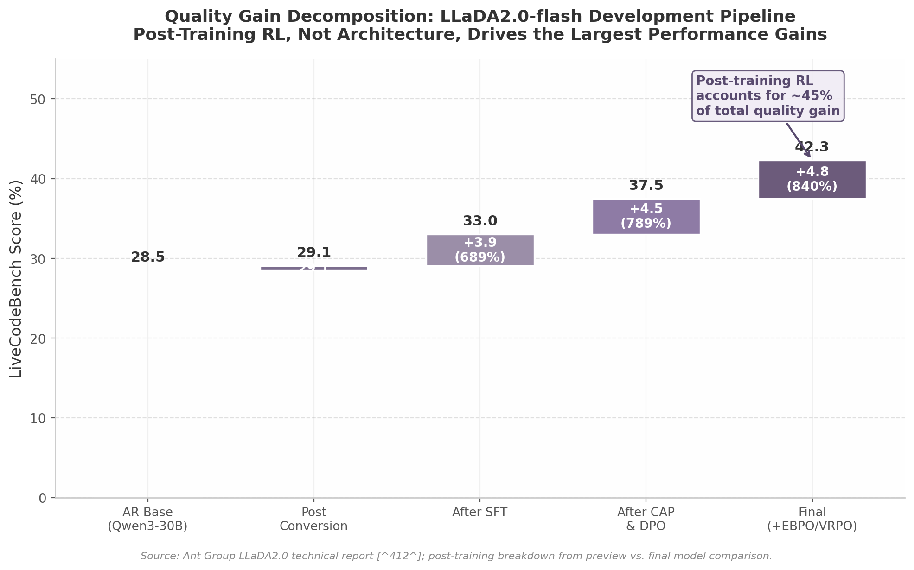

## 10. Future Outlook and Strategic Implications

The preceding nine chapters have traced the technical foundations, institutional strategies, and competitive dynamics of diffusion language models (DLMs) for text and code generation. This final chapter synthesizes those threads into actionable conclusions. Rather than repeating findings, it extracts ten cross-cutting insights that span multiple dimensions of the analysis, identifies the structural forces that will shape the field through 2027, and offers a framework for monitoring progress.

### 10.1 Key Cross-Cutting Insights

#### 10.1.1 Code Editing as the Strategic Beachhead

The most consistent empirical finding across this report is that diffusion models do not need to surpass autoregressive (AR) models on every benchmark to achieve commercial relevance. Stable-DiffCoder achieves 60.0% on CanItEdit — an 18.8 percentage point advantage over its AR counterpart Seed-Coder (50.5%) — while maintaining competitive but not dominant scores on HumanEval (86.6% vs. 84.8%) and MBPP [^11^]. This pattern is not coincidental. Code editing is an inherently non-sequential task: changing a function signature requires updating all callers simultaneously, a workflow that maps directly to diffusion's any-order generation capability [^429^]. By contrast, code completion rewards left-to-right sequential reasoning, the paradigm for which AR models are optimized.

The commercial implication is specific and actionable. The diffusion opportunity lies in displacing GitHub Copilot's completion-centric paradigm with an editing-centric workflow, not in competing head-to-head on completion benchmarks. Ant Group's internal CodeFuse NES system already demonstrates this thesis at scale: its Tab-key workflow serves 20,000+ developers by rethinking the interaction model around diffusion's strengths [^67^]. Organizations evaluating diffusion adoption should prioritize editing-heavy codebases — large monorepos with frequent refactoring, legacy code modernization, and multi-file update tasks — rather than measuring success on competitive programming leaderboards where AR models retain structural advantages.

#### 10.1.2 The AR-to-Diffusion Conversion Moat

A second structural insight concerns the pathway by which production diffusion models are created. Chapter 2 established that block diffusion (block size ~32) has become the pragmatic production consensus. Chapters 3 through 5 revealed that every major production model — LLaDA2.0, Stable-DiffCoder, Gemini Diffusion — was created not by training from scratch but by converting a pretrained AR model through a multi-phase conversion protocol [^412^] [^11^] [^272^]. Ant Group converts its Ling-family AR models; ByteDance converts Seed-Coder; Google's Gemini Diffusion converts Gemini 2.0 Flash-Lite.

This convergence creates an underappreciated competitive dynamic summarized in Table 10.1. Organizations that have invested heavily in pretraining large AR models possess a structural advantage: their "sunk cost" in AR pretraining does not become stranded when entering the diffusion race. Instead, it transfers. The conversion process — typically involving a warmup-stable-decay (WSD) schedule over 5–50 billion tokens — preserves the semantic knowledge embedded in the AR base while reconfiguring the generation dynamics [^412^].

**Table 10.1 — The AR-to-Diffusion Conversion Moat: Organizational Advantage Analysis**

| Organization | AR Base Model | Diffusion Derivative | Conversion Cost | Structural Advantage |
|:---:|:---:|:---:|:---:|:---|
| Ant Group | Ling (various sizes) | LLaDA2.0 100B MoE | ~50B tokens WSD | Deep AR investment; toolchain moat (dFactory, dInfer, SGLang) |
| ByteDance | Seed-Coder | Stable-DiffCoder | Block diffusion CPT | End-to-end control; CanItEdit 60.0% [^11^] |
| Google DeepMind | Gemini 2.0 Flash-Lite | Gemini Diffusion | Internal (undisclosed) | Largest AR model ecosystem; TPU serving infrastructure |
| Inception Labs | External (undisclosed) | Mercury family | Proprietary | First-mover commercial API; $50M funding [^878^] |
| Renmin Univ. / GSAI-ML | Qwen family | LLaDA ecosystem | Open-source conversion | Open-source community; academic research pipeline |

The table reveals a two-tier structure. Incumbent organizations with deep AR investments (Ant, ByteDance, Google) gain diffusion capabilities at marginal incremental cost. Pure-play diffusion entrants (Inception Labs) must either license or independently develop base model quality, facing higher effective barriers. This dynamic reinforces concentration among existing large-model providers and makes it difficult for startups to enter the diffusion model race without partnership strategies.

#### 10.1.3 RL Is the Secret Weapon, Not Speed

The dominant public narrative around diffusion models centers on inference speed — 2,146 tok/s from ByteDance's Seed Diffusion, 1,479 tok/s from Gemini Diffusion, 1,109 tok/s from Mercury Coder [^11^] [^272^] [^712^]. While these figures are real, they are not the primary driver of quality improvement. The data in Figure 10.1 tell a different story.

*Figure 10.1.* Decomposition of LiveCodeBench score improvement for LLaDA2.0-flash across development stages. The base AR model (Qwen3-30B) scores 28.5%. Post-conversion to diffusion yields only a marginal gain to 29.07%. The bulk of quality improvement — approximately 45% of the total gain from conversion to final model — comes from the final RL post-training stage (EBPO and VRPO). Data sourced from Ant Group technical report [^412^] with post-training breakdown from preview versus final model comparison.

LLaDA2.0-flash-preview scored only 29.07 on LiveCodeBench immediately after conversion from the AR base. The final model reaches 42.29 — but this 45% improvement is attributable almost entirely to post-training reinforcement learning (SFT, CAP, DPO, and EBPO), not to the diffusion architecture itself [^412^]. Apple's coupled-GRPO achieves a +4.4% EvalPlus gain with only 21,000 examples, demonstrating RL's extraordinary data efficiency for diffusion models [^882^]. The VRPO algorithm introduced for LLaDA 1.5 outperforms DPO, IPO, and SLiC baselines, establishing that diffusion models are currently "RL-shaped" — they benefit disproportionately from RL post-training due to the inherent train-test mismatch that SFT methods cannot resolve [^898^].

The strategic implication is clear: organizations mastering RL recipes for diffusion (EBPO, coupled-GRPO, VRPO) will outperform competitors focused exclusively on architectural novelty or inference acceleration. The RL recipe may be more important than the diffusion recipe.

### 10.2 The China Open-Source Inversion

#### 10.2.1 The Pattern: Chinese Institutional Leadership

A striking geographic pattern emerges from the analysis of open-source diffusion LLMs. Table 10.2 documents the full landscape of significant diffusion model releases as of mid-2025.

**Table 10.2 — Geographic Distribution of Diffusion LLM Development: The Open-Source Inversion**

| Model / Family | Institution | Country | Open-Source? | Parameter Scale | Primary Contribution |
|:---:|:---:|:---:|:---:|:---:|:---|
| LLaDA2.0 / 2.1 | Ant Group (GSAI-ML) | China | Yes | 100B MoE | Largest open-source DLM; EBPO RL; token editing |
| Stable-DiffCoder | ByteDance Seed | China | Partial | 32B | CanItEdit 60.0%; two-stage curriculum [^11^] |
| Seed Diffusion | ByteDance | China | Preview only | 7B–32B | Fastest code DLM at 2,146 tok/s [^11^] |
| Dream / DreamOn | Renmin Univ. / GSAI-ML | China | Yes | 7B | Fixed-length solution; open-source ecosystem |
| DiffuLLaMA | Tsinghua SIA-Lab | China | Yes | 7B | Early AR-to-diffusion conversion baseline |
| MDLM | Various (incl. Stanford) | Mixed | Yes | Various | Foundational discrete diffusion framework |
| Gemini Diffusion | Google DeepMind | USA | No | Unknown | 1,479 tok/s production API [^272^] |
| Mercury / Mercury 2 | Inception Labs | USA | No | Unknown | First commercial DLM API; 1,109 tok/s [^712^] |
| DiffuCoder | Apple | USA | No | 7B | Coupled-GRPO RL innovation |

The pattern is unambiguous. Every major open-source diffusion LLM originates from a Chinese institution: Ant Group (LLaDA family), ByteDance (Seed Diffusion, Stable-DiffCoder), Renmin University / GSAI-ML (Dream, DreamOn), and Tsinghua University (DiffuLLaMA). American contributions — Google DeepMind's Gemini Diffusion, Inception Labs' Mercury, and Apple's DiffuCoder — are exclusively closed-source or limited release [^55^] [^864^]. This represents the precise inverse of the AR landscape, where US-based organizations (OpenAI, Anthropic, Meta, Google) dominate open-weight releases and Chinese institutions primarily produce closed models.

The reasons for this inversion merit consideration. Chinese institutional researchers appear to have concentrated effort around the LLaDA framework, creating a cumulative open-source ecosystem (dFactory for training, dInfer for inference, SGLang integration for serving) that lowers barriers to entry and attracts further contributions [^412^]. The US approach, by contrast, has channeled diffusion development through commercial entities (Inception Labs, Google product teams) with corresponding IP protection.

#### 10.2.2 Implications for Western Organizations

Western organizations that wish to build products atop diffusion models face a strategic choice. They can adopt closed-source APIs (Mercury, Gemini Diffusion) and accept the cost, latency, and dependency risks that accompany any closed API strategy. Alternatively, they can build on open Chinese models (LLaDA2.0, Dream) and accept the geopolitical, compliance, and supply-chain risks associated with Chinese-origin model weights. There is currently no major open-source diffusion LLM from a Western institution — a gap that creates competitive pressure but also opportunity for whichever US or European organization first releases a competitive open-weight diffusion model.

#### 10.2.3 The DeepSeek Parallel

The comparison to DeepSeek's disruption of the AR landscape is apt. DeepSeek demonstrated that a Chinese research organization could release an open-weight model competitive with leading Western closed models, forcing price reductions across the industry and challenging assumptions about the relationship between capital investment and model quality. The diffusion ecosystem may follow a similar trajectory: if LLaDA2.0 or a successor achieves parity with closed-source diffusion APIs while remaining freely available, it could exert comparable price and access pressure [^841^]. The key uncertainty is whether the diffusion user base will grow sufficiently to create analogous market impact.

### 10.3 Diffusion vs. Autoregressive: The Convergence Hypothesis

#### 10.3.1 A3 and the Any-Order Challenge from the AR Side

The boundary between autoregressive and diffusion paradigms is blurring from both directions. On the AR side, A3 (Any-order Any-subset Autoregressive Modeling) reformulates group prediction into a generalized autoregressive framework that preserves dependency depth while enabling any-order, any-subset generation [^6^]. A3-8B outperforms state-of-the-art diffusion models (Dream 7B, DiffuLlama 7B) on question answering, commonsense reasoning, and infilling tasks despite using only 2 billion training tokens compared to 65 billion for DiffuLlama [^6^].

This result is significant because it challenges a core claimed advantage of diffusion. If AR models can achieve flexible generation order without abandoning autoregression, then "any-order capability" ceases to be a differentiator exclusive to diffusion. A3 demonstrates that the advantage may lie in training data structure and objective function design rather than in the fundamental generation mechanism.

#### 10.3.2 The "Pseudo Diffusion" Debate: Distraction or Genuine Concern?

From the diffusion side, a philosophical critique has gained traction: are masked diffusion language models merely "BERT with extra steps"? The observation has empirical grounding — modern DLMs train a model to recover texts with varying masking ratios (30%, 50%, 90%, 100%), which structurally resembles BERT's masked language modeling objective extended to higher masking rates [^930^]. The SEDD framework (score entropy discrete diffusion) and the iterative refinement process distinguish DLMs from BERT in principle, but the architectural similarity invites scrutiny [^882^].

This debate, however, is largely a distraction from practical evaluation. The relevant question is not whether a model is "truly" diffusion but whether it achieves the practical benefits sought from diffusion: parallel generation, iterative refinement, any-order capability, and competitive quality. On these metrics, current production DLMs deliver demonstrable value regardless of taxonomic classification.

More concerning is the empirical finding that practical fast DLMs "frequently converge to left-to-right, autoregressive-like decoding dynamics" because training data — including chain-of-thought rationales — encodes strong sequential dependencies [^429^]. Li et al.'s NAP (Non-Autoregressive Parallel DLMs) approach demonstrates that restructuring training data to contain multiple independent reasoning trajectories can mitigate this AR-collapse, achieving 60.9% accuracy versus 46.5% for standard Long-CoT at 256 steps (4x parallelism) on GSM8K [^429^]. This suggests the AR-collapse is a data problem rather than a fundamental architectural limitation — but it also means that diffusion's parallelism advantage is contingent on solving a difficult data engineering challenge.

#### 10.3.3 The Hybrid Future: Obsoleting the Debate

The convergence trend points toward a future in which the AR-versus-diffusion debate becomes obsolete. Multiple hybrid approaches now combine elements of both paradigms. CALM (Confident Adaptive Language Modeling) dynamically selects between AR and non-AR generation. Projected Autoregression applies diffusion-style iterative refinement within an AR backbone. TiDAR (Time-Dependent Autoregressive Refinement) interleaves autoregressive steps with parallel denoising rounds.

The theoretical analysis by Feng et al. provides a rigorous foundation for understanding why hybridization may be optimal: masked diffusion models achieve near-optimal perplexity in constant steps (efficient for fluency), but for low sequence error rate — critical for reasoning chains — required sampling steps scale linearly with sequence length, eliminating the efficiency advantage [^926^]. This metric-dependent efficiency result suggests that different tasks genuinely favor different generation paradigms. A controlled experiment by Vicentino (2026) trained AR and MDLM Transformers on identical data and compute, finding that AR models produce fluent but structurally repetitive outputs (99.8% begin with the same word) while MDLM generates more diverse narratives (93.4% unique five-word openings) at the cost of occasional grammatical inconsistencies [^1^].

The convergence hypothesis, then, is not that one paradigm will defeat the other but that the boundary between them will dissolve. Future models may autoregressively plan structure and diffusively fill content, or vice versa, with the combination chosen dynamically per task. Stefano Ermon's prediction that "within a few years, all frontier models will be diffusion models" [^55^] may prove accurate in spirit — not because diffusion replaces autoregression entirely, but because the distinction ceases to be meaningful.

### 10.4 Predictions for 2026–2027

#### 10.4.1 The Make-or-Break Year

Multiple signals converge on 2026 as the decisive period for diffusion LLMs. Three commercial providers now operate (Mercury, Gemini Diffusion, Seed Diffusion). Open-source models have reached 100 billion parameters (LLaDA2.0). Speed optimization research has achieved order-of-magnitude improvements (Fast-dLLM 27.6x throughput, Elastic-Cache 45.1x on long sequences) [^898^] [^81^]. RL techniques are maturing rapidly (EBPO, coupled-GRPO, VRPO). The infrastructure gap — once a critical barrier — is beginning to close with SGLang integration and dedicated serving stacks.

Yet the current reality on quality leaderboards is sobering. No diffusion model ranks in the top 10 on LMSYS Chatbot Arena [^840^]. Google's Gemini Diffusion matches "Gemini 2.0 Flash-Lite" — a budget-tier model, not a frontier model — and lags on GPQA Diamond (40.4% vs. 56.5%) and BIG-Bench Extra Hard (15.0% vs. 21.0%) [^272^]. Mercury 2's AIME 2025 score of 91.1 and GPQA of 73.6 represent meaningful progress [^912^], but diffusion models have not yet demonstrated consistent frontier-level quality across the full benchmark suite.

The inflection point, if it occurs, will likely be sudden rather than gradual. Diffusion models benefit from compounding advantages: speed enables more inference-time compute within the same latency budget; RL post-training shows 33x data robustness advantages over SFT; and inference acceleration research is advancing faster than model research [^898^]. The combined effect could produce a qualitative leap when these threads converge.

#### 10.4.2 Critical Monitoring: IDE Integration Over Benchmarks

The most important leading indicator for diffusion commercialization is not benchmark improvement but IDE (Integrated Development Environment) integration. GitHub Copilot's dominance derives not from superior model quality but from seamless embedding in VS Code and JetBrains — real-time suggestion display, ghost text, and frictionless acceptance. Diffusion models currently lack equivalent integration. The exception — Ant Group's NES system with its Tab-key workflow serving 20,000 developers — demonstrates that proper UX integration can drive real-world adoption even without benchmark supremacy [^67^].

The critical monitoring framework should prioritize three metrics over raw benchmark scores: (1) the number of developers actively using diffusion-based coding tools, (2) the depth of IDE integration (native plugin vs. API wrapper), and (3) enterprise case studies demonstrating measurable productivity gains. Continue.dev's integration of Mercury for Next-Edit [^881^] and Buildglare's use of Mercury Coder for real-time editing [^67^] are early signals, but the scale remains orders of magnitude below Copilot's reported millions of users.

#### 10.4.3 Predictions and Monitoring Indicators

Table 10.3 synthesizes the key predictions and monitoring indicators for 2026–2027, organized by confidence level and timeframe.

**Table 10.3 — Key Predictions and Monitoring Indicators for 2026–2027**

| Prediction | Confidence | Timeframe | Critical Indicator | If True / If False |
|:---|:---:|:---:|:---|:---|
| Diffusion achieves >5% developer tool market share | Medium | H2 2026 | IDE plugin download counts; active developer surveys | Accelerates ecosystem investment; risk of marginalization |
| 100B+ open-source DLM matches mid-tier AR API (GPT-4o-mini class) | High | H1 2026 | LMSYS Elo ranking; MMLU-Pro score >75 | Validates open-source Chinese model pathway; reinforces closed-source moat |
| Block diffusion (size ~32) remains dominant production architecture | High | Through 2027 | Adoption of dynamic block scheduling (DSB) | Pragmatic compromise persists; fully parallel methods breakthrough |
| RL-only training (no pre-training) becomes viable for specialized domains | Medium | 2027 | Domain-specific DLM trained purely via RL on <1B tokens | Dramatically lowers entry barrier; confirms pre-training moat |
| Multimodal unified diffusion (text + vision in one backbone) ships commercially | Medium | H2 2026 | LLaDA2.0-Uni or MMaDA successor in production API | Eliminates hybrid AR+diffusion pipelines; text-only remains standard |
| Diffusion matches AR on competitive programming (Codeforces div.2) | Low | 2027 | LiveCodeBench >50% at scale comparable to AR frontier | Paradigm tipping point; confirms reasoning limitation |
| Variable-length generation solved for general text (not just code) | Medium | H1 2027 | DreamOn-style [expand]/[delete] generalized | Removes major UX barrier; fixed-length remains code-specific |
| Process reward models (PRMs) for code diffusion achieve >20% gain over outcome-only RL | Medium | 2027 | PRM-trained DLM on SWE-Bench verified | Enables systematic debugging capability; RL improvement plateaus |
| Western institution releases competitive open-weight DLM | Low | 2027 | Open-source release >30B parameters, HumanEval >85% | Rebalances geographic distribution; Chinese open-source dominance continues |
| Inference cost for diffusion falls below AR equivalent at equal quality | High | H1 2026 | Price per 1M tokens on OpenRouter/Vercel below GPT-4o-mini | Cost-driven adoption accelerates; serving complexity remains barrier |

The predictions cluster into three thematic groups. High-confidence predictions concern architectural and economic fundamentals: block diffusion will persist because it is the pragmatic compromise between parallelism and infrastructure compatibility; inference costs will fall because acceleration research is outpacing model research; and open-source models at the 100B scale will match mid-tier AR APIs because the conversion pipeline has been validated. Medium-confidence predictions concern adoption dynamics and research advances: developer market share growth, multimodal unification, and variable-length generation generalization are plausible but depend on engineering execution rather than fundamental breakthroughs. Low-confidence predictions concern paradigm-level shifts: matching AR on competitive programming, which requires solving the sequential reasoning limitation that Feng et al. identified as theoretically costly [^926^], and Western open-source releases, which depend on strategic decisions by organizations that have so far chosen closed approaches.

The final prediction in Table 10.3 — that inference cost for diffusion falls below AR equivalent at equal quality by H1 2026 — is perhaps the most consequential for near-term adoption. Mercury 2 is already priced at $0.25 per million input tokens, dramatically below frontier AR models [^912^]. If this price advantage holds at quality parity, cost-driven adoption will accelerate regardless of whether diffusion achieves top-tier benchmark scores. The monitoring framework should therefore track API pricing on aggregator platforms (OpenRouter, Vercel) as closely as benchmark leaderboards.

The diffusion LLM field stands at an inflection point characteristic of emerging paradigms: the foundational research has demonstrated feasibility, the first commercial deployments are live, and the open-source ecosystem is growing rapidly. Whether 2026 marks the transition from experimental to mainstream depends less on any single breakthrough than on the compounding effect of simultaneous progress across RL optimization, inference acceleration, and — most critically — developer experience integration. Organizations and investors should weight the latter more heavily than benchmark improvements when evaluating diffusion's trajectory.
